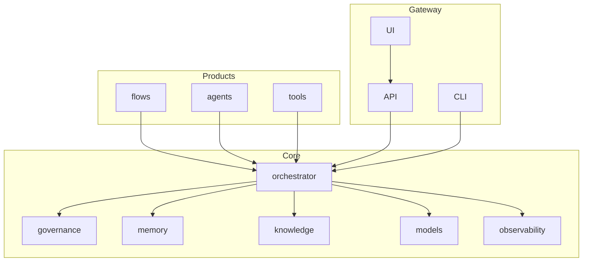
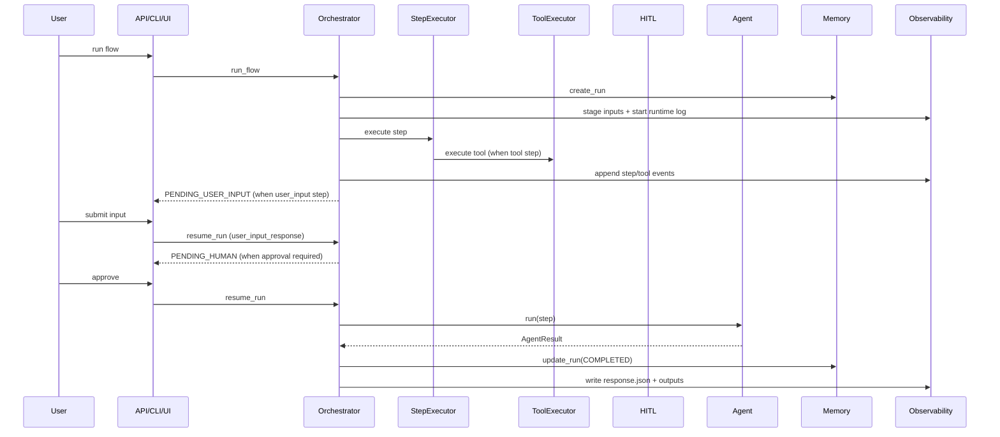
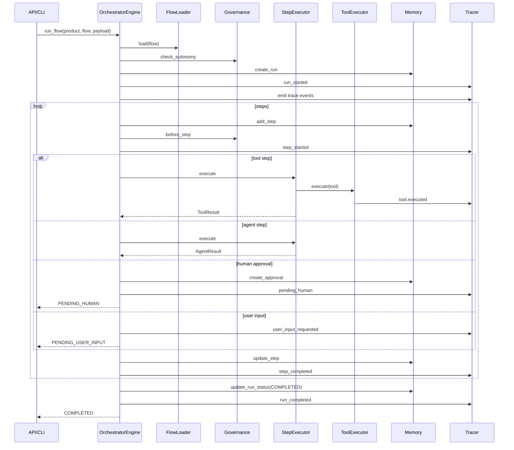
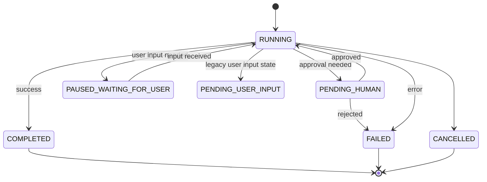
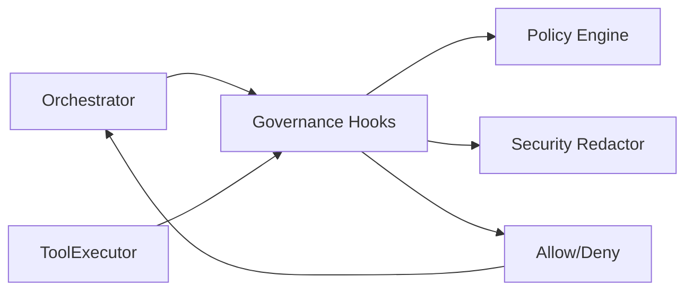
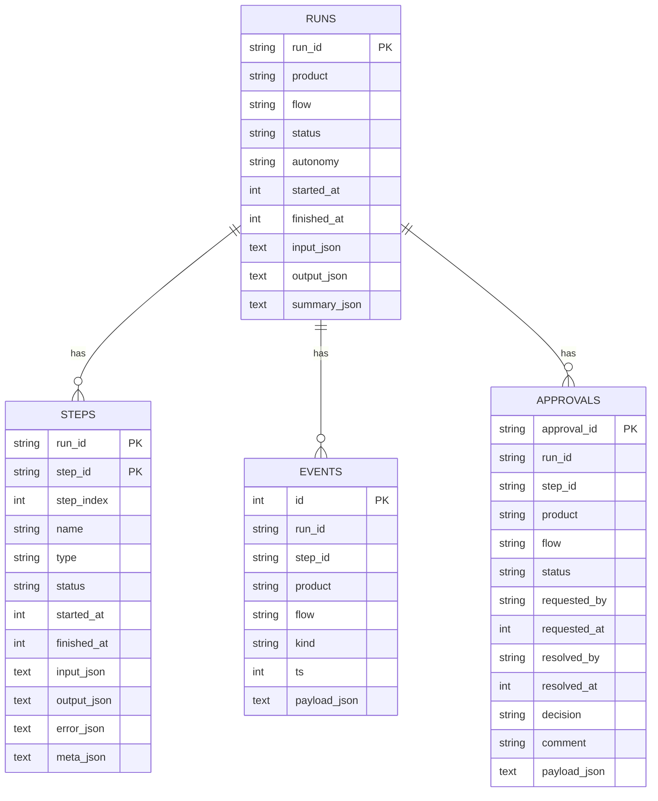
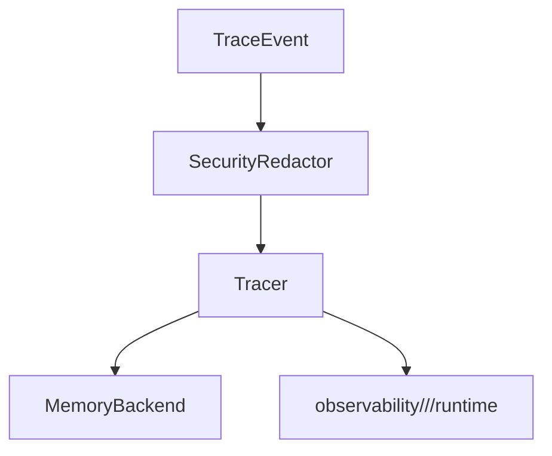
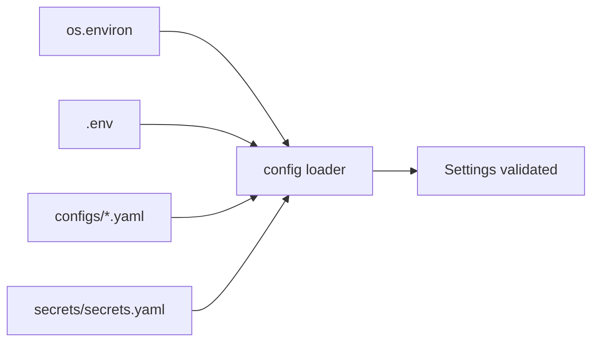
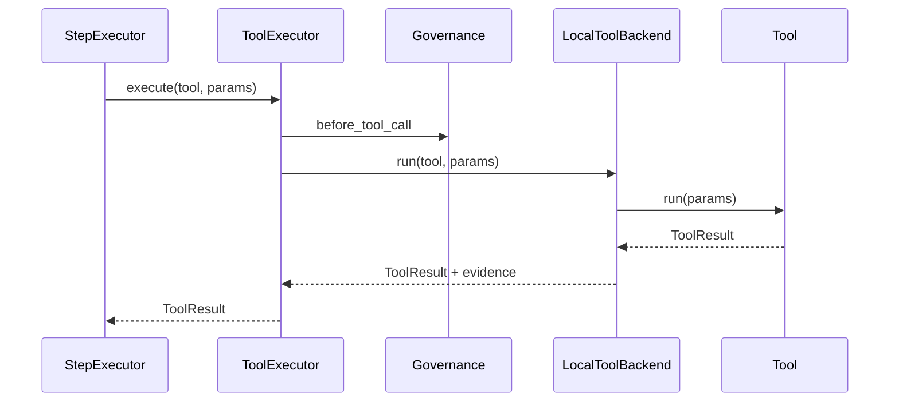

# Architecture Overview

This document provides the **high-level architecture** of the `master/` agentic framework.
It combines principles, layer diagrams, execution flows, and component summaries for engineers
building on or contributing to the platform.

**Last Updated:** 12 January 2026

---

## 1. Architectural Principles

<!-- source: core_architecture.md#1 -->

The architecture follows these non-negotiable principles:

| Principle | Description |
|-----------|-------------|
| **Thin Products, Thick Platform** | Heavy logic lives in `core/`; products define *what* to run, not *how* |
| **Headless Core Runtime** | Core is product-agnostic and UI-agnostic |
| **Explicit Contracts Everywhere** | All boundaries use Pydantic contracts |
| **No Hidden Side Effects** | State changes only through memory layer |
| **Auditability > Cleverness** | Every run, step, tool call is traceable |
| **Pause / Resume is First-Class** | HITL and user input are native, not bolted on |
| **Config > Code** | Flows, policies, limits defined in YAML |
| **Single Runtime** | One deployable service, one API, one platform UI |

Everything in `core/` is **product-agnostic**.  
Everything in `products/` is **domain-specific**.

---

## 2. High-Level Layering

<!-- source: core_architecture.md#2 -->

```
┌───────────────────────────────┐
│           Products            │  ← Business logic only
│  (flows, agents, tools)       │
└──────────────▲────────────────┘
               │
┌──────────────┴────────────────┐
│             Core              │  ← Runtime + rules
│  Orchestrator, Memory,        │
│  Governance, Models, Tools    │
└──────────────▲────────────────┘
               │
┌──────────────┴────────────────┐
│            Gateway            │  ← API, UI, CLI
│  HTTP, UI routing, auth stub  │
└───────────────────────────────┘
```



---

## 3. Core vs Products Separation

<!-- source: overview.md#5 -->

### Core (`core/`)
The **framework runtime**. Product-agnostic and centrally managed.

Core owns:
- Orchestration & workflow execution
- Agent and tool contracts
- Model routing
- Memory & persistence
- Governance & safety
- Tracing & observability
- LLM invocation via `core/agents/llm_reasoner.py`

Core **must not**:
- Contain domain logic
- Reference specific products
- Contain hardcoded flows, agents, or tools

### Products (`products/`)
Thin plug-ins built on top of core.

Each product defines:
- Flows (YAML)
- Agents (Python)
- Tools (Python)
- Product-level config

Products **must not**:
- Implement orchestration logic
- Bypass governance, memory, or logging
- Modify core code
- Call models or vendor SDKs directly

---

## 4. Execution Flow (Golden Path)

<!-- source: overview.md#3 -->



---

## 5. Orchestrator Overview

<!-- source: core_architecture.md#5 -->

**Source of truth:** `core/orchestrator/*`

Purpose: control flow execution, tool retries, HITL pauses, and resume.

### Key Modules
```
core/orchestrator/
├── engine.py              # Main coordinator
├── run_lifecycle.py       # start/resume/complete run lifecycle
├── step_executor.py       # Tool/agent step dispatch
├── plan_executor.py       # plan_propose/gate/execute steps
├── loop_executor.py       # repeat_until handling
├── user_input_handler.py  # user_input pause/resume/validation
├── flow_loader.py         # YAML → FlowDef parsing
├── branching.py           # Branch condition evaluation
├── looping.py             # Loop condition evaluation
├── templating.py          # Param/message rendering
├── context.py             # RunContext/StepContext
├── state.py               # Status helpers
├── hitl.py                # Approval creation/resolution
└── error_policy.py        # Retry/backoff definitions
```

### Responsibilities
- Load flow definitions (YAML) via `FlowLoader` from `products/<product>/flows/`.
- Enforce autonomy policy **before** a run starts.
- Execute steps in order, honoring tool retry policies & backoff.
- Pause execution for HITL approvals and user_input steps; persist approvals and user input requests.
- Evaluate branch conditions and loop stop conditions deterministically.
- Execute plan steps (`plan_propose`, `plan_gate`, `plan_execute`) using stored plan artifacts.
- Resume execution deterministically using stored run/step snapshots.
- Emit trace events for every transition (run, step, tool, approval, user_input, plan proposals).
- Govern output persistence (run output + output files) before write.
- Apply optional run budgets when `_budget_policy` is supplied in the payload.

### Session Isolation (Gateway)
The Gateway API constructs an `OrchestratorEngine` per request to avoid cross-user state leakage. Registries, settings, and the memory/tracing backends remain cached, but run context and execution state are request-scoped. Run ids include a timestamp plus a random suffix to avoid collisions under concurrent starts.

### What Orchestrator Does NOT Do
- Call models directly.
- Call tools directly.
- Persist data directly.
- Contain business logic.

### Detailed Execution Sequence

<!-- source: core_architecture.md#5 -->



---

## 6. Run Lifecycle (Status Model)

<!-- source: core_architecture.md#15 -->

**Source of truth:** `core/contracts/run_schema.py`, `core/orchestrator/state.py`



---

## 7. Governance at a Glance

<!-- source: overview.md#4, core_architecture.md#7 -->

**Source of truth:** `core/governance/*`

Governance is centralized in `core/governance`:
- Policies loaded from `configs/policies.yaml`
- Autonomy checked at run start
- Branch and loop conditions validated before execution
- Tool calls checked before execution
- Model calls checked before invocation (require reasoning purpose)
- Payloads redacted before persistence/logging
- User input and run outputs governed before persistence
- Run limits enforced (max steps, tool calls, tokens per run)



### Hook Execution Points
- At run initialization (autonomy check)
- Before step execution
- Before tool execution
- Before model execution
- Before user input ingestion
- Before run output persistence
- Before output file persistence

---

## 8. Memory & Persistence

<!-- source: core_architecture.md#9 -->

**Source of truth:** `core/memory/*`

Memory is the only layer allowed to persist state.

### Backends
- `InMemoryBackend` (default unless SQLite is enabled)
- `SQLiteBackend` (durable; enabled via `app.features.enable_sqlite_backend`)

### SQLite Tables (v1)



---

## 9. Tracing & Observability

<!-- source: core_architecture.md#10 -->

**Source of truth:** `core/memory/tracing.py` and `core/memory/observability_store.py`

- `Tracer` sanitizes and persists `TraceEvent` via memory.
- `MemoryRouter` mirrors trace events to `observability/<product>/<run_id>/runtime/events.jsonl` when observability is enabled.
- `ObservabilityStore` owns the run directory layout:
  - `input/`
  - `runtime/`
  - `output/`
- The observability root is configurable via `app.paths.observability_dir`.
- Final run responses are written to `observability/<product>/<run_id>/output/response.json`.
- The orchestrator can emit a derived `reasoning.md` artifact from runtime events.
- Input mirroring is optional and controlled by `app.features.observability_input_mirroring`.



---

## 10. Intelligence Layer

<!-- source: core_architecture.md#11, overview.md#9 -->

**Source of truth:** `core/agents/advisory.py`, `core/agents/reasoning_ladder.py`, `core/agents/critic_evaluator.py`

The platform includes bounded intelligence capabilities that operate within governance constraints.

### Advisory Agents
Located in `core/agents/advisory.py`:
- `ToolSelector` - Recommends tools based on descriptors and context
- `AgentSelector` - Recommends agents for subtasks
- `GapFinder` - Identifies missing evidence
- `Summarizer` - Condenses evidence into narrative
- `RiskExplainer` - Explains confidence/risk factors

All advisory agents return structured outputs and cannot invoke tools directly.

### Reasoning Patterns
- **Reasoning Ladder** (`core/agents/reasoning_ladder.py`):
  - Bounded interpret→propose→select pattern
  - Budget enforcement (max_passes, max_tool_calls)
  - HITL escalation when budgets exceeded
  
- **Critic Evaluator** (`core/agents/critic_evaluator.py`):
  - Quality/completeness checks
  - Structured recommendations (NONE, USER_INPUT, HITL, FETCH_MORE_EVIDENCE)
  - Cannot call tools; only analyzes artifacts

### Context Pack Builder
Located in `core/knowledge/context_pack.py`:
- Curates LLM inputs deterministically
- Includes evidence provenance
- Hash-verified reproducibility

### Guardrails
- All advisory outputs are structured; no free-form control flow
- Budget enforcement (max_passes, max_tool_calls, cost units)
- HITL escalation when budgets exceeded

---

## 11. Configuration & Settings

<!-- source: core_architecture.md#3, overview.md#7 -->

**Source of truth:** `core/config/loader.py` and `core/config/schema.py`

- Configs live in `configs/*.yaml`.
- Secrets live in `secrets/secrets.yaml`.
- `.env` is optional and only read by the config loader (does not override real env vars).
- All components receive validated `Settings` objects.
- Paths are resolved through `app.paths.*` (repo_root, storage_dir, observability_dir).
- Precedence: `env` > `secrets/secrets.yaml` > `configs/*.yaml` > defaults.
- Environment overrides use `MASTER__` namespacing.



---

## 12. Product Discovery & Registration

<!-- source: core_architecture.md#4, overview.md#8 -->

**Source of truth:** `core/utils/product_loader.py`

- Products are discovered under `products/`.
- Required files:
  - `manifest.yaml`
  - `config/product.yaml`
  - `registry.py`
- Flows are discovered from `products/<product>/flows/*.yaml`/`*.yml`.
- Enablement is controlled by `configs/products.yaml` (`enabled` + `auto_enable`).
- Manifest fields drive catalog metadata, default flow, API exposure, and UI panels.
- Product config is stored in the product catalog and exposed via API; it is not merged into global Settings automatically.
- **Auto-discovery** via `@agent` and `@tool` decorators reduces registration boilerplate.

```mermaid
flowchart TB
  Manifest[manifest.yaml] --> Loader[Product Loader]
  Config[config/product.yaml] --> Loader
  Registry[registry.py] --> Loader
  Flows[flows/*.yaml] --> Loader
  Decorators[@agent/@tool] --> AutoDiscover[Auto-Discovery]
  AutoDiscover --> Loader
  Loader --> Catalog[ProductCatalog]
  Catalog --> Orchestrator
  Catalog --> Gateway
```

---

## 13. Gateway

<!-- source: overview.md#6, core_architecture.md#14 -->

**Source of truth:** `gateway/*`

### API (`gateway/api/`)
FastAPI-based HTTP API:
- `GET /api/products`
- `GET /api/products/{product}/flows`
- `GET /api/runs`
- `GET /api/approvals`
- `GET /api/run/{run_id}`
- `GET /api/runs/{run_id}/pending_input`
- `POST /api/runs/{run_id}/user_input`
- `POST /api/run/{product}/{flow}`
- `POST /api/resume_run/{run_id}`
- `GET /api/output/{product}/{run_id}/{filename}`

Run and resume endpoints execute orchestration work in a threadpool to keep the API responsive during long-running flows.

### UI (`gateway/ui/`)
Streamlit control center with modular page architecture:
- Entry point: `gateway/ui/platform_app.py` (slim coordinator)
- Pages: `gateway/ui/pages/` (home, execution, history)
- API client: `gateway/ui/api_client.py`
- Talks only to the API; product inputs/intent/output links are driven by product config

### CLI (`gateway/cli/`)
Argparse-based CLI:
- Entry point: `gateway/cli/main.py`
- Calls the orchestrator directly (not via API)

---

## 14. Tools & Backends

<!-- source: core_architecture.md#8 -->

**Source of truth:** `core/tools/*`

- Tools execute only through `ToolExecutor`.
- ToolExecutor attaches evidence artifacts for every tool call.
- Backend:
  - `LocalToolBackend` (in-process Python execution)
- **Note:** Remote and MCP backends were removed in v1 simplification.
- `tool_batch` steps are limited to read-only, no-side-effect tools.



---

## 15. Models

<!-- source: core_architecture.md#12 -->

**Source of truth:** `core/models/*`

- `ModelRouter` selects provider/model by product/purpose.
- Providers live under `core/models/providers/`.
- Provider modules are the only location allowed to call vendor SDKs.
- LLM invocation in v1 is centralized in `core/agents/llm_reasoner.py`.
- Reasoning purpose is required for every model call.

---

## 16. Contracts & Envelopes

<!-- source: core_architecture.md#13 -->

**Source of truth:** `core/contracts/*`

- `AgentResult` and `ToolResult` are mandatory envelopes.
- Run records (`RunRecord`, `StepRecord`, `TraceEvent`) enforce stable persistence and serialization.
- External boundaries use Pydantic contracts (flows, run operations, user input, plans, budgets).
- Unified registry base class: `core/utils/registry.py` provides `ComponentRegistry[T]`.

---

## 17. V1 Acceptance Checklist

<!-- source: overview.md#10 -->

### Runtime Invariants
- Orchestrator emits trace events for run state transitions.
- Runs pause only for `user_input` or `human_approval`.
- No product-specific imports in core orchestrator.
- Models are accessed only via `core/models/router.py`.
- Tools are executed only via `core/tools/executor.py`.
- Agents never call tools directly.
- Tools never call LLM directly.
- No env reads outside config loader.
- No persistence outside memory layer.

### Intelligence Acceptance Guardrails
- Deterministic flows must replay the same steps and outputs (see `tests/acceptance_intelligence`).
- HITL/user_input transitions remain paused until explicitly resumed, and resume actions stay idempotent.
- Governance continues to deny blocked tools/models before execution, traces capture tool/model boundaries, and `plan_proposal` steps emit artifacts without invoking tools.
- Advisory agents cannot invoke tools; only return structured recommendations.
- Reasoning budgets enforce deterministic stops or HITL escalation.

### Test Coverage
- 348+ tests covering core, integration, architecture, and acceptance scenarios
- Golden path regression tests with expected output fixtures
- Architecture invariant tests enforcing import boundaries

---

## Cross-References

- **BRD**: [BRD-automation.md](../brd/BRD-automation.md), [BRD-governance.md](../brd/BRD-governance.md)
- **Techspec**: [ORC-orchestration.md](../techspec/ORC-orchestration.md), [GOV-governance.md](../techspec/GOV-governance.md)
- **Details**: [component-reference.md](component-reference.md)
- **Building Products**: [product-guide.md](product-guide.md)
