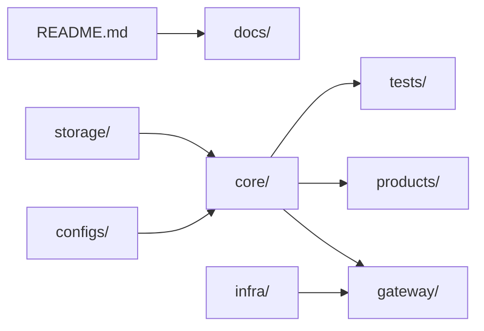
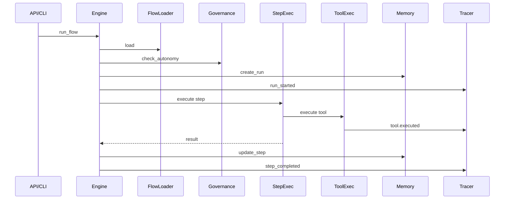
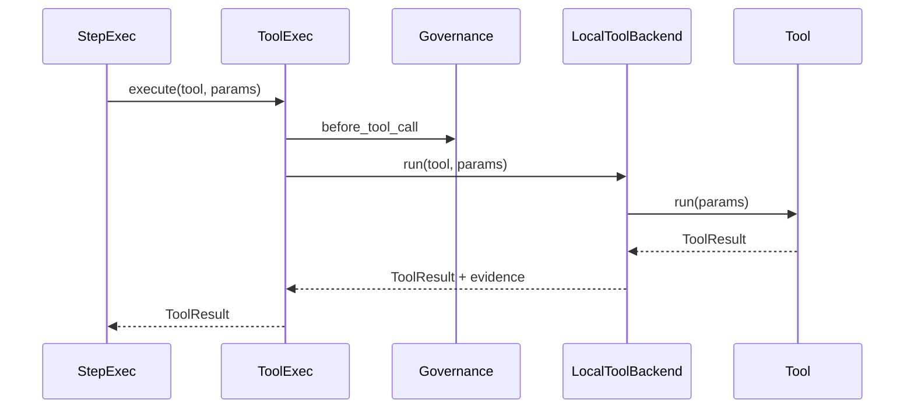
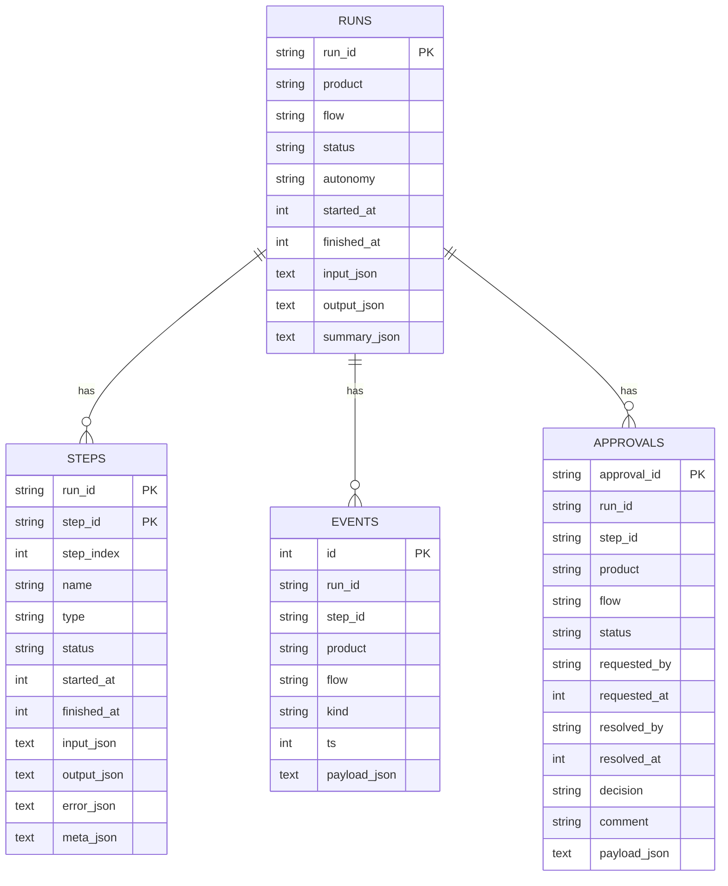
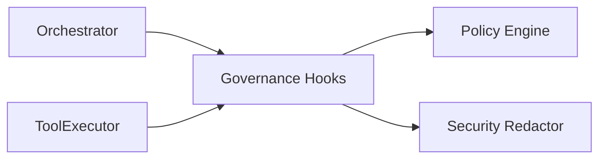
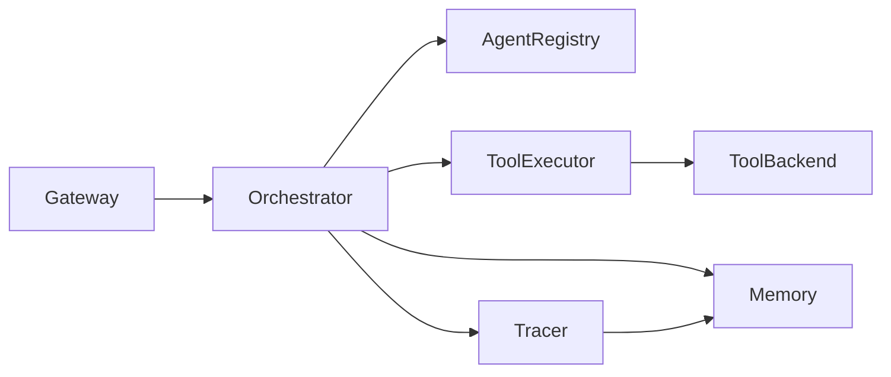

# Component Reference

This document summarizes the major components in the `master` codebase, including their code
paths, intent, and key technical characteristics. It mirrors the codebase structure and
highlights how components collaborate at runtime.

**Last Updated:** 12 January 2026

---

## Top-Level Structure

| Code Path | Code Name | Functional Details | Technical Details |
| --- | --- | --- | --- |
| `/README.md` | Root overview | High-level description of the platform, bootstrap instructions, and governance expectations. | Markdown consumed by contributors; echoes product vision and links to docs. |
| `/configs` | Configuration bundles | Declarative settings for the runtime (app metadata, model defaults, policies, per-product enablement). | YAML files loaded via `core.config` utilities; injected into agents/tools (no direct env access). |
| `/core` | Core runtime | Houses the reusable orchestration, tool, and agent infrastructure shared by every product. | Pure Python package, typed and organized into submodules (agents, tools, orchestrator, memory, etc.). |
| `/docs` | Knowledge base | Internal documentation (architecture, flows, governance, product HOWTOs). | Markdown assets referenced by onboarding and governance processes. |
| `/gateway` | Entry points | API/CLI/UI shells that expose the orchestrator to users/services. | FastAPI app (`gateway/api`), argparse-based CLI (`gateway/cli`), and Streamlit UI (`gateway/ui`). |
| `/infra` | Deployment glue | Container/K8s definitions and platform scripts used for shipping the stack. | Dockerfile, docker-compose, and k8s manifests. |
| `/observability` | Run observability | Per-run input/runtime/output artifacts for all products. | `core/memory/observability_store.py` defines the directory layout and `response.json`; input mirroring is optional. |
| `/products` | Product packs | Individual product definitions (flows, agents, tools, assets). | Each product ships a `manifest.yaml`, `config/product.yaml`, `registry.py`, and flow YAML. |
| `/storage` | Persistent state | Default runtime storage path for memory DB files and other artifacts. | Used by `core/memory` as the default storage root; overridable via `app.paths.storage_dir`. |
| `/tests` | Automated tests | Pytest suites covering core units, integration flows, CLI/API/UI, and product regressions. | Organized into `tests/core`, `tests/integration`, and `products/*/tests`. |
| `/pyproject.toml` / `/requirements.txt` | Build metadata | PEP‑621 project definition and pip requirements for production tooling. | Used by CI/CD; coordinates dependency versions. |

---

## Core Package (`/core`)

### Orchestrator

| Code Path | Code Name | Functional Details | Technical Details |
| --- | --- | --- | --- |
| `core/orchestrator/engine.py` | Flow engine | Drives flow execution, pause/resume, and trace emission. | Loads FlowDef from `products/<product>/flows/`, enforces autonomy and governance checks, persists runs/steps, emits trace events, handles branch/loop/plan steps. |
| `core/orchestrator/run_lifecycle.py` | Run lifecycle | Handles start_run, resume_run, complete_run. | Extracted from engine.py for focused responsibility. |
| `core/orchestrator/plan_executor.py` | Plan executor | Handles plan_propose/gate/execute steps. | Manages action plan lifecycle. |
| `core/orchestrator/loop_executor.py` | Loop executor | Handles repeat_until step execution. | Budget-aware loop handling. |
| `core/orchestrator/user_input_handler.py` | User input handler | Handles user_input pause/resume/validation. | Validates against QuestionSet schemas. |
| `core/orchestrator/flow_loader.py` | Flow loader | Loads FlowDefs/StepDefs from flow YAML. | Validates and normalizes step ids; no execution or persistence (JSON supported by loader when called directly). |
| `core/orchestrator/step_executor.py` | Step executor | Executes tool/agent/tool_batch/plan_proposal steps. | Renders params from payload/artifacts, delegates to ToolExecutor/AgentRegistry, enforces agent output governance; tool retries only. |
| `core/orchestrator/branching.py` | Branch evaluator | Deterministic branch evaluation. | Evaluates safe condition expressions over artifacts and step outputs. |
| `core/orchestrator/looping.py` | Loop evaluator | Deterministic stop-condition evaluation. | Evaluates bounded repeat-until conditions against artifacts and memory. |
| `core/orchestrator/templating.py` | Template renderer | Param/message rendering for steps. | Supports payload/artifact interpolation; strict for messages, lenient for params. |
| `core/orchestrator/hitl.py` | HITL service | Approval creation and resolution. | Persists approval records via MemoryRouter. |
| `core/orchestrator/state.py` | Status helpers | Canonical run/step status groups. | Re-exports RunStatus/StepStatus for runtime use. |
| `core/contracts/user_input_schema.py` | User input contracts | Typed request/response for `user_input` steps. | Supports choice and free-text modes. |
| `core/contracts/interaction_schema.py` | Interaction contracts | Consolidated HITL and question schemas. | QuestionSet, Question, Answer models. |
| `core/contracts/context_pack_schema.py` | Context pack contracts | Evidence-backed context summaries. | Includes EvidenceItem (merged from evidence_schema). |
| `core/contracts/action_plan_schema.py` | Action plan contracts | Executable plan schema. | Used by `plan_propose`/`plan_gate`/`plan_execute`. |
| `core/contracts/reasoning_schema.py` | Reasoning purpose contract | Enum for required LLM reasoning purposes. | Used by LLM routing, governance, and tracing. |

### Agents

| Code Path | Code Name | Functional Details | Technical Details |
| --- | --- | --- | --- |
| `core/agents/base.py` | `BaseAgent` | Abstract contract for agents. | `run(step_context)` returns `AgentResult`. Includes `@agent` decorator for auto-discovery. |
| `core/agents/registry.py` | Agent registry | Global DI container for agent factories. | Inherits from `ComponentRegistry[BaseAgent]`; case-normalized name resolution; new instance per resolution; exposes descriptor catalog. |
| `core/agents/llm_reasoner.py` | LLM reasoner | Built-in LLM agent and role-specific helpers. | Invokes models via `core/models/router.py` and emits governance/tracing hooks. |
| `core/agents/advisory.py` | Advisory agents | Tool/agent selectors, gap finder, summarizer, risk explainer. | Structured outputs used for advisory steps; registered as core agents. Cannot invoke tools directly. |
| `core/agents/reasoning_ladder.py` | Reasoning ladder | Multi-pass reasoning helper. | Bounded interpret → propose → select flow with budget awareness. HITL escalation on budget exceed. |
| `core/agents/critic_evaluator.py` | Critic evaluator | Quality/completeness checks. | Returns structured recommendations (NONE, USER_INPUT, HITL, FETCH_MORE_EVIDENCE). Cannot call tools. |

### Tools

| Code Path | Code Name | Functional Details | Technical Details |
| --- | --- | --- | --- |
| `core/tools/base.py` | `BaseTool` | Tool contract used by products. | `run(params, ctx)` returns `ToolResult`. Includes `@tool` decorator for auto-discovery. |
| `core/tools/registry.py` | Tool registry | Global DI container for tool factories. | Inherits from `ComponentRegistry[BaseTool]`; case-normalized name resolution; exposes descriptor catalog. |
| `core/tools/executor.py` | Tool executor | Central dispatcher for tool execution. | Applies governance hooks and redaction; emits trace events; wraps outputs as evidence. |
| `core/tools/retrieval.py` | Approved retrieval tool | Read-only retrieval across run records and trace events. | Enforces retrieval policies; returns evidence + citations. |
| `core/tools/backends/local_backend.py` | Local backend | In-process tool execution. | Calls Python tool implementation directly. |

**Note:** Remote and MCP backends were removed in v1 simplification. Only local backend is supported.

### Descriptors
- `core/contracts/descriptors_schema.py` defines the `ToolDescriptor` and `AgentDescriptor` catalog contracts used by registries.
- Tool descriptors declare `read_only`, `side_effect`, `capabilities`, `cost_hint`, and `sensitivity_class`.
- Agent descriptors declare `purpose`, `capabilities`, and `allowed_step_types`.
- These descriptors gate `tool_batch` eligibility and enable intelligent tool/agent selection.

### Evidence
- Evidence models are consolidated in `core/contracts/context_pack_schema.py`.
- `EvidenceItem` includes provenance tracking (source, timestamp, confidence).

### Unified Registry
- `core/utils/registry.py` provides `ComponentRegistry[T]` base class.
- Both `AgentRegistry` and `ToolRegistry` inherit from this unified implementation.
- Provides: `register`, `resolve`, `has`, `list_registered`, `get_meta`.

### Memory

| Code Path | Code Name | Functional Details | Technical Details |
| --- | --- | --- | --- |
| `core/memory/base.py` | Memory interfaces | Contracts for adapters (runs, steps, events, approvals). | Base classes consumed by routers/backends. |
| `core/memory/sqlite_backend.py` | SQLite backend | Durable run/memory persistence. | Stores runs, steps, events, approvals in SQLite (enabled via feature flag). |
| `core/memory/in_memory.py` | In-memory backend | Lightweight store for tests/dev. | Default backend unless SQLite is enabled. |
| `core/memory/router.py` | Memory router | Chooses appropriate backend and exposes CRUD. | Used by orchestrator, API, CLI, tracer; owns observability store. |
| `core/memory/observability_store.py` | Observability store | Filesystem run artifacts. | Writes `input/`, `runtime/`, `output/` and `response.json`. |

### Knowledge

| Code Path | Code Name | Functional Details | Technical Details |
| --- | --- | --- | --- |
| `core/knowledge/base.py` | Knowledge contracts | Typed retrieval/ingestion interfaces. | Defines Chunk, Query, VectorStore. |
| `core/knowledge/retriever.py` | Retriever | Query execution helper. | Works with vector store or lexical fallback. |
| `core/knowledge/vector_store.py` | Vector store | Optional embedding store. | Enabled only when feature flags are set. |
| `core/knowledge/context_pack.py` | Context pack builder | Evidence-backed summaries. | Builds ContextPack artifacts from evidence. |
| `core/knowledge/context_pack_merge.py` | Context merge | Merge answers into context packs. | Used for question_set user input. |
| `core/knowledge/structured.py` | Structured accessor | Minimal CSV querying helpers. | No persistence; optional pandas use. |

### Governance & Security

| Code Path | Code Name | Functional Details | Technical Details |
| --- | --- | --- | --- |
| `core/governance/policies.py` | Policy engine | Evaluates tool/model allowlists and autonomy rules. | Per-product overrides supported. |
| `core/governance/hooks.py` | Governance hooks | Integration point for orchestrator/tools. | Autonomy, step/tool/model checks; agent output validation; user input/output gating. |
| `core/governance/security.py` | Redaction | Scrubs secrets/PII from payloads. | Regex + key-hint based sanitization. |
| `core/governance/branch_gate.py` | Branch gating | Validates branch conditions. | Rejects disallowed paths or targets. |
| `core/governance/loop_gate.py` | Loop gating | Validates loop stop conditions. | Rejects disallowed paths or targets. |
| `core/governance/budgeting.py` | Budgeting | Tracks run budgets. | Consumes tool/pass/parallel budgets with actions. |
| `core/governance/plan_gate.py` | Plan gating | Gates ActionPlans. | Applies allowlists and budget sensitivity. |
| `core/governance/retrieval_policy.py` | Retrieval policy | Allowed retrieval sources. | Per-product/per-flow source allowlists. |

### Models

| Code Path | Code Name | Functional Details | Technical Details |
| --- | --- | --- | --- |
| `core/models/router.py` | Model router | Selects provider/model per product/purpose. | Enforces model policies. |
| `core/models/providers/openai_provider.py` | OpenAI provider | Vendor adapter. | Provider modules are the only place allowed to call model SDKs. |

### Tracing & Observability

| Code Path | Code Name | Functional Details | Technical Details |
| --- | --- | --- | --- |
| `core/memory/tracing.py` | Tracer | Persists trace events with redaction. | Writes to memory backend; MemoryRouter mirrors to observability runtime logs. |
| `core/memory/observability_store.py` | Observability store | Filesystem layout for run artifacts. | Creates `input/`, `runtime/`, `output/` and writes `response.json`. |
| `core/utils/reasoning_exporter.py` | Reasoning exporter | Builds reasoning markdown. | Extracts runtime events into `reasoning.md`. |

---

## Gateway (`/gateway`)

| Code Path | Code Name | Functional Details | Technical Details |
| --- | --- | --- | --- |
| `gateway/api/http_app.py` | FastAPI factory | Builds API router and app. | `/api` routes wired in `routes_run.py`. |
| `gateway/api/routes_run.py` | Run routes | Starts/resumes flows and reads runs/approvals. | Uses orchestrator + product catalog; exposes pending user input endpoints. |
| `gateway/cli/main.py` | CLI entry | Argparse CLI for local runs. | Directly calls orchestrator. |
| `gateway/ui/platform_app.py` | Streamlit UI | Control center for products, runs, approvals, user inputs. | Talks to API only. |

---

## Products (`/products`)

Each product pack includes:
- `manifest.yaml`
- `config/product.yaml`
- `flows/*.yaml`
- `agents/` and `tools/`
- `registry.py`
- `tests/`

Products are discovered and registered by `core/utils/product_loader.py`.

---

## Configurations (`/configs`)

| File | Purpose | Notes |
| --- | --- | --- |
| `app.yaml` | Global app metadata | Host/ports, paths, flags. |
| `logging.yaml` | Logging config | Level, redaction, tracing toggle. |
| `models.yaml` | Model routing | Provider and model defaults. |
| `policies.yaml` | Governance rules | Tool/model allowlists, autonomy, per-run limits. |
| `products.yaml` | Product enablement | Discovery settings. |

---

## Tests

| Path | Purpose | Notes |
| --- | --- | --- |
| `tests/core` | Unit/regression suites for core subsystems. | Orchestrator, memory, governance, tools, contracts. |
| `tests/integration` | End-to-end flows. | CLI, API, UI, resilience. |
| `products/*/tests` | Product regressions. | Golden paths for each product. |

---

## Component Relationships

- Gateway (API/CLI/UI) invokes the core orchestrator.
- Orchestrator executes steps via tool and agent registries.
- Tool execution flows through `ToolExecutor` with governance checks.
- Memory persists runs, steps, events, and approvals.
- Tracing emits sanitized events to memory + observability store.

---

## Technical Standards Recap

- Agents/tools never read environment variables directly.
- All agent/tool outputs must use Pydantic contracts.
- Tracing goes through `core/memory/tracing.py`.
- Governance checks are centralized and non-bypassable.

---

This document should be updated whenever new top-level components or subsystems are added.

---

## Cross-References

- **Architecture**: [architecture-overview.md](architecture-overview.md)
- **BRD**: [BRD-automation.md](../brd/BRD-automation.md), [BRD-operations.md](../brd/BRD-operations.md)
- **Techspec**: [ORC-orchestration.md](../techspec/ORC-orchestration.md), [AGT-agents-tools.md](../techspec/AGT-agents-tools.md), [MEM-memory.md](../techspec/MEM-memory.md)
