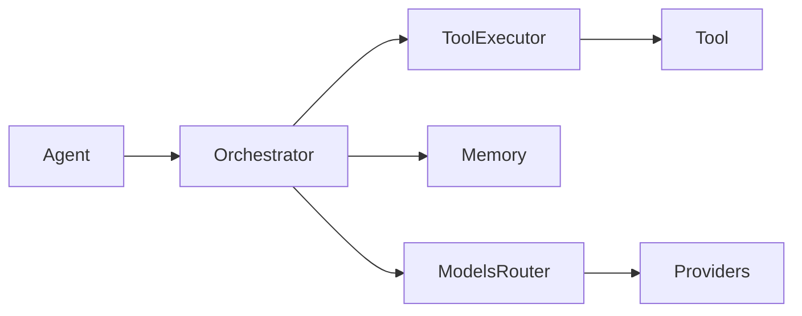

# Engineering Standards — master/

This document is the **constitution** of the `master/` platform.  
All code (human-written or AI-generated) **must** comply with these rules.

Violations are considered **architectural defects**, not style issues.

This document overrides all other conventions.

**Last Updated:** 12 January 2026

---

## 1. Absolute Boundary Rules (Non-Negotiable)

### 1.1 External Vendor Calls
- ❌ **FORBIDDEN**: Calling OpenAI, Anthropic, HuggingFace, vector DBs, HTTP APIs, or any external services directly from:
  - agents
  - tools
  - orchestrator
  - products

- ✅ **ALLOWED ONLY IN**:

core/models/providers/

Rules:
- All vendor SDK usage must be wrapped behind a provider interface.
- No provider-specific logic outside this layer.
- Model selection is done via logical names (never vendor IDs).



---

### 1.2 Tool Execution
- ❌ **FORBIDDEN**: Agents calling tools directly.
- ❌ **FORBIDDEN**: Tools executing other tools.
- ❌ **FORBIDDEN**: Direct backend calls from orchestrator.

- ✅ **MANDATORY FLOW**:

Agent → ToolExecutor → Governance → Backend → ToolResult

Rules:
- All tool execution **must** go through:

core/tools/executor.py

- Tool backends are implementation details, never invoked directly.
- `tool_batch` may execute only tools marked `read_only` and `side_effect=false`.

---

### 1.3 Persistence & State
- ❌ **FORBIDDEN**: Writing to disk, DBs, or files outside approved core persistence layers.
- ❌ **FORBIDDEN**: SQLite, filesystem, or vector store access outside core persistence modules.

- ✅ **ALLOWED ONLY IN**:

core/memory/*
core/memory/observability_store.py

Rules:
- Orchestrator and agents treat memory as a black box.
- Memory access is always via interfaces, never concrete backends.

---

### 1.4 Environment Variables & Config
- ❌ **FORBIDDEN**: Reading environment variables directly (`os.getenv`) outside the config loader.
- ❌ **FORBIDDEN**: Hard-coded secrets, URLs, model names, limits, or timeouts.

- ✅ **ALLOWED ONLY IN**:

core/config/loader.py

Rules:
- All runtime values come from:
  - YAML config files
  - Environment variables injected via loader
  - In-memory config objects
- No component owns configuration.

---

### 1.5 Contracts at Boundaries
- ❌ **FORBIDDEN**: Unstructured payloads crossing core boundaries.
- ✅ **MANDATORY**: Use Pydantic contracts for flows, runs, user input, plans, and tool/agent envelopes.

---

## 2. Core Execution Philosophy (Foundational)

### 2.1 Goal-Driven, Not Template-Driven
- **Agents are strictly GOAL-DRIVEN.**
- Message templates are **not** a control mechanism.

Rules:
- ❌ No product logic embedded in templates.
- ❌ No template engineering as a system behavior lever.
- ✅ Agents receive:
  - explicit params/instructions
  - constraints
  - expected outputs
  - allowed tools
  from the orchestrator.

Templates (if present at all):
- Are strictly non-authoritative presentation strings
- Live with product flows/agents, not in core
- Must not encode business logic or branching behavior

---

### 2.2 Orchestrator Is the Control Plane
- The orchestrator owns:
  - flow execution
  - step sequencing
  - retries and backoff
  - tool authorization
  - HITL pauses and resumes
  - deterministic branching and looping
  - plan gating and plan execution
  - state transitions

Rules:
- ❌ Agents do not decide workflow.
- ❌ Agents do not call other agents.
- ❌ Agents do not schedule tools.
- ✅ Agents return structured intent; orchestrator decides execution.
- ✅ Agent outputs are data-only; no control fields (next_step, retry, branching) are allowed.

---

## 3. Naming Conventions

### 3.1 Files & Modules
- `snake_case`
- No abbreviations unless universally understood
- One responsibility per file

Examples:

flow_loader.py
tool_executor.py
sqlite_backend.py

---

### 3.2 Classes
- `PascalCase`
- One public class per file unless explicitly justified

Examples:

RunContext
BaseAgent
ToolResult

---

### 3.3 Functions
- `snake_case`
- Verb-first naming

Examples:

load_flow()
execute_step()
validate_policy()

---

### 3.4 Constants & Enums
- `UPPER_SNAKE_CASE`

Examples:

RUNNING
PENDING_HUMAN
PENDING_USER_INPUT
FULL_AUTO

---

## 4. Result Envelope Rules (Critical)

### 4.1 No Raw Returns
- ❌ **FORBIDDEN**: Returning raw strings, dicts, lists, or primitives from:
  - agents
  - tools
  - orchestrator steps

- ✅ **MANDATORY**: Typed result envelopes everywhere.

---

### 4.2 Agent Results
All agents **must** return `AgentResult`.

Required fields:
- `ok: bool`
- `data: Any`
- `error: AgentError | None`
- `meta: dict`

Additional rules:
- LLM calls must declare a reasoning purpose (see `core/contracts/reasoning_schema.py`).

---

### 4.3 Tool Results
All tools **must** return `ToolResult`.

Required fields:
- `ok: bool`
- `data: Any`
- `error: ToolError | None`
- `meta: dict`

---

### 4.4 Error Objects
Errors are **data**, not control flow.

Rules:
- ❌ Do not raise exceptions for expected failures.
- ✅ Return structured error objects.

Exceptions are allowed **only** for:
- programmer errors
- contract violations
- corrupted state

---

## 5. Tracing & Observability Rules

### 5.1 Mandatory Tracing
Every significant action **must** emit a trace event:
- flow start/end
- step start/end
- agent execution
- tool execution
- HITL pause/resume
- errors and retries

---

### 5.2 Tracing Flow
All tracing goes through:

core/memory/tracing.py

Runtime traces are also written to:
- `observability/<product>/<run_id>/runtime/events.jsonl`
- `observability/<product>/<run_id>/output/response.json`

Rules:
- ❌ No `print()`
- ❌ No ad-hoc logging
- ❌ No silent failures

---

### 5.3 Sanitization
- All trace payloads **must** be sanitized before persistence.
- PII and secrets are scrubbed via:

core/governance/security.py

---

## 6. Error Handling Rules

### 6.1 Expected Failures
- Use structured error objects (`AgentError`, `ToolError`)
- Include:
  - error code
  - human-readable message
  - recoverability flag

---

### 6.2 Unexpected Failures
- Raise exceptions
- Must be caught at orchestrator boundary
- Must emit failure trace event
- Must persist failure state

---

### 6.3 Retries & Backoff
- ❌ No manual retry loops in agents or tools
- Retry behavior is driven by:
  - flow definition (tool steps only)
  - error policy evaluation

---

## 7. Product Code Rules

### 7.1 Product Folder Structure
Each product **must** follow:
```
products/<product>/
├── flows/
├── agents/
├── tools/
├── config/
├── registry.py
└── tests/
```
---

### 7.2 Product Responsibilities
Products define:
- domain goals
- domain tools
- flow sequencing
- schemas and constraints

Products **do NOT** define:
- execution mechanics
- orchestration logic
- logging
- persistence
- governance
- model invocation logic
- template-based behavior control
- cross-run or module-level mutable state
- subflow composition or dynamic flow mutation

Registries:
- Product agents/tools must be registered as factories (no shared instances).

---

### 7.3 Templates in Products
Rules:
- Templates are **optional**
- Templates must NOT encode logic
- Templates must NOT replace goals or flows
- Templates may only provide:
  - formatting hints
  - domain vocabulary
  - stylistic guidance (if required)
- Templates are optional implementation details and must never be required for correct execution.

---

### 7.4 Imports
- Products may import:
  - core public contracts
  - core registries
  - BaseAgent / BaseTool

- Products may **not** import:
  - orchestrator internals
  - memory backends
  - governance internals
  - logging internals

---

## 8. Configuration Rules

### 8.1 No Hardcoding
- ❌ Hard-coded model names
- ❌ Hard-coded tool limits
- ❌ Hard-coded retry logic

Everything must be configurable via YAML.

---

### 8.2 Config Precedence
Highest → Lowest:
1. Environment overrides (`MASTER__*`)
2. `secrets/secrets.yaml`
3. `configs/*.yaml`
4. Code defaults (safe only)

---

## 9. Code Generation Rules (AI Safety)

All AI-generated code **must**:
- Follow this document verbatim
- Prefer clarity over cleverness
- Be explicit rather than implicit
- Avoid hidden side effects
- Include docstrings for public interfaces

If unsure:
> **Fail closed, not open.**

---

## 10. Configuration & Secrets Rules

### 10.1 Config Sources and Precedence (Highest → Lowest)
1. Environment overrides (`MASTER__*`)
2. `secrets/secrets.yaml`
3. `configs/*.yaml`
4. Code defaults (safe, minimal)

`.env` is optional and only fills missing env vars; it never overrides real environment values.

---

### 10.2 What Goes Where

#### A) `.env` (gitignored)
Use for **non-secret runtime flags only**:
- ports, debug, log level
- feature flags
- local paths

❌ Never store secrets.

---

#### B) `configs/*.yaml` (checked into git)
Use for **shared platform defaults**:
- discovery rules
- model routing logic (logical names)
- policy defaults
- logging config

❌ Never store secrets.

---

#### C) `secrets/secrets.yaml` (gitignored)
Use for **all secrets**:
- API keys
- tokens
- credentials

Rules:
- Must never be logged
- Must be redacted by governance
- Missing secrets fail fast

#### D) Product Config (`products/<product>/config/product.yaml`)
Product config is loaded by the product loader and surfaced via the catalog/API. It is not merged into global Settings unless explicitly injected by callers.

---

### 10.3 Loading Rules
- No `os.getenv()` outside config loader
- No direct file reads of configs/secrets outside loader
- One validated config object injected everywhere

---

## 11. Enforcement

- Code reviews enforce this document
- CI validates:
  - boundary violations
  - envelope compliance
  - missing tracing
- Any exception must be documented and approved

---

## 12. Test Standards

### 12.1 Test Organization

| Test Type | Location | Purpose |
|-----------|----------|---------|
| Unit tests | `tests/unit/` | Fast, isolated tests |
| Core tests | `tests/core/` | Core module tests |
| Integration tests | `tests/integration/` | End-to-end tests |
| Architecture tests | `tests/architecture/` | Invariant enforcement |
| Acceptance tests | `tests/acceptance_intelligence/` | Intelligence guarantees |
| Product tests | `products/<name>/tests/` | Product-specific tests |

### 12.2 Architecture Invariant Tests

The following invariants are enforced by tests in `tests/architecture/`:

- **Agents never call tools directly** - No ToolExecutor imports in agent files
- **Tools never call LLM directly** - No OpenAI/Anthropic imports in tool files
- **Products never import core internals** - Only allowed core modules
- **No env reads outside config loader** - Only `core/config/loader.py` reads `os.environ`
- **No persistence outside memory** - Only `core/memory/*.py` writes to disk/DB
- **No cross-product imports** - Products are isolated

### 12.3 Acceptance Tests

Acceptance tests in `tests/acceptance_intelligence/` ensure:

- **Determinism** - Same input produces same output
- **Pause/Resume** - HITL and user_input work correctly
- **Governance** - Blocked tools/models are denied
- **Trace emission** - All boundaries emit trace events
- **Golden paths** - Known-good scenarios match expected output

---

## 13. Module Structure Summary

### Core Governance (5 files)
```
core/governance/
├── budgeting.py    # Budget enforcement
├── gates.py        # Unified gates (Branch, Loop, Plan, Critic, Retrieval)
├── hooks.py        # Governance hook orchestration
├── policies.py     # Policy loading
└── security.py     # Redaction
```

### Core Orchestrator (14 files)
```
core/orchestrator/
├── engine.py              # Main coordinator
├── run_lifecycle.py       # Run lifecycle
├── step_executor.py       # Step dispatch
├── plan_executor.py       # Plan steps
├── loop_executor.py       # Loop handling
├── user_input_handler.py  # User input
├── flow_loader.py         # Flow loading
├── branching.py           # Branch evaluation
├── looping.py             # Loop evaluation
├── templating.py          # Template rendering
├── context.py             # Context objects
├── state.py               # Status helpers
├── hitl.py                # HITL service
└── error_policy.py        # Retry/backoff
```

### Tool Backends (1 file)
```
core/tools/backends/
└── local_backend.py       # In-process execution only
```

**Note:** Remote and MCP backends were removed in v1.

**This document is binding.**

---

## Cross-References

- **Governance**: [governance-reference.md](governance-reference.md)
- **Architecture**: [architecture-overview.md](architecture-overview.md)
- **Techspec**: [ACC-acceptance.md](../techspec/ACC-acceptance.md)
