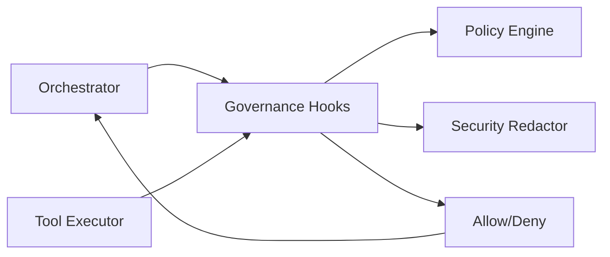

## Governance and Policies — master/

This document defines the **governance model** for the `master/` agentic platform.

**Last Updated:** 12 January 2026

Governance exists to ensure:
- Safety
- Auditability
- Determinism
- Enterprise compliance
- Controlled autonomy at scale

All governance is **centralized in core**.  
No product, agent, or tool may bypass governance under any circumstance.

This document is governed by:
- [engineering-standards.md](engineering-standards.md)

---

## 1. Governance Scope

Governance applies uniformly across:
- Flows
- Steps
- Agents
- Tools
- Models
- Autonomy levels
- Human-in-the-loop (HITL)
- Tracing, observability, and persistence

Rules:
- ❌ Products must not implement custom governance logic
- ❌ Agents must not self-enforce policy
- ✅ All enforcement happens via core governance hooks



---

## 2. Policy Configuration

All policies are **data-driven** and defined in:

configs/policies.yaml

Rules:
- Policies are configuration, not code
- Changes to policies do not require redeploying core logic
- Policies are evaluated **at runtime**, not compile time

---

## 3. Policy Types

### 3.1 Global Allow/Block Lists

Policies in `configs/policies.yaml` are allow/block lists, evaluated by the core policy engine.

Example:
```yaml
allowed_tools: []
blocked_tools: []
allowed_models: []
blocked_models: []
```

Rules:
	•	If `allowed_tools` is empty, all registered tools are allowed unless blocked
	•	If `allowed_models` is empty, all registered models are allowed unless blocked
	•	Blocked lists always take precedence

---

### 3.2 Per-Product Overrides

Per-product overrides are the primary way to constrain a specific product.

Example:
```yaml
by_product:
  hello_world:
    allowed_tools:
      - echo_tool
    allowed_models:
      - gpt-4o-mini
```

Rules:
	•	Product policies override global defaults
	• Products cannot access tools or models not explicitly allowed

---

### 3.3 Autonomy Policies

Autonomy is enforced via governance hooks based on the flow autonomy level and policy config.

Rules:
	•	full_auto requires explicit policy enablement
	•	Agents cannot override autonomy
	•	Orchestrator enforces autonomy at run start

---

### 3.4 Demo Safety Limits

Policies can cap demo usage to prevent runaway cost or abuse:
- `model_max_tokens` limits per-call model token requests.
- `max_tokens_per_run` caps total model tokens consumed per run.
- `max_steps` caps total steps per run.
- `max_tool_calls` caps tool invocations per run.
- `max_payload_bytes` caps the size of the initial run payload.

Limits are enforced in the governance hooks and orchestrator. Violations fail the run with a structured error.
Model calls also apply prompt-injection pattern checks before invocation.
Payload size limits are also enforced on user input responses and output/output file payloads.

### 3.5 Execution Budgets (Optional)

Runs may supply a `_budget_policy` payload that conforms to `BudgetPolicy`.
Budgets enforce:
- Max tool calls and passes
- Max parallel tool calls
- Max total cost units
- Optional HITL escalation when exceeded

Budget enforcement is implemented in `core/governance/budgeting.py`.

### 3.6 Retrieval Policies

Approved retrieval is constrained via `retrieval_allowed_sources` and optional per-flow overrides under `by_product`.
The `approved_retrieval` tool enforces these policies at runtime.
Retrieval policy enforcement is handled by `RetrievalGate` in `core/governance/gates.py`.

### 3.7 Unified Gates

All governance gates are consolidated in `core/governance/gates.py`:
- `BranchGate` - Branch condition validation
- `LoopGate` - Loop condition validation
- `PlanGate` - Plan step validation
- `CriticGate` - Critic output validation
- `RetrievalGate` - Retrieval source validation

Gates follow a registry pattern with `resolve_gate()` for dynamic resolution.

## 4. Human-in-the-Loop (HITL)

### 4.1 When HITL Is Required

HITL is triggered when:
- A step type is human_approval

HITL is not optional when required.

---

### 4.2 HITL Behavior

When HITL is triggered:
	•	Execution pauses immediately
	•	Run status transitions to PENDING_HUMAN
	•	Run and step context are persisted
	•	An approval request is created and tracked

No further execution occurs until resolution.

---

### 4.3 Resume Flow

Flow resumption occurs via:

POST /api/resume_run/{run_id}

Rules:
	•	Run must be in PENDING_HUMAN
	•	Approval decision must exist
	•	Resume action is fully audited

---

### 4.4 User Input Pause

User input pauses are triggered when:
- A step type is user_input

Behavior:
	•	Execution pauses immediately
	•	Run status transitions to PENDING_USER_INPUT
	•	Inputs may be staged as PAUSED_WAITING_FOR_USER
	•	Run and step context are persisted
	•	Resume requires validated `user_input_response`

---

## 5. Governance Hooks

Governance hooks are mandatory enforcement points executed by the runtime.

### 5.1 Available Hooks

Hook Name	Trigger
check_autonomy	Run initialization (autonomy policy enforcement)
validate_branch_conditions	Flow validation (branch condition policy)
validate_loop_conditions	Flow validation (loop condition policy)
before_step	Step execution
before_tool_call	Tool invocation
before_model_call	Model invocation
validate_agent_output	Agent output validation
before_user_input_response	User input ingestion
before_run_output	Run output persistence
before_output_files	Run output file persistence


---

### 5.2 Hook Responsibilities

Hooks may:
- Allow execution
- Deny execution
- Modify context metadata
- Emit trace events

Hooks must NOT:
	•	Execute tools
	•	Modify flow structure
	•	Call external systems

Agent output validation rejects control fields (next-step directives) and invalid payload shapes.

---

## 6. Security and Redaction

### 6.1 PII and Secret Scrubbing

All logs, traces, and persisted artifacts are scrubbed for:
	•	API keys
	•	Tokens
	•	Secrets
	•	PII patterns (emails, IDs, phone numbers)

Implemented in:

core/governance/security.py

Scrubbing occurs before persistence and trace/log emission.

---

### 6.2 Redaction Rules

Redacted values appear as:

***REDACTED***

Rules:
	•	Raw secrets must never be written to disk
	•	Redaction patterns are configurable; enforcement is mandatory

---

## 7. Auditability

Every run must record:
	•	Who initiated the run
	•	Product and flow identifiers
	•	Step execution timeline
	•	Tool invocations
	•	Approval decisions
	•	Final outcome and errors

Stored via:

core/memory/*

Audit records are persisted and updated via core/memory.

---

## 8. Policy Violations

When a policy is violated:
	•	Execution stops immediately
	•	Run status transitions to FAILED
	•	A structured governance error is recorded
	•	No partial or unsafe execution continues

There is no "best effort" execution after violation.

---

## 9. Governance Error Types

Error Type	Description
policy_blocked	Disallowed action
autonomy_denied	Autonomy exceeded
tool_blocked	Tool not permitted
model_blocked	Model not permitted
branch_condition_disallowed	Branch condition policy blocked
loop_condition_disallowed	Loop condition policy blocked

Errors are returned as structured data, not exceptions.

---

## 10. Product Developer Rules

Product teams:
	•	Must design flows within allowed autonomy
	•	Must request new tool or model access centrally
	•	Must not encode governance logic in agents or flows
	•	Must test approval and denial paths explicitly

---

## 11. Non-Negotiable Rules
	•	Governance cannot be bypassed
	•	Policies are evaluated at runtime
	•	Hooks are mandatory
	•	Violations are final
	•	Safety overrides convenience

---

## 12. Governance Module Structure

Current implementation in `core/governance/`:

```
core/governance/
├── __init__.py
├── budgeting.py    # Budget enforcement
├── gates.py        # Unified gates (Branch, Loop, Plan, Critic, Retrieval)
├── hooks.py        # Governance hook orchestration
├── policies.py     # Policy loading and evaluation
└── security.py     # Redaction and injection checks
```

**Note:** Individual gate files (branch_gate.py, loop_gate.py, etc.) were consolidated into `gates.py` per the refactoring plan.

---

This governance model ensures controlled autonomy, full auditability, and enterprise-grade safety while preserving extensibility and velocity.

---

## Cross-References

- **Engineering Standards**: [engineering-standards.md](engineering-standards.md)
- **Architecture**: [architecture-overview.md](architecture-overview.md)
- **BRD**: [BRD-governance.md](../brd/BRD-governance.md)
- **Techspec**: [GOV-governance.md](../techspec/GOV-governance.md)
