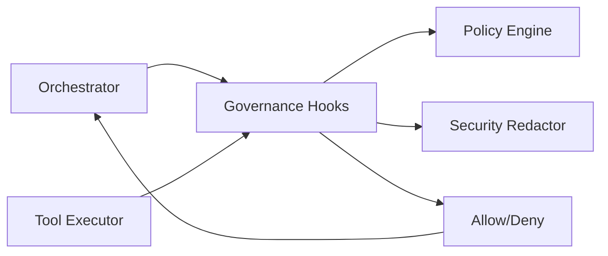

# System Design: Governance (SD-GOV)

> **Component**: Governance Layer  
> **Version**: 1.2  
> **Path**: `core/governance/`  
> **Tech Spec**: [GOV-governance.md](../../03_techspec/GOV-governance.md)  
> **Last Updated**: 2026-01-20  

---

## Version Control

| Version | Date | Changes |
|---------|------|---------|
| 1.2 | 2026-01-20 | Added V1.3 Self-Modification Prevention sections |
| 1.1 | 2026-01-13 | Header version normalization |

## 1. Scope & Ownership

| Owns | Does Not Own |
|------|--------------|
| Hook execution (pre/post step) | Step execution logic |
| Gate evaluation and approval | Run lifecycle management |
| Policy enforcement (allow/block) | Trace storage |
| PII redaction | LLM calls |
| Budget tracking | Token counting |
| Autonomy enforcement | Flow definition |
| Branch/loop condition validation | Branch/loop execution |

**Invariant**: INV-2 — Governance is non-bypassable.

---

## 2. Governance Scope

Governance applies uniformly across:
- Flows
- Steps
- Agents
- Tools
- Models
- Autonomy levels
- Human-in-the-loop (HITL)
- Tracing, observability, and persistence

Rules:
- ❌ Products must not implement custom governance logic
- ❌ Agents must not self-enforce policy
- ✅ All enforcement happens via core governance hooks



---

## 3. Module Structure

```
core/governance/
├── __init__.py
├── budgeting.py    # Budget enforcement
├── gates.py        # Unified gates (Branch, Loop, Plan, Critic, Retrieval)
├── hooks.py        # Governance hook orchestration
├── policies.py     # Policy loading and evaluation
└── security.py     # Redaction and injection checks
```

---

## 4. External Contracts

### Public APIs

| Interface | Location | Purpose |
|-----------|----------|---------|
| `GovernanceHooks.check_autonomy()` | `core/governance/hooks.py` | Autonomy policy check at run start |
| `GovernanceHooks.before_step()` | `core/governance/hooks.py` | Pre-step governance check |
| `GovernanceHooks.before_tool_call()` | `core/governance/hooks.py` | Pre-tool governance check |
| `GovernanceHooks.before_model_call()` | `core/governance/hooks.py` | Pre-model governance check |
| `GovernanceHooks.validate_agent_output()` | `core/governance/hooks.py` | Agent output validation |
| `GovernanceHooks.validate_branch_conditions()` | `core/governance/hooks.py` | Branch condition validation |
| `GovernanceHooks.validate_loop_conditions()` | `core/governance/hooks.py` | Loop condition validation |
| `GovernanceHooks.check_semantic_confidence()` | `core/governance/hooks.py` | Semantic envelope confidence gate (ORC-SEM-050) |
| `GovernanceHooks.before_complete()` | `core/governance/hooks.py` | Run completion governance |
| `PolicyEngine.evaluate_tool_call()` | `core/governance/policies.py` | Tool policy evaluation |
| `PolicyEngine.evaluate_model_use()` | `core/governance/policies.py` | Model policy evaluation |
| `PolicyEngine.evaluate_autonomy()` | `core/governance/policies.py` | Autonomy policy evaluation |
| `SecurityRedactor.sanitize()` | `core/governance/security.py` | Payload sanitization |
| `SecurityRedactor.redact_text()` | `core/governance/security.py` | Text redaction |
| `GateRegistry` | `core/governance/gates.py` | Gate registration and resolution |
| `consume_budget()` | `core/governance/budgeting.py` | Budget consumption tracking |

### Component Details

| Code Path | Code Name | Functional Details | Technical Details |
| --- | --- | --- | --- |
| `core/governance/policies.py` | PolicyEngine | Evaluates tool/model allowlists and autonomy rules. | Returns `PolicyDecision` dataclass with `allow`, `reason`, `details`. Per-product overrides via `_policy_for_product()`. |
| `core/governance/hooks.py` | GovernanceHooks | Integration point for orchestrator/tools. | Returns `HookDecision` dataclass with `allowed`, `reason`, `details`, `scrubbed`. Wraps PolicyEngine and SecurityRedactor. |
| `core/governance/security.py` | SecurityRedactor | Scrubs secrets/PII from payloads. | Regex + key-hint based sanitization. Default patterns for API keys, emails, phone numbers. Configurable `max_text_chars` limit. |
| `core/governance/gates.py` | GateRegistry + Gate classes | Branch, Loop, Plan, Critic, Retrieval gates. | Registry pattern with `GateRegistry.register()`, `GateRegistry.get()`. Base `Gate` protocol with `evaluate(context) -> GateResult`. |
| `core/governance/budgeting.py` | Budget functions | Tracks run budgets. | `consume_budget()` returns `(allowed, action, updated_state)` tuple. Supports pass/tool/parallel budgets with DEGRADE/HALT/HITL actions. |

---

## 5. Policy Configuration

All policies are **data-driven** and defined in:

```
configs/policies.yaml
```

Rules:
- Policies are configuration, not code
- Changes to policies do not require redeploying core logic
- Policies are evaluated **at runtime**, not compile time

### Policy Types

#### Global Allow/Block Lists

```yaml
allowed_tools: []
blocked_tools: []
allowed_models: []
blocked_models: []
```

Rules:
- If `allowed_tools` is empty, all registered tools are allowed unless blocked
- If `allowed_models` is empty, all registered models are allowed unless blocked
- Blocked lists always take precedence

#### Per-Product Overrides

```yaml
by_product:
  hello_world:
    allowed_tools:
      - echo_tool
    allowed_models:
      - gpt-4o-mini
```

Rules:
- Product policies override global defaults
- Products cannot access tools or models not explicitly allowed

#### Demo Safety Limits

Policies can cap demo usage to prevent runaway cost or abuse:
- `model_max_tokens` limits per-call model token requests
- `max_tokens_per_run` caps total model tokens consumed per run
- `max_steps` caps total steps per run
- `max_tool_calls` caps tool invocations per run
- `max_payload_bytes` caps the size of the initial run payload

Limits are enforced in the governance hooks and orchestrator. Violations fail the run with a structured error.

#### Execution Budgets (Optional)

Runs may supply a `_budget_policy` payload that conforms to `BudgetPolicy`.
Budgets enforce:
- Max tool calls and passes
- Max parallel tool calls
- Max total cost units
- Optional HITL escalation when exceeded

---

## 6. Governance Hooks

Governance hooks are mandatory enforcement points executed by the runtime.

### Available Hooks

| Hook Name | Trigger |
|-----------|---------|
| `check_autonomy` | Run initialization (autonomy policy enforcement) |
| `check_semantic_confidence` | Semantic interpretation phase (confidence threshold gate) |
| `validate_branch_conditions` | Flow validation (branch condition policy) |
| `validate_loop_conditions` | Flow validation (loop condition policy) |
| `before_step` | Step execution |
| `before_tool_call` | Tool invocation |
| `before_model_call` | Model invocation |
| `validate_agent_output` | Agent output validation |
| `before_user_input_response` | User input ingestion |
| `before_run_output` | Run output persistence |
| `before_output_files` | Run output file persistence |

### Hook Responsibilities

Hooks may:
- Allow execution
- Deny execution
- Modify context metadata
- Emit trace events

Hooks must NOT:
- Execute tools
- Modify flow structure
- Call external systems

Agent output validation rejects control fields (next-step directives) and invalid payload shapes.

### Semantic Confidence Gate

The `check_semantic_confidence()` hook is a critical governance check during the semantic interpretation phase. It enforces confidence thresholds before allowing flow execution to proceed.

```python
def check_semantic_confidence(
    envelope: SemanticEnvelope,
    threshold: Optional[float] = None,       # default: 0.7
    entity_threshold: Optional[float] = None, # default: 0.5
    settings: Optional[Settings] = None,
) -> Tuple[bool, Optional[str]]
```

#### Behavior

| Check | Threshold | Action on Failure |
|-------|-----------|-------------------|
| `envelope.confidence >= threshold` | 0.7 (configurable) | Return `(False, reason)` |
| All `entity.confidence >= entity_threshold` | 0.5 (configurable) | Return `(False, reason)` |

#### Configuration

Thresholds can be configured in settings:

```yaml
semantic:
  confidence_threshold: 0.7
  entity_confidence_threshold: 0.5
```

#### Trace Events

| Event | When |
|-------|------|
| `SEMANTIC_VALIDATION_COMPLETED` | Check completes (pass or fail) |

---

## 7. Unified Gates

All governance gates are consolidated in `core/governance/gates.py`:

| Gate | Purpose |
|------|---------|
| `BranchGate` | Branch condition validation |
| `LoopGate` | Loop condition validation |
| `PlanGate` | Plan step validation |
| `CriticGate` | Critic output validation |
| `RetrievalGate` | Retrieval source validation |

Gates follow a registry pattern with `resolve_gate()` for dynamic resolution.

---

## 8. Human-in-the-Loop (HITL)

### When HITL Is Required

HITL is triggered when:
- A step type is `human_approval`
- Budget escalation is triggered
- Plan gate requires approval

HITL is not optional when required.

### HITL Behavior

When HITL is triggered:
- Execution pauses immediately
- Run status transitions to PENDING_HUMAN
- Run and step context are persisted
- An approval request is created and tracked

No further execution occurs until resolution.

### Resume Flow

Flow resumption occurs via:

```
POST /api/resume_run/{run_id}
```

Rules:
- Run must be in PENDING_HUMAN
- Approval decision must exist
- Resume action is fully audited

---

## 9. Security and Redaction

### PII and Secret Scrubbing

All logs, traces, and persisted artifacts are scrubbed for:
- API keys
- Tokens
- Secrets
- PII patterns (emails, IDs, phone numbers)

Implemented in: `core/governance/security.py`

Scrubbing occurs before persistence and trace/log emission.

### Redaction Rules

Redacted values appear as: `***REDACTED***`

Rules:
- Raw secrets must never be written to disk
- Redaction patterns are configurable; enforcement is mandatory

---

## 10. Internal State & Lifecycles

### Gate State Machine

```
┌─────────────┐     evaluate      ┌─────────────┐
│   PENDING   │ ────────────────► │  EVALUATED  │
└─────────────┘                   └──────┬──────┘
                                         │
                           ┌─────────────┼─────────────┐
                           │             │             │
                           ▼             ▼             ▼
                    ┌──────────┐  ┌──────────┐  ┌──────────┐
                    │ APPROVED │  │ REJECTED │  │ WAITING  │
                    └──────────┘  └──────────┘  └────┬─────┘
                                                     │
                                              user action
                                                     │
                                         ┌───────────┴───────────┐
                                         ▼                       ▼
                                  ┌──────────┐            ┌──────────┐
                                  │ APPROVED │            │ REJECTED │
                                  └──────────┘            └──────────┘
```

---

## 11. Policy Violations

When a policy is violated:
- Execution stops immediately
- Run status transitions to FAILED
- A structured governance error is recorded
- No partial or unsafe execution continues

There is no "best effort" execution after violation.

### Governance Error Types

| Error Type | Description |
|------------|-------------|
| `policy_blocked` | Disallowed action |
| `autonomy_denied` | Autonomy exceeded |
| `tool_blocked` | Tool not permitted |
| `model_blocked` | Model not permitted |
| `branch_condition_disallowed` | Branch condition policy blocked |
| `loop_condition_disallowed` | Loop condition policy blocked |

Errors are returned as structured data, not exceptions.

---

## 12. Observability

| Event | When | Payload |
|-------|------|---------|
| `autonomy.checked` | Run initialization | `{product, flow, autonomy_level}` |
| `hook.pre_step` | Pre-step hook runs | `{step_id, hook_result}` |
| `hook.post_step` | Post-step hook runs | `{step_id, hook_result}` |
| `gate.evaluated` | Gate evaluated | `{gate_id, result}` |
| `gate.approved` | Gate approved | `{gate_id, approved_by}` |
| `gate.rejected` | Gate rejected | `{gate_id, reason}` |
| `gate.paused` | Gate waiting for approval | `{gate_id, run_id}` |
| `policy.blocked` | Action blocked by policy | `{action, policy_id}` |
| `pii.redacted` | PII redacted from text | `{field, pattern}` |
| `budget.checked` | Budget check performed | `{run_id, remaining}` |
| `budget.exceeded` | Budget limit hit | `{run_id, limit}` |

---

## 13. Non-Negotiable Rules

- Governance cannot be bypassed
- Policies are evaluated at runtime
- Hooks are mandatory
- Violations are final
- Safety overrides convenience

---

## 13.1. Runtime Self-Modification Prevention (V1.3)

The governance layer prevents agents from modifying their own configuration, prompts, or policies during execution.

### SelfModificationGuard

```python
# core/governance/self_modification_guard.py
class SelfModificationGuard:
    """
    Guards against runtime self-modification attempts.
    
    - enabled: Guard active (default True)
    - exempt_agents: Set of agent IDs that bypass guard (for system use)
    """
```

### Guard Methods

| Method | Blocks | Tech Spec |
|--------|--------|-----------|
| `check_config_modification(agent_id, target_config)` | Config changes | GOV-POL-SELFMOD-001 |
| `check_prompt_modification(agent_id, target_prompt)` | Prompt changes | GOV-POL-SELFMOD-001 |
| `check_policy_modification(agent_id, target_policy)` | Policy changes | GOV-POL-SELFMOD-001 |
| `check_learning_update(agent_id)` | Weight/learning updates | GOV-POL-SELFMOD-002 |

### Exceptions

```python
class SelfModificationBlockedError(Exception):
    """Raised when self-modification attempt is blocked."""
    def __init__(self, agent_id: str, target: str, reason: str): ...
```

### Trace Events

| Event | Trigger | Payload | Tech Spec |
|-------|---------|---------|-----------|
| `self_modification_blocked` | Guard blocks attempt | `{agent_id, target, reason}` | GOV-POL-SELFMOD-003 |

### SelfModificationAttempt

```python
@dataclass
class SelfModificationAttempt:
    """Record of a self-modification attempt."""
    agent_id: str
    target: str
    blocked: bool
    reason: str
    timestamp: datetime
```

### Implementation Files

| File | Purpose |
|------|---------|
| `core/governance/self_modification_guard.py` | SelfModificationBlockedError, SelfModificationAttempt, SelfModificationGuard |
| `core/memory/tracing.py` | SELF_MODIFICATION_BLOCKED event type |

---

## 13.2. Frozen Configuration Enforcement (V1.3)

Configuration is frozen at run initialization to prevent mutation.

### FrozenConfig

```python
# core/governance/self_modification_guard.py
@dataclass
class FrozenConfig:
    frozen_at: datetime
    policies_hash: str     # SHA-256 of policies
    agents_hash: str       # SHA-256 of agent config
    tools_hash: str        # SHA-256 of tool registry
    budget_hash: str       # SHA-256 of budget limits
    
    # Full snapshots for comparison
    policies_snapshot: Dict[str, Any]
    agents_snapshot: Dict[str, Any]
    tools_snapshot: List[str]
    budget_snapshot: Dict[str, Any]
```

### Factory Method

```python
@classmethod
def create(cls, policies: Dict, agents: Dict, 
           tools: List[str], budget: Dict) -> "FrozenConfig":
    """
    Create FrozenConfig with hash snapshots at run initialization.
    """
```

### Validation Methods

| Method | Validates | Tech Spec |
|--------|-----------|-----------|
| `validate_policies(current)` | Policy configuration unchanged | GOV-POL-SELFMOD-010 |
| `validate_agents(current)` | Agent config unchanged | GOV-POL-SELFMOD-011 |
| `validate_budget(current)` | Budget limits unchanged | GOV-POL-SELFMOD-012 |
| `validate_tools(current)` | Tool registry unchanged | GOV-POL-SELFMOD-013 |
| `check_mutation()` | Combined validation | GOV-POL-SELFMOD-010..013 |

### ConfigMutationBlockedError

```python
class ConfigMutationBlockedError(Exception):
    """Raised when frozen configuration has been mutated."""
    def __init__(self, field: str, expected_hash: str, actual_hash: str): ...
```

### Implementation Files

| File | Purpose |
|------|---------|
| `core/governance/self_modification_guard.py` | FrozenConfig, ConfigMutationBlockedError |

---

## 13.3. Allowed Runtime Mutations (V1.3)

Certain runtime mutations are explicitly allowed for proper execution.

### AllowedMutationType

```python
# core/governance/self_modification_guard.py
class AllowedMutationType:
    BUDGET_CONSUMPTION = "budget_consumption"       # GOV-POL-SELFMOD-020
    RUN_ARTIFACTS = "run_artifacts"                 # GOV-POL-SELFMOD-021
    EVIDENCE_ACCUMULATION = "evidence_accumulation" # GOV-POL-SELFMOD-021
    RUN_STATUS = "run_status"                       # GOV-POL-SELFMOD-022
    STEP_STATUS = "step_status"                     # GOV-POL-SELFMOD-022
    TRACE_EVENTS = "trace_events"                   # Observability
    
    ALL = frozenset({
        BUDGET_CONSUMPTION, RUN_ARTIFACTS, EVIDENCE_ACCUMULATION,
        RUN_STATUS, STEP_STATUS, TRACE_EVENTS
    })
```

### Mutation Functions

| Function | Purpose | Tech Spec |
|----------|---------|-----------|
| `is_allowed_mutation(mutation_type)` | Check if type is allowed | GOV-POL-SELFMOD-020..022 |
| `get_allowed_mutation_rationale(mutation_type)` | Get documented rationale | GOV-POL-SELFMOD-020..022 |
| `check_mutation_allowed(mutation_type)` | Raise if not allowed | GOV-POL-SELFMOD-020..022 |

### Rationale by Type

| Mutation | Rationale |
|----------|-----------|
| `BUDGET_CONSUMPTION` | Budget tracking is governance-controlled counter mutation |
| `RUN_ARTIFACTS` | Runs accumulate output artifacts as primary function |
| `EVIDENCE_ACCUMULATION` | Evidence gathering is core intelligence function |
| `RUN_STATUS` | Status transitions follow state machine rules |
| `STEP_STATUS` | Step completion is execution control |
| `TRACE_EVENTS` | Observability requires event emission |

### Implementation Files

| File | Purpose |
|------|---------|
| `core/governance/self_modification_guard.py` | AllowedMutationType, is_allowed_mutation(), check_mutation_allowed() |

---

## 14. Tech Spec Coverage

See [SD-COVERAGE.md](../SD-COVERAGE.md#governance-gov) for full matrix.

| Category | Status |
|----------|--------|
| Hooks (GOV-HOOK-*) | ✅ All Implemented |
| Gates (GOV-GATE-*) | ✅ All Implemented |
| Policies (GOV-POL-*) | ✅ All Implemented |
| Security (GOV-SEC-*) | ✅ All Implemented |
| Budgets (GOV-BUD-*) | ✅ All Implemented |
| Self-Modification Prevention (GOV-POL-SELFMOD-*) | ✅ All Implemented (V1.3) |

---

## 15. Files

| File | Purpose |
|------|---------|
| `core/governance/__init__.py` | Module exports |
| `core/governance/hooks.py` | Pre/post step hooks, governance orchestration |
| `core/governance/gates.py` | Unified gate evaluation |
| `core/governance/policies.py` | Policy enforcement |
| `core/governance/security.py` | PII redaction, secrets |
| `core/governance/budgeting.py` | Token budget tracking |
| `core/governance/self_modification_guard.py` | Self-modification prevention (V1.3) |

---

## See Also

- [SD-ARCH.md](../SD-ARCH.md) — Architecture overview
- [SD-ORC.md](SD-ORC.md) — Orchestration integration
- [SD-INDEX.md](../SD-INDEX.md) — Navigation and delta-detection loop
