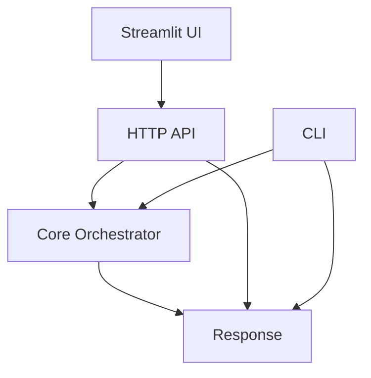

# System Design: Gateway (SD-GW)

> **Component**: Gateway Layer (API, CLI, UI)  
> **Path**: `gateway/`  
> **Tech Spec**: [GW-gateway.md](../../03_technical_specifications/GW-gateway.md)  
> **Last Updated**: 2026-01-16

---

## 1. Scope & Ownership

| Owns | Does Not Own |
|------|--------------|
| HTTP API routes | Run execution (orchestrator) |
| CLI commands | Business logic (products) |
| Streamlit UI | Governance enforcement |
| Request validation | State persistence |
| Response formatting | Agent/tool logic |
| Auth middleware | Policy decisions |
| Error response formatting | Step execution |

---

## 2. Gateway Design Principles

The Gateway layer provides:
- Multiple access points to the same core functionality
- Thin translation layer (no business logic)
- Consistent schemas across all interfaces
- Request validation before orchestrator handoff
- Response formatting for consumers



---

## 3. Module Structure

```
gateway/
├── __init__.py
├── api/
│   ├── __init__.py
│   ├── http_app.py       # FastAPI app factory (create_app)
│   ├── routes_run.py     # Run/product route handlers
│   └── deps.py           # FastAPI dependencies (get_engine, get_catalog)
├── cli/
│   ├── __init__.py
│   └── main.py           # CLI entry point (argparse-based)
└── ui/
    ├── __init__.py
    ├── platform_app.py   # Streamlit main application
    ├── api_client.py     # HTTP client for API calls
    ├── components/       # Reusable UI components
    ├── pages/            # Streamlit page modules
    ├── static/           # Static assets
    └── templates/        # HTML/template files
```

---

## 4. External Contracts

### HTTP API

| Endpoint | Method | Purpose |
|----------|--------|---------|
| `/products` | GET | List all products |
| `/products/{product}` | GET | Get product details |
| `/products/{product}/flows` | GET | List product flows |
| `/products/{product}/flows/{flow}/run` | POST | Start new run |
| `/runs/{run_id}` | GET | Get run status |
| `/runs/{run_id}/resume` | POST | Resume paused run |
| `/runs/{run_id}/user-input` | POST | Submit user input |
| `/runs/{run_id}/attachments/{filename}` | GET | Download attachment |
| `/health` | GET | Health check |

### Component Details

| Code Path | Code Name | Functional Details | Technical Details |
| --- | --- | --- | --- |
| `gateway/api/http_app.py` | HTTP App | FastAPI app factory with CORS config. | `create_app()` returns configured FastAPI. |
| `gateway/api/routes_run.py` | Run Routes | Run lifecycle: start, status, resume, user-input. | `RunRequest`, `ResumeRequest`, `UserInputSubmission` models. |
| `gateway/api/deps.py` | Dependencies | Dependency injection for engine, catalog, memory. | `get_engine()`, `get_product_catalog()`, `get_memory_router()`. |
| `gateway/cli/main.py` | CLI Entry | Command-line interface with argparse. | `cmd_run()`, `cmd_status()`, `cmd_resume()`, `cmd_approvals()`. |
| `gateway/ui/platform_app.py` | Platform UI | Streamlit app with modular pages. | `components/` and `pages/` structure. |
| `gateway/ui/api_client.py` | API Client | HTTP client for UI → API communication. | Wraps API endpoints for UI. |

### CLI Commands

| Command | Purpose |
|---------|---------|
| `master list-products` | List all products with metadata |
| `master list-flows --product <name>` | List flows for a product |
| `master run --product <name> --flow <flow> --payload '{...}'` | Start a run with JSON payload |
| `master run --product <name> --flow <flow> --payload-file <path>` | Start a run from payload file |
| `master status --run-id <id>` | Check run status |
| `master resume --run-id <id> --approve --payload '{...}'` | Resume paused run with decision |
| `master approvals` | List pending approvals |

### Schemas

| Schema | Location | Purpose |
|--------|----------|---------|
| `RunRequest` | `gateway/api/routes_run.py` | Run start request (`payload`, `text`) |
| `ResumeRequest` | `gateway/api/routes_run.py` | Resume request (`decision`, `resolved_by`, `comment`, `approval_payload`) |
| `UserInputSubmission` | `gateway/api/routes_run.py` | User input response (`prompt_id`, `selected_option_ids`, `free_text`) |
| `RunOperationResult` | `core/contracts/run_schema.py` | Unified run operation result |
| `ProductMeta` | `core/utils/product_loader.py` | Product metadata |

---

## 5. API Route Handlers

### Run Lifecycle

```python
# gateway/api/routes_run.py
router = APIRouter()

class RunRequest(BaseModel):
    payload: Dict[str, Any] = Field(default_factory=dict)
    text: Optional[str] = Field(default=None, description="Optional plain-text input for intent-driven flows.")

class ResumeRequest(BaseModel):
    decision: str = Field(default="APPROVED")
    resolved_by: Optional[str] = None
    comment: Optional[str] = None
    approval_payload: Dict[str, Any] = Field(default_factory=dict)
    user_input_response: Dict[str, Any] = Field(default_factory=dict)

@router.post("/products/{product}/flows/{flow}/run")
async def run_flow(
    product: str,
    flow: str,
    req: RunRequest,
    engine: OrchestratorEngine = Depends(get_engine),
    catalog: ProductCatalog = Depends(get_product_catalog),
) -> Dict[str, Any]:
    """Start a new run for a product flow."""
    meta, flows = _ensure_product_ready(catalog, product)
    _ensure_flow(meta, flows, flow)
    result = await run_in_threadpool(engine.run_flow, product=product, flow=flow, payload=req.payload)
    return _respond(result)

@router.get("/runs/{run_id}")
async def get_run(run_id: str, engine: OrchestratorEngine = Depends(get_engine)) -> Dict[str, Any]:
    """Get current status of a run."""
    result = await run_in_threadpool(engine.get_run, run_id=run_id)
    return _respond(result)

@router.post("/runs/{run_id}/resume")
async def resume_run(run_id: str, req: ResumeRequest, engine: OrchestratorEngine = Depends(get_engine)) -> Dict[str, Any]:
    """Resume a paused run after HITL approval."""
    result = await run_in_threadpool(engine.resume_run, run_id=run_id, decision=req.decision, ...)
    return _respond(result)
```

### Response Format

All API responses follow a consistent format:

```python
def _ok(data: Dict[str, Any], *, meta: Optional[Dict[str, Any]] = None) -> Dict[str, Any]:
    return {"ok": True, "data": data, "error": None, "meta": meta or {}}

def _error(*, http_status: int, code: str, message: str, details: Optional[Dict[str, Any]] = None) -> Dict[str, Any]:
    payload = {
        "ok": False,
        "data": None,
        "error": {"code": code, "message": message, "details": details or {}},
        "meta": {},
    }
    raise HTTPException(status_code=http_status, detail=payload)
```

---

## 6. Middleware Stack

### Request Flow

```
Request → Auth → Logging → Validation → Handler → Response Formatting → Response
```

### Middleware Components

| Middleware | Purpose |
|------------|---------|
| `AuthMiddleware` | API key / token validation |
| `LoggingMiddleware` | Request/response logging |
| `CORSMiddleware` | Cross-origin request handling |
| `ErrorMiddleware` | Exception → error response |
| `TracingMiddleware` | Trace ID injection |

### Error Response Format

```python
{
    "success": false,
    "data": null,
    "error": {
        "code": "VALIDATION_ERROR",
        "message": "Invalid product name",
        "details": { ... }
    },
    "trace_id": "..."
}
```

---

## 7. CLI Implementation

### Command Structure

```python
# gateway/cli/main.py
import argparse
from core.orchestrator.engine import OrchestratorEngine

def cmd_run(engine: OrchestratorEngine, catalog: ProductCatalog, *, product: str, flow: str, payload: Dict[str, Any], requested_by: Optional[str]) -> int:
    """Start a run for a product flow."""
    _, flows = _catalog_product(catalog, product)
    if flow not in flows:
        raise SystemExit(f"Unknown flow '{flow}' for product '{product}'.")
    res = engine.run_flow(product=product, flow=flow, payload=payload, requested_by=requested_by)
    _print_json(res.model_dump())
    return 0 if res.ok else 1

def cmd_status(engine: OrchestratorEngine, *, run_id: str) -> int:
    """Check status of a run."""
    res = engine.get_run(run_id=run_id)
    _print_json(res.model_dump())
    return 0 if res.ok else 1

def cmd_resume(engine: OrchestratorEngine, *, run_id: str, decision: str, payload: Dict[str, Any], resolved_by: Optional[str], comment: Optional[str]) -> int:
    """Resume a paused run."""
    res = engine.resume_run(run_id=run_id, decision=decision, approval_payload=payload, ...)
    _print_json(res.model_dump())
    return 0 if res.ok else 1

def cmd_approvals(memory: MemoryRouter) -> int:
    """List pending approvals."""
    approvals = [a.model_dump() for a in memory.list_pending_approvals(limit=100, offset=0)]
    _print_json({"approvals": approvals})
    return 0

def main() -> int:
    parser = argparse.ArgumentParser(prog="master")
    subparsers = parser.add_subparsers(dest="command")
    # list-products, list-flows, run, status, resume, approvals subcommands
    ...
```

### Output Formatting

CLI outputs use:
- JSON format for all structured output (`_print_json()`)
- `model_dump()` for Pydantic model serialization
- Exit code 0 for success, 1 for errors

---

## 8. Streamlit UI

The Streamlit UI provides a platform interface:

### Structure

```
gateway/ui/
├── platform_app.py   # Main Streamlit entry point
├── api_client.py     # HTTP client for API calls
├── components/       # Reusable UI components
├── pages/            # Modular page modules (home, execution, history)
├── static/           # Static assets (CSS, images)
└── templates/        # HTML templates
```

### Pages

| Page | Purpose |
|------|---------|
| Home | Product/flow selection and dashboard |
| Execution | Execute and monitor runs in real-time |
| History | Run history, traces, and audit logs |

### UI Design

```python
# gateway/ui/platform_app.py
import streamlit as st
from gateway.ui.api_client import APIClient

client = APIClient(base_url=settings.api_url)

st.title("Master Platform")

# Product selection
products = client.list_products()
product = st.selectbox("Product", [p.name for p in products])

# Flow selection
flows = client.list_flows(product)
flow = st.selectbox("Flow", flows)

# Payload input
payload = st.text_area("Payload (JSON)")

if st.button("Run"):
    result = client.run_flow(product, flow, json.loads(payload))
    st.json(result)
```

---

## 9. Internal State

The gateway is **stateless** — all state is managed by the orchestrator and memory layer.

Gateway maintains:
- No run state
- No session state (beyond request scope)
- No caching of core data

This enables horizontal scaling of the gateway layer.

---

## 10. Governance Integration

Gateway does not enforce governance but:
- Validates request format before orchestrator handoff
- Formats governance errors in responses
- Surfaces HITL requirements to users

```python
# Example: Surfacing HITL requirement
if run.status == "PENDING_HUMAN":
    response.pending_approval = {
        "gate_id": run.pending_gate.id,
        "description": run.pending_gate.description,
        "approve_url": f"/run/{run.id}/approve",
        "reject_url": f"/run/{run.id}/reject"
    }
```

---

## 11. Observability

| Event | When | Payload |
|-------|------|---------|
| `api.request` | API request received | `{method, path, user}` |
| `api.response` | API response sent | `{status, duration_ms}` |
| `api.run_started` | Run started via API | `{run_id, product, flow}` |
| `api.run_resumed` | Run resumed via API | `{run_id}` |
| `api.approved` | Gate approved via API | `{run_id, gate_id}` |
| `api.rejected` | Gate rejected via API | `{run_id, gate_id}` |
| `api.error` | API error occurred | `{error_code, path}` |
| `cli.command` | CLI command executed | `{command, args}` |
| `cli.error` | CLI error occurred | `{command, error}` |

---

## 12. Tech Spec Coverage

See [SD-COVERAGE.md](../SD-COVERAGE.md#gateway-gw) for full matrix.

| Category | Status |
|----------|--------|
| HTTP API (GW-API-*) | ✅ All Implemented |
| CLI (GW-CLI-*) | ✅ All Implemented |
| UI (GW-UI-*) | ✅ All Implemented |
| Middleware (GW-MW-*) | ✅ All Implemented |

---

## 13. Files

| File | Purpose |
|------|---------|
| `gateway/__init__.py` | Module exports |
| `gateway/api/__init__.py` | API module |
| `gateway/api/http_app.py` | FastAPI app factory (`create_app()`) |
| `gateway/api/routes_run.py` | Run/product route handlers |
| `gateway/api/deps.py` | FastAPI dependencies (`get_engine`, `get_catalog`, `get_memory_router`) |
| `gateway/cli/__init__.py` | CLI module |
| `gateway/cli/main.py` | CLI entry point (argparse-based) |
| `gateway/ui/__init__.py` | UI module |
| `gateway/ui/platform_app.py` | Streamlit main application |
| `gateway/ui/api_client.py` | HTTP client for API calls |
| `gateway/ui/components/` | Reusable UI components |
| `gateway/ui/pages/` | Modular page modules |
| `gateway/ui/static/` | Static assets |
| `gateway/ui/templates/` | HTML templates |

---

## See Also

- [SD-ARCH.md](../SD-ARCH.md) — Architecture overview
- [SD-ORC.md](SD-ORC.md) — Orchestration (gateway calls into)
- [SD-GOV.md](SD-GOV.md) — Governance (error formatting)
