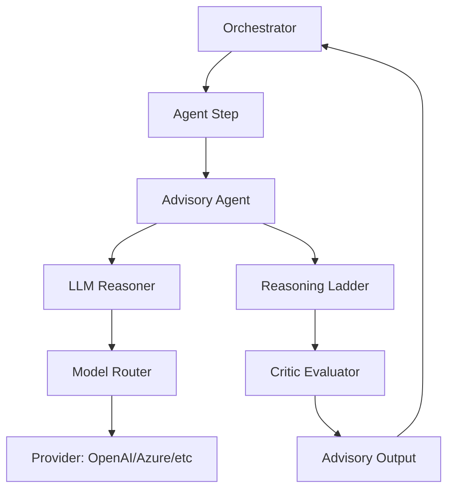

# System Design: Intelligence (SD-INT)

> **Component**: Intelligence Middleware  
> **Path**: `core/agents/`  
> **Tech Spec**: [INT-intelligence.md](../../03_technical_specifications/INT-intelligence.md)  
> **Last Updated**: 2026-01-16

---

## 1. Scope & Ownership

| Owns | Does Not Own |
|------|--------------|
| Advisory agent pattern | Control flow decisions (orchestrator) |
| Reasoning ladder execution | Tool execution |
| Critic evaluation | Action execution |
| LLM interaction abstraction | Token budget enforcement (governance) |
| Agent registration | Step execution |
| Model routing | Flow definition |
| Output recommendation | Final decision-making |

**Invariant**: INV-1 — Agents are advisory only. They RECOMMEND, never EXECUTE.

---

## 2. Intelligence Layer Overview

The Intelligence Layer provides:
- LLM-backed reasoning with structured outputs
- Advisory agents that emit recommendations
- Multi-phase reasoning ladders
- Critic evaluation for quality checks
- Model routing for provider abstraction



---

## 3. Module Structure

```
core/agents/
├── __init__.py
├── base.py                 # BaseAgent abstract class
├── registry.py             # AgentRegistry with factory pattern
├── advisory.py             # _AdvisoryAgent implementations
├── reasoning_ladder.py     # run_reasoning_ladder() function
├── critic_evaluator.py     # run_critic_evaluator() function
├── llm_reasoner.py         # LLM-backed reasoning helpers
└── advisors/               # Built-in advisory agent implementations
    ├── __init__.py
    ├── base.py
    ├── agent_selector.py
    ├── tool_selector.py
    ├── gap_finder.py
    ├── risk_explainer.py
    └── summarizer.py

core/models/
├── __init__.py
├── router.py               # ModelRouter for provider selection
└── providers/              # Provider implementations
    ├── __init__.py
    └── openai_provider.py  # OpenAI/Azure provider
```

---

## 4. External Contracts

### Public APIs

| Interface | Location | Purpose |
|-----------|----------|---------|
| `AgentRegistry.register()` | `core/agents/registry.py` | Register agent factory |
| `AgentRegistry.resolve()` | `core/agents/registry.py` | Get agent instance by name |
| `AgentRegistry.list_descriptors()` | `core/agents/registry.py` | List all agent descriptors |
| `BaseAgent` | `core/agents/base.py` | Abstract base agent class |
| `run_reasoning_ladder()` | `core/agents/reasoning_ladder.py` | Multi-phase reasoning function |
| `run_critic_evaluator()` | `core/agents/critic_evaluator.py` | Critic evaluation function |
| `ModelRouter.select()` | `core/models/router.py` | Select model for purpose |
| `OpenAIProvider` | `core/models/providers/openai_provider.py` | OpenAI API provider |

### Component Details

| Code Path | Code Name | Functional Details | Technical Details |
| --- | --- | --- | --- |
| `core/agents/advisory.py` | _AdvisoryAgent | Base advisory agent class. | Subclasses define `output_model`, `purpose`, `kind`. Uses `_call_reasoner()` for LLM interaction. |
| `core/agents/reasoning_ladder.py` | run_reasoning_ladder | Multi-phase LLM reasoning. | Phases: interpret → propose → select. Budget-aware with HITL escalation. Returns `ReasoningLadderResult`. |
| `core/agents/critic_evaluator.py` | run_critic_evaluator | Output quality evaluation. | Budget-aware. Returns `CriticResult` with `CriticOutput` or `CriticFailure`. |
| `core/agents/registry.py` | AgentRegistry | Agent factory registration. | Class-level registry. Stores `AgentRegistration` with factory, meta, descriptor. |
| `core/models/router.py` | ModelRouter | Model selection. | Routes by product/purpose. Returns `ModelSelection(provider, model)`. |
| `core/models/providers/openai_provider.py` | OpenAIProvider | OpenAI/Azure API wrapper. | Handles `OpenAIRequest` → `OpenAIResponse`. |

### Schemas

| Schema | Location | Purpose |
|--------|----------|---------|
| `AgentResult` | `core/contracts/agent_schema.py` | Agent execution result with `ok`, `data`, `error`, `meta` |
| `AgentDescriptor` | `core/contracts/descriptors_schema.py` | Agent metadata for discovery |
| `ReasoningLadderResult` | `core/contracts/reasoning_ladder_schema.py` | Reasoning ladder output |
| `CriticResult` | `core/contracts/critic_schema.py` | Critic evaluation output |
| `CriticOutput` | `core/contracts/critic_schema.py` | Critic recommendations |
| `ToolSelectorOutput` | `core/contracts/advisory_schema.py` | Tool selector agent output |
| `AgentSelectorOutput` | `core/contracts/advisory_schema.py` | Agent selector output |

---

## 5. Advisory Pattern

Agents follow a strict advisory pattern:

```python
class AdvisoryAgent:
    async def advise(self, context: Context) -> Advisory:
        """
        Produce a recommendation based on context.
        
        Returns:
            Advisory: Structured recommendation with:
                - action: Recommended action
                - confidence: Confidence score
                - reasoning: Explanation
                - artifacts: Supporting data
        """
```

### Advisory Output Structure

```python
@dataclass
class Advisory:
    action: str              # Recommended action
    confidence: float        # 0.0 - 1.0 confidence score
    reasoning: str           # Explanation of recommendation
    artifacts: dict          # Supporting data/evidence
    alternatives: list       # Alternative recommendations
```

### Rules

- Agents emit recommendations, not commands
- Orchestrator decides whether to follow recommendation
- Agents have no direct access to tools or state mutation
- All agent outputs are validated by governance

---

## 6. Reasoning Ladder

The Reasoning Ladder is a multi-phase reasoning pattern:

### Phases

```
┌─────────────┐     ┌─────────────┐     ┌─────────────┐     ┌─────────────┐
│  INTERPRET  │ ──► │   PROPOSE   │ ──► │   CRITIQUE  │ ──► │  RECOMMEND  │
└─────────────┘     └─────────────┘     └─────────────┘     └─────────────┘
      │                   │                   │                   │
      ▼                   ▼                   ▼                   ▼
  intent_frame       proposals[]         critique{}        recommendation
```

| Phase | Purpose | Output |
|-------|---------|--------|
| `INTERPRET` | Understand the request | Intent frame |
| `PROPOSE` | Generate candidate solutions | List of proposals |
| `CRITIQUE` | Evaluate proposals | Critique with scores |
| `RECOMMEND` | Select best option | Final recommendation |

### Ladder Configuration

```python
ladder = ReasoningLadder(
    phases=["interpret", "propose", "critique", "recommend"],
    max_passes=3,
    timeout_ms=30000
)
```

---

## 7. Critic Evaluator

The Critic Evaluator provides quality gates for agent outputs:

### Evaluation Criteria

| Criterion | Description |
|-----------|-------------|
| `correctness` | Is the output factually correct? |
| `relevance` | Does it address the request? |
| `completeness` | Are all requirements covered? |
| `coherence` | Is the reasoning logical? |
| `safety` | Does it follow safety guidelines? |

### Bounded Iteration

```python
critic = CriticEvaluator(
    max_iterations=3,
    min_score=0.7,
    criteria=["correctness", "relevance", "safety"]
)
```

The critic loops until:
- Minimum score is reached
- Maximum iterations exhausted
- A blocking issue is found

---

## 8. Model Routing

### Model Selection

```python
router = ModelRouter()
model = router.get_model("gpt-4o")  # Returns provider-abstracted model
```

### Provider Abstraction

| Provider | Location | Models Supported |
|----------|----------|------------------|
| OpenAI | `core/models/providers/openai.py` | gpt-4o, gpt-4o-mini, etc. |
| Azure | `core/models/providers/azure.py` | Azure OpenAI models |
| Anthropic | `core/models/providers/anthropic.py` | Claude models |

### Configuration

Models are configured in `configs/models.yaml`:

```yaml
models:
  gpt-4o:
    provider: openai
    max_tokens: 4096
    temperature: 0.7
  gpt-4o-mini:
    provider: openai
    max_tokens: 2048
    temperature: 0.5
```

---

## 9. Internal State & Lifecycles

### Bounded Execution

| Limit | Default | Configurable | Purpose |
|-------|---------|--------------|---------|
| `max_passes` | 3 | Yes | Limit reasoning iterations |
| `max_tool_calls` | 0 | Yes | Prevent tool calls in pure reasoning |
| `timeout_ms` | 30000 | Yes | Prevent runaway agents |

### Agent Lifecycle

```
┌──────────┐    invoke    ┌──────────┐    reason    ┌──────────┐
│  READY   │ ──────────►  │ RUNNING  │ ──────────►  │ COMPLETE │
└──────────┘              └────┬─────┘              └──────────┘
                               │
                      timeout/error
                               │
                               ▼
                          ┌──────────┐
                          │  FAILED  │
                          └──────────┘
```

---

## 10. Governance Integration

### Pre-Model Hook

Before any model call:
```python
governance.before_model_call(model_name, prompt, context)
# May block if model not allowed
```

### Agent Output Validation

After agent produces output:
```python
governance.validate_agent_output(output, context)
# Rejects control fields, invalid shapes
```

### Token Budget

All model calls count against run token budget:
- Budget checked before call
- Token usage tracked after call
- Budget exceeded → escalation or failure

---

## 11. Observability

| Event | When | Payload |
|-------|------|---------|
| `agent.invoked` | Agent called | `{agent_name, input_summary}` |
| `agent.completed` | Agent finished | `{agent_name, duration_ms}` |
| `agent.timeout` | Agent timed out | `{agent_name, timeout_ms}` |
| `agent.error` | Agent failed | `{agent_name, error}` |
| `ladder.phase` | Reasoning phase started | `{phase, pass_number}` |
| `ladder.bounded` | Max passes reached | `{max_passes}` |
| `critic.evaluated` | Critique completed | `{score, issues_count}` |
| `critic.bounded` | Critique bounded | `{max_iterations}` |
| `model.called` | Model invocation | `{model_name, tokens}` |
| `model.response` | Model response received | `{model_name, duration_ms}` |

### Artifacts

| Artifact | Format | When |
|----------|--------|------|
| `advisory` | JSON | Every agent invocation |
| `ladder_stage_{n}` | JSON | Each reasoning phase |
| `critique` | JSON | After critic evaluation |
| `model_request` | JSON | Each model call (redacted) |
| `model_response` | JSON | Each model response (redacted) |

---

## 12. Tech Spec Coverage

See [SD-COVERAGE.md](../SD-COVERAGE.md#intelligence-int) for full matrix.

| Category | Status |
|----------|--------|
| Advisory (INT-ADV-*) | ✅ All Implemented |
| Reasoning Ladder (INT-LADDER-*) | 🟡 Mostly Implemented |
| Critic (INT-CRITIC-*) | ✅ All Implemented |
| Model Router (INT-MODEL-*) | ✅ All Implemented |

---

## 13. Files

| File | Purpose |
|------|---------|
| `core/agents/__init__.py` | Module exports |
| `core/agents/base.py` | Base agent class |
| `core/agents/registry.py` | Agent registration |
| `core/agents/advisory.py` | Advisory pattern |
| `core/agents/reasoning_ladder.py` | Multi-phase reasoning |
| `core/agents/critic_evaluator.py` | Critique evaluation |
| `core/agents/llm_reasoner.py` | LLM-backed reasoning |
| `core/models/__init__.py` | Model module exports |
| `core/models/router.py` | LLM routing |
| `core/models/providers/` | Provider implementations |

---

## See Also

- [SD-ARCH.md](../SD-ARCH.md) — Architecture overview
- [SD-ORC.md](SD-ORC.md) — Orchestration (invokes agents)
- [SD-GOV.md](SD-GOV.md) — Governance (validates outputs)
