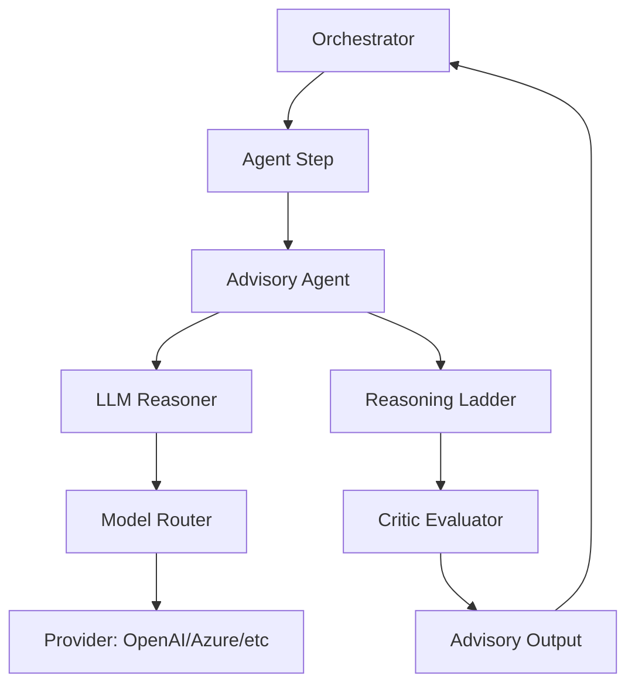
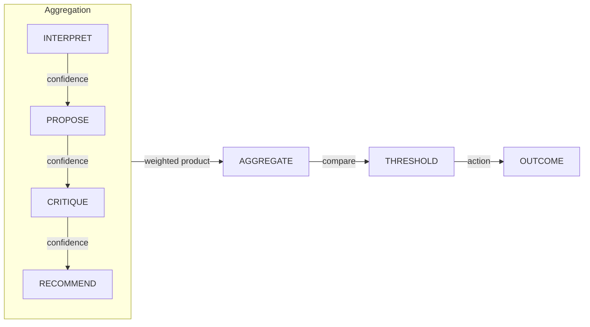

# System Design: Intelligence (SD-INT)

> **Component**: Intelligence Middleware  
> **Version**: 1.2  
> **Path**: `core/agents/`, `core/knowledge/`  
> **Tech Spec**: [INT-intelligence.md](../../03_techspec/INT-intelligence.md)  
> **Last Updated**: 2026-01-20  

---

## Version Control

| Version | Date | Changes |
|---------|------|---------|
| 1.2 | 2026-01-20 | Added V1.3 Hypothesis Management, SufficiencyState, Confidence, ContextPack Freeze sections |
| 1.1 | 2026-01-13 | Header version normalization |

## 1. Scope & Ownership

| Owns | Does Not Own |
|------|--------------|
| Advisory agent pattern | Control flow decisions (orchestrator) |
| Reasoning ladder execution | Tool execution |
| Critic evaluation | Action execution |
| LLM interaction abstraction | Token budget enforcement (governance) |
| Agent registration | Step execution |
| Model routing | Flow definition |
| Output recommendation | Final decision-making |

**Invariant**: INV-1 — Agents are advisory only. They RECOMMEND, never EXECUTE.

---

## 2. Intelligence Layer Overview

The Intelligence Layer provides:
- LLM-backed reasoning with structured outputs
- Advisory agents that emit recommendations
- Multi-phase reasoning ladders
- Critic evaluation for quality checks
- Model routing for provider abstraction



---

## 3. Module Structure

```
core/agents/
├── __init__.py
├── base.py                 # BaseAgent abstract class
├── registry.py             # AgentRegistry with factory pattern
├── advisory.py             # _AdvisoryAgent implementations
├── reasoning_ladder.py     # run_reasoning_ladder() function
├── critic_evaluator.py     # run_critic_evaluator() function
├── llm_reasoner.py         # LLM-backed reasoning helpers
└── advisors/               # Built-in advisory agent implementations
    ├── __init__.py
    ├── base.py
    ├── agent_selector.py
    ├── tool_selector.py
    ├── gap_finder.py
    ├── risk_explainer.py
    └── summarizer.py

core/models/
├── __init__.py
├── router.py               # ModelRouter for provider selection
└── providers/              # Provider implementations
    ├── __init__.py
    └── openai_provider.py  # OpenAI/Azure provider
```

---

## 4. External Contracts

### Public APIs

| Interface | Location | Purpose |
|-----------|----------|---------|
| `AgentRegistry.register()` | `core/agents/registry.py` | Register agent factory |
| `AgentRegistry.resolve()` | `core/agents/registry.py` | Get agent instance by name |
| `AgentRegistry.list_descriptors()` | `core/agents/registry.py` | List all agent descriptors |
| `BaseAgent` | `core/agents/base.py` | Abstract base agent class |
| `run_reasoning_ladder()` | `core/agents/reasoning_ladder.py` | Multi-phase reasoning function |
| `run_critic_evaluator()` | `core/agents/critic_evaluator.py` | Critic evaluation function |
| `ModelRouter.select()` | `core/models/router.py` | Select model for purpose |
| `OpenAIProvider` | `core/models/providers/openai_provider.py` | OpenAI API provider |

### Component Details

| Code Path | Code Name | Functional Details | Technical Details |
| --- | --- | --- | --- |
| `core/agents/advisory.py` | _AdvisoryAgent | Base advisory agent class. | Subclasses define `output_model`, `purpose`, `kind`. Uses `_call_reasoner()` for LLM interaction. |
| `core/agents/reasoning_ladder.py` | run_reasoning_ladder | Multi-phase LLM reasoning. | Phases: interpret → propose → select. Budget-aware with HITL escalation. Returns `ReasoningLadderResult`. |
| `core/agents/critic_evaluator.py` | run_critic_evaluator | Output quality evaluation. | Budget-aware. Returns `CriticResult` with `CriticOutput` or `CriticFailure`. |
| `core/agents/registry.py` | AgentRegistry | Agent factory registration. | Class-level registry. Stores `AgentRegistration` with factory, meta, descriptor. |
| `core/models/router.py` | ModelRouter | Model selection. | Routes by product/purpose. Returns `ModelSelection(provider, model)`. |
| `core/models/providers/openai_provider.py` | OpenAIProvider | OpenAI/Azure API wrapper. | Handles `OpenAIRequest` → `OpenAIResponse`. |

### Schemas

| Schema | Location | Purpose |
|--------|----------|---------|
| `AgentResult` | `core/contracts/agent_schema.py` | Agent execution result with `ok`, `data`, `error`, `meta` |
| `AgentDescriptor` | `core/contracts/descriptors_schema.py` | Agent metadata for discovery |
| `ReasoningLadderResult` | `core/contracts/reasoning_ladder_schema.py` | Reasoning ladder output |
| `CriticResult` | `core/contracts/critic_schema.py` | Critic evaluation output |
| `CriticOutput` | `core/contracts/critic_schema.py` | Critic recommendations |
| `ToolSelectorOutput` | `core/contracts/advisory_schema.py` | Tool selector agent output |
| `AgentSelectorOutput` | `core/contracts/advisory_schema.py` | Agent selector output |

---

## 5. Advisory Pattern

Agents follow a strict advisory pattern:

```python
class AdvisoryAgent:
    async def advise(self, context: Context) -> Advisory:
        """
        Produce a recommendation based on context.
        
        Returns:
            Advisory: Structured recommendation with:
                - action: Recommended action
                - confidence: Confidence score
                - reasoning: Explanation
                - artifacts: Supporting data
        """
```

### Advisory Output Structure

```python
@dataclass
class Advisory:
    action: str              # Recommended action
    confidence: float        # 0.0 - 1.0 confidence score
    reasoning: str           # Explanation of recommendation
    artifacts: dict          # Supporting data/evidence
    alternatives: list       # Alternative recommendations
```

### Rules

- Agents emit recommendations, not commands
- Orchestrator decides whether to follow recommendation
- Agents have no direct access to tools or state mutation
- All agent outputs are validated by governance

---

## 6. Reasoning Ladder

The Reasoning Ladder is a multi-phase reasoning pattern:

### Phases

```
┌─────────────┐     ┌─────────────┐     ┌─────────────┐     ┌─────────────┐
│  INTERPRET  │ ──► │   PROPOSE   │ ──► │   CRITIQUE  │ ──► │  RECOMMEND  │
└─────────────┘     └─────────────┘     └─────────────┘     └─────────────┘
      │                   │                   │                   │
      ▼                   ▼                   ▼                   ▼
  intent_frame       proposals[]         critique{}        recommendation
```

| Phase | Purpose | Output |
|-------|---------|--------|
| `INTERPRET` | Understand the request | Intent frame |
| `PROPOSE` | Generate candidate solutions | List of proposals |
| `CRITIQUE` | Evaluate proposals | Critique with scores |
| `RECOMMEND` | Select best option | Final recommendation |

### Ladder Configuration

```python
ladder = ReasoningLadder(
    phases=["interpret", "propose", "critique", "recommend"],
    max_passes=3,
    timeout_ms=30000
)
```

---

## 7. Critic Evaluator

The Critic Evaluator provides quality gates for agent outputs:

### Evaluation Criteria

| Criterion | Description |
|-----------|-------------|
| `correctness` | Is the output factually correct? |
| `relevance` | Does it address the request? |
| `completeness` | Are all requirements covered? |
| `coherence` | Is the reasoning logical? |
| `safety` | Does it follow safety guidelines? |

### Bounded Iteration

```python
critic = CriticEvaluator(
    max_iterations=3,
    min_score=0.7,
    criteria=["correctness", "relevance", "safety"]
)
```

The critic loops until:
- Minimum score is reached
- Maximum iterations exhausted
- A blocking issue is found

---

## 8. Model Routing

### Model Selection

```python
router = ModelRouter()
model = router.get_model("gpt-4o")  # Returns provider-abstracted model
```

### Provider Abstraction

| Provider | Location | Models Supported |
|----------|----------|------------------|
| OpenAI | `core/models/providers/openai.py` | gpt-4o, gpt-4o-mini, etc. |
| Azure | `core/models/providers/azure.py` | Azure OpenAI models |
| Anthropic | `core/models/providers/anthropic.py` | Claude models |

### Configuration

Models are configured in `configs/models.yaml`:

```yaml
models:
  gpt-4o:
    provider: openai
    max_tokens: 4096
    temperature: 0.7
  gpt-4o-mini:
    provider: openai
    max_tokens: 2048
    temperature: 0.5
```

---

## 9. Internal State & Lifecycles

### Bounded Execution

| Limit | Default | Configurable | Purpose |
|-------|---------|--------------|---------|
| `max_passes` | 3 | Yes | Limit reasoning iterations |
| `max_tool_calls` | 0 | Yes | Prevent tool calls in pure reasoning |
| `timeout_ms` | 30000 | Yes | Prevent runaway agents |

### Agent Lifecycle

```
┌──────────┐    invoke    ┌──────────┐    reason    ┌──────────┐
│  READY   │ ──────────►  │ RUNNING  │ ──────────►  │ COMPLETE │
└──────────┘              └────┬─────┘              └──────────┘
                               │
                      timeout/error
                               │
                               ▼
                          ┌──────────┐
                          │  FAILED  │
                          └──────────┘
```

---

## 10. Governance Integration

### Pre-Model Hook

Before any model call:
```python
governance.before_model_call(model_name, prompt, context)
# May block if model not allowed
```

### Agent Output Validation

After agent produces output:
```python
governance.validate_agent_output(output, context)
# Rejects control fields, invalid shapes
```

### Token Budget

All model calls count against run token budget:
- Budget checked before call
- Token usage tracked after call
- Budget exceeded → escalation or failure

---

## 11. Observability

| Event | When | Payload |
|-------|------|---------|
| `agent.invoked` | Agent called | `{agent_name, input_summary}` |
| `agent.completed` | Agent finished | `{agent_name, duration_ms}` |
| `agent.timeout` | Agent timed out | `{agent_name, timeout_ms}` |
| `agent.error` | Agent failed | `{agent_name, error}` |
| `ladder.phase` | Reasoning phase started | `{phase, pass_number}` |
| `ladder.bounded` | Max passes reached | `{max_passes}` |
| `critic.evaluated` | Critique completed | `{score, issues_count}` |
| `critic.bounded` | Critique bounded | `{max_iterations}` |
| `model.called` | Model invocation | `{model_name, tokens}` |
| `model.response` | Model response received | `{model_name, duration_ms}` |

### Artifacts

| Artifact | Format | When |
|----------|--------|------|
| `advisory` | JSON | Every agent invocation |
| `ladder_stage_{n}` | JSON | Each reasoning phase |
| `critique` | JSON | After critic evaluation |
| `model_request` | JSON | Each model call (redacted) |
| `model_response` | JSON | Each model response (redacted) |

---

## 11.1. Hypothesis Management (V1.3)

The Intelligence layer manages competing hypotheses with structured evidence and confidence tracking.

### Hypothesis Structure

| Field | Type | Purpose | Tech Spec |
|-------|------|---------|-----------|
| `id` | `str` | Unique hypothesis identifier | INT-HYP-002 |
| `description` | `str` | Human-readable description | INT-HYP-002 |
| `confidence` | `float` | Confidence score 0.0-1.0 | INT-HYP-002 |
| `evidence_refs` | `List[EvidenceRef]` | Supporting evidence references | INT-HYP-002 |
| `created_at` | `datetime` | Creation timestamp | INT-HYP-002 |
| `source_phase` | `str` | Reasoning phase that created it | INT-HYP-002 |

### EvidenceRef Structure

| Field | Type | Purpose |
|-------|------|---------|
| `evidence_id` | `str` | Reference to evidence |
| `source_tool` | `Optional[str]` | Tool that produced evidence |
| `confidence` | `float` | Evidence confidence |
| `summary` | `str` | Evidence summary |

### HypothesisSet

| Field | Type | Purpose | Tech Spec |
|-------|------|---------|-----------|
| `hypotheses` | `List[Hypothesis]` | All hypotheses in set | INT-HYP-003 |
| `created_at` | `datetime` | Set creation timestamp | INT-HYP-003 |
| `context_hash` | `str` | Hash of context at creation | INT-HYP-003 |
| `frozen` | `bool` | Immutability flag | INT-HYP-004 |

**Invariant**: Frozen HypothesisSet cannot be modified (INT-HYP-004). All hypotheses retained for audit (INT-HYP-005).

### Hypothesis Selection

The `select_hypothesis()` function chooses the best hypothesis:

```python
# core/knowledge/hypothesis_selector.py
def select_hypothesis(
    hypothesis_set: HypothesisSet,
    confidence_margin: float = 0.1
) -> HypothesisSelectionResult:
    """
    Select best hypothesis with confidence margin handling.
    
    - Returns highest confidence hypothesis (INT-HYP-SEL-002)
    - If top 2 within margin: escalate to ASK_USER (INT-HYP-SEL-003)
    - Emits hypothesis_selected event (INT-HYP-SEL-004)
    - Records rejection reasons (INT-HYP-SEL-005)
    """
```

### Selection Trace Events

| Event | Trigger | Payload | Tech Spec |
|-------|---------|---------|-----------|
| `hypothesis_selected` | Selection completes | `{run_id, selected_id, confidence, rejected_count}` | INT-HYP-SEL-004 |

### Implementation Files

| File | Purpose |
|------|---------|
| `core/contracts/hypothesis_schema.py` | EvidenceRef, Hypothesis, HypothesisSet models |
| `core/knowledge/hypothesis_selector.py` | select_hypothesis() function, HypothesisSelectionResult |
| `core/memory/tracing.py` | HYPOTHESIS_SELECTED event type |

---

## 11.2. SufficiencyState (V1.3)

The Intelligence layer tracks what is known, unknown, assumed, and missing per run.

### SufficiencyState Structure

| Field | Type | Purpose | Tech Spec |
|-------|------|---------|-----------|
| `run_id` | `str` | Associated run | INT-SUFF-001 |
| `facts` | `List[Fact]` | Verified evidence | INT-SUFF-002 |
| `unknowns` | `List[Unknown]` | Unresolved questions | INT-SUFF-003 |
| `assumptions` | `List[Assumption]` | Assumptions with confidence | INT-SUFF-004 |
| `gaps` | `List[Gap]` | Missing information | INT-SUFF-005 |
| `last_updated` | `datetime` | Last state update | INT-SUFF-001 |

### Component Models

```python
# core/contracts/sufficiency_schema.py
class Fact(BaseModel):
    fact_id: str
    statement: str
    evidence_refs: List[str]
    verified_at: datetime

class Unknown(BaseModel):
    unknown_id: str
    question: str
    priority: str  # "high", "medium", "low"
    blocking: bool

class Assumption(BaseModel):
    assumption_id: str
    statement: str
    confidence: float  # 0.0-1.0
    source: str

class Gap(BaseModel):
    gap_id: str
    description: str
    blocking: bool
    resolution_hint: Optional[str]
```

### SufficiencyState Lifecycle

| Operation | Description | Tech Spec |
|-----------|-------------|-----------|
| Persist after reasoning | State saved after each pass | INT-SUFF-LC-001 |
| Update from evidence | New evidence resolves unknowns/gaps | INT-SUFF-LC-002 |
| Emit state updated | Each change emits trace event | INT-SUFF-LC-003 |
| Restore for resume | State restored on run resume | INT-SUFF-LC-004 |
| Check for proceed | Run proceeds if gaps.blocking==0 | INT-SUFF-LC-005 |

### SufficiencyManager

```python
# core/knowledge/sufficiency_manager.py
class SufficiencyManager:
    def create_state(self, run_id: str) -> SufficiencyState: ...
    def add_fact(self, state: SufficiencyState, fact: Fact) -> None: ...
    def add_unknown(self, state: SufficiencyState, unknown: Unknown) -> None: ...
    def add_assumption(self, state: SufficiencyState, assumption: Assumption) -> None: ...
    def add_gap(self, state: SufficiencyState, gap: Gap) -> None: ...
    def resolve_unknown(self, state: SufficiencyState, unknown_id: str, resolution: str) -> None: ...
    def resolve_gap(self, state: SufficiencyState, gap_id: str) -> None: ...
    def can_proceed(self, state: SufficiencyState) -> Tuple[bool, List[Gap]]: ...
    def persist(self, state: SufficiencyState, memory: MemoryBackend) -> None: ...
    def restore(self, run_id: str, memory: MemoryBackend) -> Optional[SufficiencyState]: ...
    def get_state_updated_payload(self, state: SufficiencyState) -> Dict[str, Any]: ...
```

### Trace Events

| Event | Trigger | Payload | Tech Spec |
|-------|---------|---------|-----------|
| `sufficiency_state_updated` | State changes | `{run_id, facts_count, unknowns_count, assumptions_count, gaps_count, blocking_gaps}` | INT-SUFF-LC-003 |

### Implementation Files

| File | Purpose |
|------|---------|
| `core/contracts/sufficiency_schema.py` | Fact, Unknown, Assumption, Gap, SufficiencyState models |
| `core/knowledge/sufficiency_manager.py` | SufficiencyManager class |
| `core/memory/tracing.py` | SUFFICIENCY_STATE_UPDATED event type |
| `core/memory/in_memory.py` | persist_sufficiency_state(), restore_sufficiency_state() |
| `core/memory/sqlite_backend.py` | persist_sufficiency_state(), restore_sufficiency_state() |

---

## 11.3. Confidence as Runtime Signal (V1.3)

Confidence flows through all reasoning phases as a first-class runtime signal.

### Confidence Flow



### Confidence Functions

| Function | Purpose | Tech Spec |
|----------|---------|-----------|
| `get_phase_confidence(output)` | Extract confidence from phase output | INT-CONF-002 |
| `aggregate_confidence(confidences, weights)` | Weighted product formula | INT-CONF-003 |
| `aggregate_phase_confidences(...)` | Aggregate all 4 phases | INT-CONF-001 |
| `check_confidence_threshold(conf, threshold)` | Evaluate against threshold | INT-CONF-004 |

### Aggregation Formula

```
aggregate_confidence = Π(c_i ^ w_i) where Σw_i = 1.0
```

- Weights normalized to sum to 1.0
- Confidence clamped to [0.0, 1.0]
- Zero in any component → zero aggregate

### ConfidenceThresholdAction

| Action | When | Description |
|--------|------|-------------|
| `PROCEED` | conf >= threshold | Continue execution |
| `ASK_USER` | conf >= 80% of threshold | Request user clarification |
| `HITL` | conf >= 50% of threshold | Escalate to human |
| `ABORT` | conf < 50% of threshold | Abort run |

### Trace Events

| Event | Trigger | Payload | Tech Spec |
|-------|---------|---------|-----------|
| `confidence_below_threshold` | Threshold violated | `{run_id, confidence, threshold, action}` | INT-CONF-005 |
| `confidence_aggregated` | Aggregation complete | `{run_id, aggregate, components}` | INT-CONF-005 |

### Implementation Files

| File | Purpose |
|------|---------|
| `core/knowledge/confidence.py` | ConfidenceThresholdAction, aggregate_confidence(), etc. |
| `core/memory/tracing.py` | CONFIDENCE_BELOW_THRESHOLD, CONFIDENCE_AGGREGATED events |

---

## 11.4. Confidence Thresholds (V1.3)

Confidence thresholds are configurable with governance floor enforcement.

### Configuration

| Setting | Default | Floor | Tech Spec |
|---------|---------|-------|-----------|
| `reasoning_confidence_threshold` | 0.7 | 0.5 | INT-CONF-THR-001, INT-CONF-THR-005 |
| Per-product override | — | 0.5 | INT-CONF-THR-002 |

### Threshold Resolution

```python
# core/knowledge/confidence.py
CONFIDENCE_THRESHOLD_FLOOR = 0.5  # Governance floor

def resolve_confidence_threshold(
    product_id: str,
    global_threshold: float = 0.7,
    by_product: Optional[Dict[str, Dict]] = None
) -> float:
    """
    Resolve threshold with floor enforcement.
    - Product override takes precedence
    - Floor enforced at both config and runtime
    """
```

### Threshold Trace Events

| Event | Trigger | Payload | Tech Spec |
|-------|---------|---------|-----------|
| `confidence_threshold_violated` | Below threshold | `{run_id, actual, threshold, action, product_id}` | INT-CONF-THR-004 |

### Implementation Files

| File | Purpose |
|------|---------|
| `core/knowledge/confidence.py` | CONFIDENCE_THRESHOLD_FLOOR, resolve_confidence_threshold() |
| `core/config/schema.py` | reasoning_confidence_threshold field in PoliciesConfig |
| `core/memory/tracing.py` | CONFIDENCE_THRESHOLD_VIOLATED event type |

---

## 11.5. ContextPack Freeze (V1.3)

ContextPack becomes immutable before plan generation to ensure evidence integrity.

### Freeze Fields

| Field | Type | Purpose | Tech Spec |
|-------|------|---------|-----------|
| `frozen` | `bool` | Immutability flag | INT-CP-FREEZE-001 |
| `frozen_at` | `datetime` | Freeze timestamp | INT-CP-FREEZE-002 |
| `frozen_hash` | `str` | SHA-256 content hash | INT-CP-FREEZE-002 |

### Freeze Behavior

```python
# core/contracts/context_pack_schema.py
class ContextPack(BaseModel):
    # ... existing fields ...
    frozen: bool = False
    frozen_at: Optional[datetime] = None
    frozen_hash: Optional[str] = None
    
    def freeze(self) -> str:
        """Freeze the ContextPack and return hash."""
        if self.frozen:
            raise ContextPackFrozenError("Already frozen")
        self.frozen = True
        self.frozen_at = datetime.utcnow()
        self.frozen_hash = self._compute_hash()
        return self.frozen_hash
    
    def add_evidence(self, entry: EvidenceEntry) -> None:
        self._check_not_frozen()
        self.evidence.append(entry)
    
    def _check_not_frozen(self) -> None:
        if self.frozen:
            raise ContextPackFrozenError("Cannot modify frozen ContextPack")
```

### Exceptions

| Exception | When | Tech Spec |
|-----------|------|-----------|
| `ContextPackFrozenError` | Modify frozen pack | INT-CP-FREEZE-003 |
| `ContextPackNotFrozenError` | Execute without freeze | INT-CP-FREEZE-LC-003 |

### Freeze Lifecycle

| Step | Description | Tech Spec |
|------|-------------|-----------|
| 1. Gather evidence | ContextPack accumulates evidence | — |
| 2. Freeze | `freeze()` makes immutable | INT-CP-FREEZE-001 |
| 3. Emit event | `context_pack_frozen` traced | INT-CP-FREEZE-LC-001 |
| 4. Persist | Frozen pack stored | INT-CP-FREEZE-LC-002 |
| 5. Validate | Plan executor checks frozen | INT-CP-FREEZE-LC-003 |

### Trace Events

| Event | Trigger | Payload | Tech Spec |
|-------|---------|---------|-----------|
| `context_pack_frozen` | ContextPack frozen | `{run_id, frozen_hash, evidence_count}` | INT-CP-FREEZE-LC-001 |

### Persistence

```python
# core/memory/base.py
class MemoryBackend(ABC):
    @abstractmethod
    def persist_context_pack(self, run_id: str, context_pack: ContextPack) -> None: ...
    
    @abstractmethod
    def restore_context_pack(self, run_id: str) -> Optional[ContextPack]: ...
```

### Implementation Files

| File | Purpose |
|------|---------|
| `core/contracts/context_pack_schema.py` | ContextPackFrozenError, freeze fields, freeze(), mutation guards |
| `core/memory/tracing.py` | CONTEXT_PACK_FROZEN event type |
| `core/memory/base.py` | persist_context_pack(), restore_context_pack() abstract methods |
| `core/memory/router.py` | persist_context_pack(), restore_context_pack() delegation |
| `core/memory/in_memory.py` | _context_packs storage, implementation |
| `core/memory/sqlite_backend.py` | summary_json field storage |

---

## 12. Tech Spec Coverage

See [SD-COVERAGE.md](../SD-COVERAGE.md#intelligence-int) for full matrix.

| Category | Status |
|----------|--------|
| Advisory (INT-ADV-*) | ✅ All Implemented |
| Reasoning Ladder (INT-LADDER-*) | ✅ All Implemented |
| Critic (INT-CRITIC-*) | ✅ All Implemented |
| Model Router (INT-MODEL-*) | ✅ All Implemented |
| Hypothesis Management (INT-HYP-*) | ✅ All Implemented (V1.3) |
| Hypothesis Selection (INT-HYP-SEL-*) | ✅ All Implemented (V1.3) |
| Sufficiency State (INT-SUFF-*) | ✅ All Implemented (V1.3) |
| Sufficiency Lifecycle (INT-SUFF-LC-*) | ✅ All Implemented (V1.3) |
| Confidence (INT-CONF-*) | ✅ All Implemented (V1.3) |
| Confidence Threshold (INT-CONF-THR-*) | ✅ All Implemented (V1.3) |
| ContextPack Freeze (INT-CP-FREEZE-*) | ✅ All Implemented (V1.3) |
| ContextPack Freeze Lifecycle (INT-CP-FREEZE-LC-*) | ✅ All Implemented (V1.3) |

---

## 13. Files

| File | Purpose |
|------|---------|
| `core/agents/__init__.py` | Module exports |
| `core/agents/base.py` | Base agent class |
| `core/agents/registry.py` | Agent registration |
| `core/agents/advisory.py` | Advisory pattern |
| `core/agents/reasoning_ladder.py` | Multi-phase reasoning |
| `core/agents/critic_evaluator.py` | Critique evaluation |
| `core/agents/llm_reasoner.py` | LLM-backed reasoning |
| `core/knowledge/__init__.py` | Knowledge module exports |
| `core/knowledge/hypothesis_selector.py` | Hypothesis selection (V1.3) |
| `core/knowledge/sufficiency_manager.py` | Sufficiency state management (V1.3) |
| `core/knowledge/confidence.py` | Confidence functions (V1.3) |
| `core/contracts/hypothesis_schema.py` | Hypothesis models (V1.3) |
| `core/contracts/sufficiency_schema.py` | Sufficiency models (V1.3) |
| `core/contracts/context_pack_schema.py` | ContextPack with freeze (V1.3) |
| `core/models/__init__.py` | Model module exports |
| `core/models/router.py` | LLM routing |
| `core/models/providers/` | Provider implementations |

---

## See Also

- [SD-ARCH.md](../SD-ARCH.md) — Architecture overview
- [SD-ORC.md](SD-ORC.md) — Orchestration (invokes agents)
- [SD-GOV.md](SD-GOV.md) — Governance (validates outputs)
