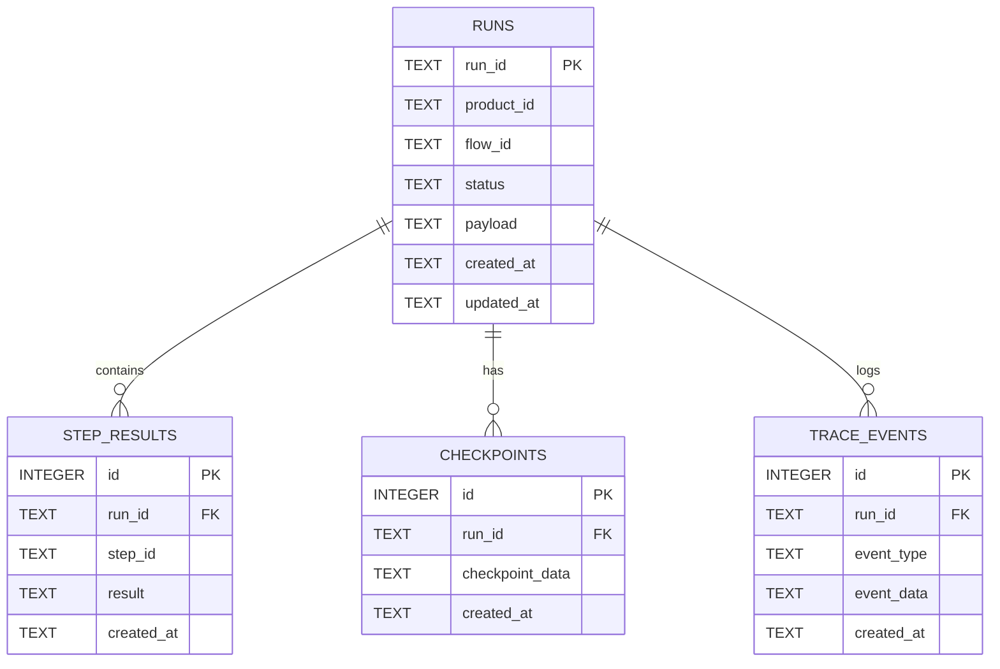
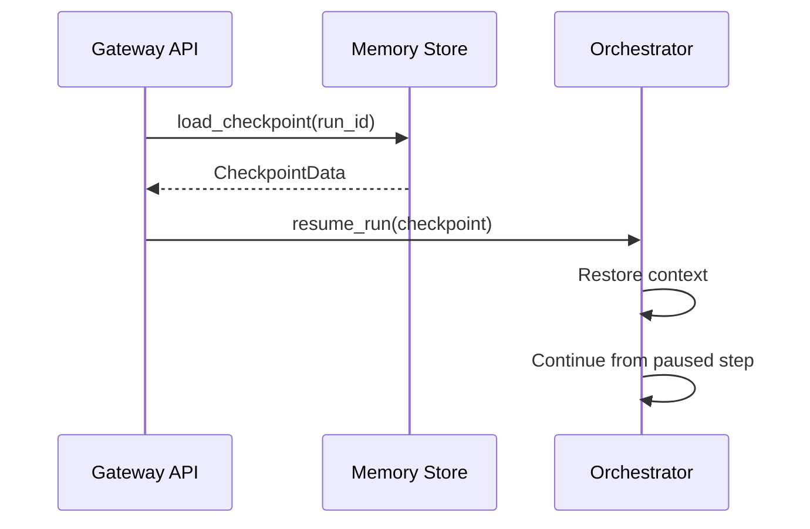

# System Design: Memory (SD-MEM)

> **Component**: Memory & Persistence Layer  
> **Version**: 1.2  
> **Path**: `core/memory/`  
> **Tech Spec**: [MEM-memory.md](../../03_techspec/MEM-memory.md)  
> **Last Updated**: 2026-01-20  

---

## Version Control

| Version | Date | Changes |
|---------|------|---------|
| 1.2 | 2026-01-20 | Added V1.3 Explainability and Reproducibility sections |
| 1.1 | 2026-01-13 | Header version normalization |

## 1. Scope & Ownership

| Owns | Does Not Own |
|------|--------------|
| Run/step persistence | Trace analysis |
| Memory backends (SQLite, In-Memory) | Telemetry export |
| Session isolation | Governance enforcement |
| Message history | LLM calls |
| Checkpoint/resume | Flow definition |
| Run-scoped data lifecycle | Cross-run aggregation |
| Tracing event emission | Metric aggregation |
| SQLite state tables | Vector storage |

---

## 2. Memory Design Principles

- Memory is pluggable; default is SQLite
- In-memory backend available for ephemeral testing
- Storage isolation: `storage/memory/{product}/`
- Every run has an isolated memory scope
- Memory router dispatches to appropriate backend

---

## 3. Module Structure

```
core/memory/
├── __init__.py
├── base.py               # Abstract memory store interface
├── in_memory.py          # In-memory ephemeral backend
├── sqlite_backend.py     # SQLite persistent backend
├── observability_store.py # Trace event storage
├── router.py             # Backend selection and routing
└── tracing.py            # Trace event emission
```

---

## 4. External Contracts

### Public APIs

| Interface | Location | Purpose |
|-----------|----------|---------|
| `MemoryBackend` | `core/memory/base.py` | Abstract backend interface |
| `InMemoryBackend` | `core/memory/in_memory.py` | Testing backend |
| `SQLiteBackend` | `core/memory/sqlite_backend.py` | Persistent backend |
| `MemoryRouter` | `core/memory/router.py` | Backend routing and delegation |
| `Tracer.emit()` | `core/memory/tracing.py` | Emit trace event |
| `ObservabilityStore` | `core/memory/observability_store.py` | File-based observability storage |
| `ApprovalRecord` | `core/memory/base.py` | HITL approval record |
| `RunBundle` | `core/memory/base.py` | Bundled run data for retrieval |

### Component Details

| Code Path | Code Name | Functional Details | Technical Details |
| --- | --- | --- | --- |
| `core/memory/base.py` | MemoryBackend | Abstract base class for persistence. | Defines `create_run`, `update_run_status`, `add_step`, `add_event`, `create_approval`, `resolve_approval`. |
| `core/memory/in_memory.py` | InMemoryBackend | Ephemeral store for tests. | Dictionary-backed; no disk writes. |
| `core/memory/sqlite_backend.py` | SQLiteBackend | Persistent store. | WAL mode, JSON fields as TEXT, schema versioning, 30s timeout. |
| `core/memory/router.py` | MemoryRouter | Delegates to chosen backend. | Also maintains ObservabilityStore for file-based trace mirroring. |
| `core/memory/observability_store.py` | ObservabilityStore | File-based trace storage. | Writes to `observability/<product>/<run_id>/` directories. |
| `core/memory/tracing.py` | Tracer | Trace emission pipeline. | Sanitizes via SecurityRedactor before persistence. Optional log mirroring. |

### Schemas

| Schema | Location | Purpose |
|--------|----------|---------|
| `TraceEvent` | `core/contracts/run_schema.py` | Trace event structure |
| `RunRecord` | `core/contracts/run_schema.py` | Run record structure |
| `StepRecord` | `core/contracts/run_schema.py` | Step record structure |
| `ApprovalRecord` | `core/memory/base.py` | HITL approval record |
| `RunBundle` | `core/memory/base.py` | Bundled run + steps + events + approvals |

---

## 5. Internal State & Lifecycles

### Backend Interface

```python
class MemoryBackend(ABC):
    """Interface used by core.orchestrator and core.memory.Tracer."""
    
    @abstractmethod
    def create_run(self, run: RunRecord) -> None: ...
    
    @abstractmethod
    def update_run_status(self, run_id: str, status: str, *, summary: Optional[Dict[str, Any]] = None) -> None: ...
    
    @abstractmethod
    def update_run_output(self, run_id: str, *, output: Optional[Dict[str, Any]]) -> None: ...
    
    @abstractmethod
    def add_step(self, step: StepRecord) -> None: ...
    
    @abstractmethod
    def update_step(self, run_id: str, step_id: str, patch: Dict[str, Any]) -> None: ...
    
    @abstractmethod
    def add_event(self, event: TraceEvent) -> None: ...
    
    def append_trace_event(self, event: TraceEvent) -> None: ...
    
    @abstractmethod
    def create_approval(self, approval: ApprovalRecord) -> None: ...
    
    @abstractmethod
    def resolve_approval(self, approval_id: str, *, decision: str, resolved_by: Optional[str], comment: Optional[str]) -> None: ...
```

### SQLite Schema

The persistent backend uses SQLite with the following tables:



### Storage Layout

```
storage/memory/{product}/
├── runs.db              # SQLite database
└── {run_id}/
    ├── run.json         # Run metadata (optional export)
    ├── state.json       # Current state snapshot
    ├── trace.jsonl      # Trace events (JSON Lines)
    └── steps/
        ├── step_0.json  # Step 0 result
        ├── step_1.json  # Step 1 result
        └── ...
```

### Storage Isolation

Each product has isolated storage:

```
storage/
└── memory/
    ├── hello_world/
    │   └── runs.db
    ├── ade/
    │   └── runs.db
    └── {product}/
        └── runs.db
```

Rules:
- Products cannot access each other's databases
- Storage paths are derived from product ID
- No cross-product queries

### Run Lifecycle State Mapping

| Run Status | Memory Operations |
|------------|-------------------|
| `CREATED` | Initial `save_state()` |
| `RUNNING` | Step results accumulated |
| `PENDING_HUMAN` | Checkpoint saved |
| `COMPLETED` | Final state persisted |
| `FAILED` | Error state persisted |

---

## 6. Checkpoint & Resume

### Checkpoint Structure

When a run pauses (e.g., HITL), a checkpoint captures:
- Run ID and current status
- Completed step results
- Current step context
- Pending approval details

### Resume Flow



---

## 7. Tracing & Observability

### Trace Event Types

| Event Type | Description |
|------------|-------------|
| `run.started` | Run initialization |
| `run.completed` | Run finished successfully |
| `run.failed` | Run finished with error |
| `step.started` | Step execution began |
| `step.completed` | Step execution finished |
| `step.failed` | Step execution failed |
| `tool.called` | Tool invocation |
| `model.called` | LLM invocation |
| `semantic_interpretation.started` | Semantic phase begins (ORC-SEM-040) |
| `semantic_interpretation.completed` | Semantic phase succeeds (ORC-SEM-041) |
| `semantic_interpretation.failed` | Semantic phase errors |
| `semantic_interpretation.skipped` | Semantic phase bypassed |
| `semantic_validation.completed` | Confidence check complete (ORC-SEM-042) |
| `semantic_stop.issued` | ASK_USER/ABORT triggered (ORC-SEM-043) |
| `gate.evaluated` | Gate evaluation |
| `hitl.requested` | Human approval requested |
| `hitl.resolved` | Human approval provided |

### Trace Storage

Trace events are stored in the same SQLite database as run data:
- Indexed by `run_id` for efficient querying
- Timestamps for ordering
- JSON payload for flexible event data

---

## 8. Governance & Controls

### Memory Access Controls

```python
# Memory access is scoped to product
router = MemoryRouter(product_id="hello_world")
store = router.get_backend()
# ✅ Can only access hello_world runs
# ❌ Cannot access other product data
```

### Data Retention

- Runs are retained indefinitely by default
- Products may define retention policies
- Trace events follow run retention

---

## 9. Observability

| Event | When | Payload |
|-------|------|---------|
| `memory.state_saved` | State persisted | `{run_id, size_bytes}` |
| `memory.state_loaded` | State loaded | `{run_id}` |
| `memory.trace_written` | Trace event written | `{run_id, event_type}` |
| `memory.step_saved` | Step result saved | `{run_id, step_id}` |
| `memory.checkpoint_created` | Checkpoint saved | `{run_id, checkpoint_id}` |
| `memory.checkpoint_loaded` | Checkpoint restored | `{run_id, checkpoint_id}` |
| `memory.backend_selected` | Backend routing decision | `{backend_type, product_id}` |

---

## 10. In-Memory Backend

The in-memory backend (`InMemoryBackend`) is used for:
- Unit tests
- Integration tests
- Ephemeral demo runs

Characteristics:
- No disk I/O
- Dictionary-backed storage
- Same interface as SQLite backend
- Data lost on process exit

---

## 10.1. Explainability (V1.3)

The memory layer supports structured explainability for reasoning traces and decisions.

### Explainability Dataclasses

| Class | Purpose | Fields |
|-------|---------|--------|
| `EvidenceRef` | Reference to evidence | `evidence_id`, `source_tool`, `confidence`, `summary` |
| `DecisionPoint` | Decision with evidence | `decision_id`, `step_id`, `phase`, `decision_type`, `evidence_refs`, `source_tools` |
| `ReasoningStep` | Reasoning phase summary | `step_id`, `phase`, `input_summary`, `output_summary`, `confidence`, `decisions` |
| `ConfidencePoint` | Confidence evolution | `phase`, `confidence`, `timestamp`, `reason` |
| `ExplanationArtifact` | Full explanation | `run_id`, `reasoning_chain`, `evidence_used`, `decisions_made`, `confidence_evolution`, `terminal_outcome` |

### explain_run() API

```python
# core/memory/explainability.py
def explain_run(run_id: str, trace_events: List[TraceEvent]) -> ExplanationArtifact:
    """
    Build explanation artifact from trace events.
    
    - Reconstructs reasoning chain (MEM-EXPLAIN-003)
    - Links evidence to decisions (MEM-EXPLAIN-002)
    - Tracks confidence evolution (MEM-EXPLAIN-005)
    - Includes terminal outcome (MEM-EXPLAIN-005)
    """
```

### Utility Functions

| Function | Purpose | Tech Spec |
|----------|---------|-----------|
| `create_evidence_ref(...)` | Factory for EvidenceRef | MEM-EXPLAIN-002 |
| `create_decision_point(...)` | Factory for DecisionPoint | MEM-EXPLAIN-002 |
| `get_decision_chain(artifact)` | Chronological decision list | MEM-EXPLAIN-003 |
| `trace_evidence_to_decisions(evidence_id, artifact)` | Evidence traceability | MEM-EXPLAIN-002 |

### Implementation Files

| File | Purpose |
|------|---------|
| `core/memory/explainability.py` | Dataclasses, explain_run(), utility functions |

---

## 10.2. Explanation Artifact Schema (V1.3)

Pydantic models for structured explanation persistence and API responses.

### Pydantic Models

| Model | Fields | Tech Spec |
|-------|--------|-----------|
| `EvidenceRefModel` | `evidence_id`, `source_tool`, `confidence` (0-1), `summary` | MEM-EXPLAIN-ART-002 |
| `DecisionPointModel` | `decision_id`, `step_id`, `phase`, `decision_type`, `evidence_refs`, `timestamp` | MEM-EXPLAIN-ART-002 |
| `ReasoningStepModel` | `step_id`, `phase`, `input_summary`, `output_summary`, `confidence`, `evidence_refs` | MEM-EXPLAIN-ART-002 |
| `ConfidencePointModel` | `phase`, `confidence`, `timestamp`, `reason` | MEM-EXPLAIN-ART-002 |
| `TerminalOutcomeSection` | `outcome`, `outcome_reason`, `outcome_explanation` | MEM-EXPLAIN-ART-003 |
| `ExplanationArtifactModel` | `run_id`, `created_at`, `reasoning_steps`, `evidence_used`, `decisions_made`, `confidence_evolution`, `terminal_outcome` | MEM-EXPLAIN-ART-001 |

### Conversion Functions

```python
# core/contracts/explanation_schema.py
def dataclass_to_pydantic_evidence_ref(dc: EvidenceRef) -> EvidenceRefModel: ...
def dataclass_to_pydantic_decision_point(dc: DecisionPoint) -> DecisionPointModel: ...
def dataclass_to_pydantic_reasoning_step(dc: ReasoningStep) -> ReasoningStepModel: ...
def dataclass_to_pydantic_confidence_point(dc: ConfidencePoint) -> ConfidencePointModel: ...
```

### Pydantic API

```python
# core/memory/explainability.py
def to_pydantic_artifact(artifact: ExplanationArtifact) -> ExplanationArtifactModel: ...
def explain_run_pydantic(run_id: str, trace_events: List[TraceEvent]) -> ExplanationArtifactModel: ...
```

### Implementation Files

| File | Purpose |
|------|---------|
| `core/contracts/explanation_schema.py` | Pydantic models and conversion functions |
| `core/memory/explainability.py` | to_pydantic_artifact(), explain_run_pydantic() |

---

## 10.3. Reproducibility: Version Tracking (V1.3)

RunRecords include version information for deterministic replay.

### Versions Model

| Field | Type | Purpose | Tech Spec |
|-------|------|---------|-----------|
| `platform_version` | `str` | MASTER platform version | MEM-REPRO-002 |
| `flow_version` | `str` | Flow definition version | MEM-REPRO-002 |
| `python_version` | `str` | Python interpreter version | MEM-REPRO-002 |
| `models` | `Dict[str, str]` | Model name → version mapping | MEM-REPRO-003 |

### Version Capture

```python
# core/contracts/run_schema.py
class Versions(BaseModel):
    platform_version: str = "1.0.0"
    flow_version: str = "unknown"
    python_version: str
    models: Dict[str, str] = {}
    
    @classmethod
    def capture(cls, *, platform_version: str = "1.0.0", 
                flow_version: str = "unknown", 
                models: Optional[Dict[str, str]] = None) -> "Versions":
        """Capture versions at runtime."""
        return cls(
            platform_version=platform_version,
            flow_version=flow_version,
            python_version=f"{sys.version_info.major}.{sys.version_info.minor}.{sys.version_info.micro}",
            models=models or {}
        )
```

### RunRecord Integration

```python
class RunRecord(BaseModel):
    # ... existing fields ...
    versions: Optional[Versions] = None  # MEM-REPRO-001
```

### start_run() Updates

```python
# core/orchestrator/run_lifecycle.py
def start_run(..., platform_version: str = "1.0.0", 
              model_versions: Optional[Dict[str, str]] = None) -> RunRecord:
    """
    Captures versions at run initialization.
    - flow_version from flow_def.version
    - python_version from sys.version_info
    - Populates RunRecord.versions
    """
```

### Implementation Files

| File | Purpose |
|------|---------|
| `core/contracts/run_schema.py` | Versions model, RunRecord.versions field |
| `core/orchestrator/run_lifecycle.py` | Version capture in start_run() |

---

## 10.4. Reproducibility: Input Hashing (V1.3)

All run inputs are hashed for deterministic validation.

### Canonical JSON

```python
# core/utils/hashing.py
class CanonicalJSONEncoder(json.JSONEncoder):
    """Consistent JSON serialization for hashing."""
    # datetime/date → ISO format
    # sets → sorted lists
    # Pydantic models → model_dump()
```

### Hash Functions

| Function | Purpose | Tech Spec |
|----------|---------|-----------|
| `compute_hash(data, algorithm="sha256")` | Canonical hash | MEM-REPRO-010, MEM-REPRO-011 |
| `compute_input_hash(payload)` | Hash run input | MEM-REPRO-010 |
| `compute_output_hash(output)` | Hash run output | MEM-REPRO-020 |
| `verify_hash(data, expected_hash)` | Verify hash match | MEM-REPRO-030 |

### RunRecord Integration

```python
class RunRecord(BaseModel):
    # ... existing fields ...
    input_hash: Optional[str] = None   # MEM-REPRO-010
    output_hash: Optional[str] = None  # MEM-REPRO-020
```

### ContextPack Integration

```python
class ContextPack(BaseModel):
    # ... existing fields ...
    content_hash: Optional[str] = None  # MEM-REPRO-012
    # Set during freeze() alongside frozen_hash
```

### start_run() Hash Capture

```python
def start_run(...) -> RunRecord:
    """Computes input_hash from payload at initialization."""
    input_hash = compute_input_hash(payload)
    # Stored in RunRecord
```

### Implementation Files

| File | Purpose |
|------|---------|
| `core/utils/hashing.py` | CanonicalJSONEncoder, compute_hash(), hash utilities |
| `core/contracts/run_schema.py` | input_hash, output_hash fields |
| `core/contracts/context_pack_schema.py` | content_hash field |
| `core/orchestrator/run_lifecycle.py` | Hash capture in start_run() |

---

## 10.5. Reproducibility: Output Hashing (V1.3)

Run outputs are hashed and recorded for validation.

### Output Hash Recording

| Terminal State | Hash Source | Tech Spec |
|----------------|-------------|-----------|
| `COMPLETED` | Final output artifact | MEM-REPRO-020 |
| `FAILED` | `{error_code, error_message}` | MEM-REPRO-020 |

### complete_run() Updates

```python
def complete_run(run_id: str, output: Dict[str, Any], ...) -> None:
    """
    - Computes output_hash from final output
    - Includes output_hash in run_completed event payload
    - Stores output_hash in RunRecord
    """
```

### fail_run() Updates

```python
def fail_run(run_id: str, error_code: str, error_message: str, ...) -> None:
    """
    - Computes output_hash from error artifact
    - Includes output_hash in run_failed event payload
    - Stores output_hash in RunRecord
    """
```

### Trace Event Payloads

| Event | Includes | Tech Spec |
|-------|----------|-----------|
| `run_completed` | `output_hash` | MEM-REPRO-021 |
| `run_failed` | `output_hash` | MEM-REPRO-021 |

### Implementation Files

| File | Purpose |
|------|---------|
| `core/orchestrator/run_lifecycle.py` | Output hash in complete_run(), fail_run() |
| `core/utils/hashing.py` | compute_output_hash() |

---

## 10.6. Reproducibility: Validation API (V1.3)

API for validating run reproducibility by comparing stored vs. recomputed hashes.

### Validation Result

```python
# core/memory/reproducibility.py
@dataclass
class Discrepancy:
    field: str           # "input_hash", "output_hash", "platform_version"
    expected_hash: str   # Stored value
    actual_hash: str     # Recomputed value
    details: Optional[str] = None

@dataclass  
class ReproducibilityResult:
    run_id: str
    is_reproducible: bool
    discrepancies: List[Discrepancy]
    verified_fields: List[str]
    skipped_fields: List[str]
    error: Optional[str] = None
```

### validate_reproducibility() API

```python
def validate_reproducibility(
    run_id: str,
    run_record: Optional[RunRecord] = None,
    memory: Optional[MemoryBackend] = None
) -> ReproducibilityResult:
    """
    Compare stored hashes against recomputed values.
    
    - Validates input_hash (MEM-REPRO-030)
    - Validates output_hash (MEM-REPRO-030)
    - Returns is_reproducible boolean (MEM-REPRO-031)
    - Returns discrepancies with field, expected, actual (MEM-REPRO-032)
    """
```

### Helper Functions

| Function | Purpose |
|----------|---------|
| `validate_input_hash(run_record)` | Validate input hash |
| `validate_output_hash(run_record)` | Validate output hash |
| `validate_version_consistency(run_record)` | Check version validity |
| `create_reproducibility_snapshot(run_record)` | Capture current state |

### Implementation Files

| File | Purpose |
|------|---------|
| `core/memory/reproducibility.py` | Discrepancy, ReproducibilityResult, validate_reproducibility() |

---

## 11. Tech Spec Coverage

See [SD-COVERAGE.md](../SD-COVERAGE.md#memory-mem) for full matrix.

| Category | Status |
|----------|--------|
| Backend (MEM-BACK-*) | ✅ All Implemented |
| Tracing (MEM-TRACE-*) | ✅ All Implemented |
| Persistence (MEM-PERS-*) | ✅ All Implemented |
| Checkpoints (MEM-CHK-*) | ✅ All Implemented |
| Isolation (MEM-ISO-*) | ✅ All Implemented |
| Explainability (MEM-EXPLAIN-*) | ✅ All Implemented (V1.3) |
| Explanation Artifact (MEM-EXPLAIN-ART-*) | ✅ All Implemented (V1.3) |
| Reproducibility (MEM-REPRO-*) | ✅ All Implemented (V1.3) |

---

## 12. Files

| File | Purpose |
|------|---------|
| `core/memory/__init__.py` | Module exports |
| `core/memory/base.py` | Backend interface |
| `core/memory/in_memory.py` | In-memory backend |
| `core/memory/sqlite_backend.py` | SQLite backend |
| `core/memory/router.py` | Backend routing |
| `core/memory/tracing.py` | Trace event handling |
| `core/memory/observability_store.py` | Observability data |
| `core/memory/explainability.py` | Explainability API (V1.3) |
| `core/memory/reproducibility.py` | Reproducibility validation (V1.3) |
| `core/contracts/explanation_schema.py` | Explanation Pydantic models (V1.3) |
| `core/utils/hashing.py` | Canonical hashing utilities (V1.3) |

---

## See Also

- [SD-ARCH.md](../SD-ARCH.md) — Architecture overview
- [SD-ORC.md](SD-ORC.md) — Orchestration (uses memory)
- [SD-GOV.md](SD-GOV.md) — Governance (memory access controls)
