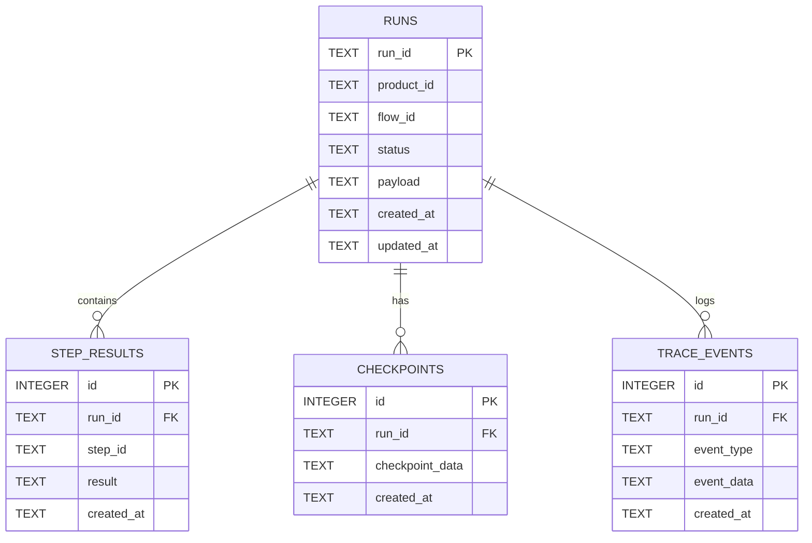
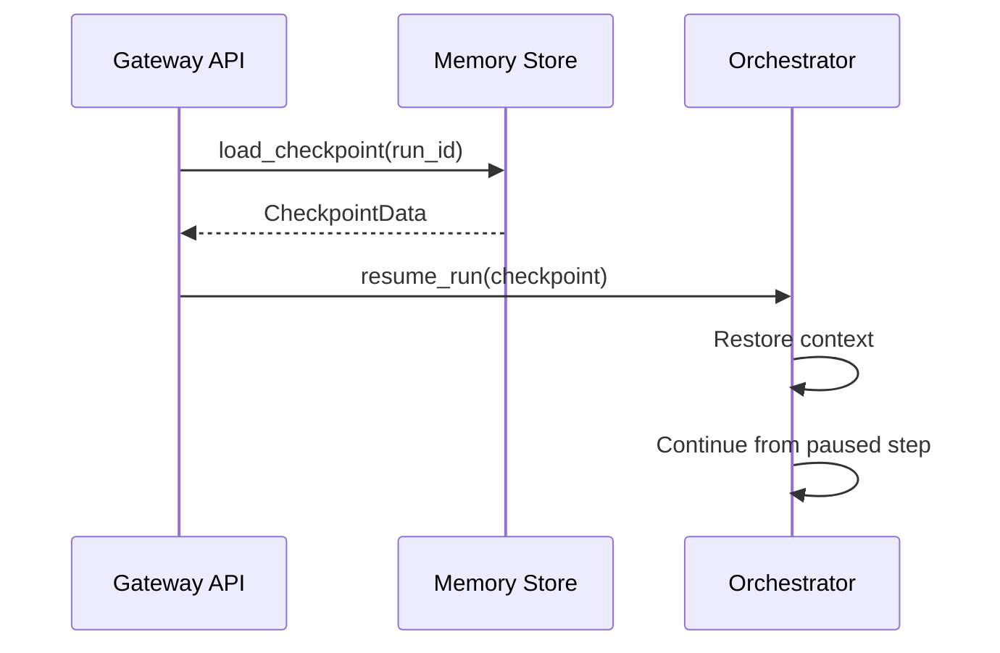

# System Design: Memory (SD-MEM)

> **Component**: Memory & Persistence Layer  
> **Path**: `core/memory/`  
> **Tech Spec**: [MEM-memory.md](../../03_technical_specifications/MEM-memory.md)  
> **Last Updated**: 2026-01-16

---

## 1. Scope & Ownership

| Owns | Does Not Own |
|------|--------------|
| Run/step persistence | Trace analysis |
| Memory backends (SQLite, In-Memory) | Telemetry export |
| Session isolation | Governance enforcement |
| Message history | LLM calls |
| Checkpoint/resume | Flow definition |
| Run-scoped data lifecycle | Cross-run aggregation |
| Tracing event emission | Metric aggregation |
| SQLite state tables | Vector storage |

---

## 2. Memory Design Principles

- Memory is pluggable; default is SQLite
- In-memory backend available for ephemeral testing
- Storage isolation: `storage/memory/{product}/`
- Every run has an isolated memory scope
- Memory router dispatches to appropriate backend

---

## 3. Module Structure

```
core/memory/
├── __init__.py
├── base.py               # Abstract memory store interface
├── in_memory.py          # In-memory ephemeral backend
├── sqlite_backend.py     # SQLite persistent backend
├── observability_store.py # Trace event storage
├── router.py             # Backend selection and routing
└── tracing.py            # Trace event emission
```

---

## 4. External Contracts

### Public APIs

| Interface | Location | Purpose |
|-----------|----------|---------|
| `MemoryBackend` | `core/memory/base.py` | Abstract backend interface |
| `InMemoryBackend` | `core/memory/in_memory.py` | Testing backend |
| `SQLiteBackend` | `core/memory/sqlite_backend.py` | Persistent backend |
| `MemoryRouter` | `core/memory/router.py` | Backend routing and delegation |
| `Tracer.emit()` | `core/memory/tracing.py` | Emit trace event |
| `ObservabilityStore` | `core/memory/observability_store.py` | File-based observability storage |
| `ApprovalRecord` | `core/memory/base.py` | HITL approval record |
| `RunBundle` | `core/memory/base.py` | Bundled run data for retrieval |

### Component Details

| Code Path | Code Name | Functional Details | Technical Details |
| --- | --- | --- | --- |
| `core/memory/base.py` | MemoryBackend | Abstract base class for persistence. | Defines `create_run`, `update_run_status`, `add_step`, `add_event`, `create_approval`, `resolve_approval`. |
| `core/memory/in_memory.py` | InMemoryBackend | Ephemeral store for tests. | Dictionary-backed; no disk writes. |
| `core/memory/sqlite_backend.py` | SQLiteBackend | Persistent store. | WAL mode, JSON fields as TEXT, schema versioning, 30s timeout. |
| `core/memory/router.py` | MemoryRouter | Delegates to chosen backend. | Also maintains ObservabilityStore for file-based trace mirroring. |
| `core/memory/observability_store.py` | ObservabilityStore | File-based trace storage. | Writes to `observability/<product>/<run_id>/` directories. |
| `core/memory/tracing.py` | Tracer | Trace emission pipeline. | Sanitizes via SecurityRedactor before persistence. Optional log mirroring. |

### Schemas

| Schema | Location | Purpose |
|--------|----------|---------|
| `TraceEvent` | `core/contracts/run_schema.py` | Trace event structure |
| `RunRecord` | `core/contracts/run_schema.py` | Run record structure |
| `StepRecord` | `core/contracts/run_schema.py` | Step record structure |
| `ApprovalRecord` | `core/memory/base.py` | HITL approval record |
| `RunBundle` | `core/memory/base.py` | Bundled run + steps + events + approvals |

---

## 5. Internal State & Lifecycles

### Backend Interface

```python
class MemoryBackend(ABC):
    """Interface used by core.orchestrator and core.memory.Tracer."""
    
    @abstractmethod
    def create_run(self, run: RunRecord) -> None: ...
    
    @abstractmethod
    def update_run_status(self, run_id: str, status: str, *, summary: Optional[Dict[str, Any]] = None) -> None: ...
    
    @abstractmethod
    def update_run_output(self, run_id: str, *, output: Optional[Dict[str, Any]]) -> None: ...
    
    @abstractmethod
    def add_step(self, step: StepRecord) -> None: ...
    
    @abstractmethod
    def update_step(self, run_id: str, step_id: str, patch: Dict[str, Any]) -> None: ...
    
    @abstractmethod
    def add_event(self, event: TraceEvent) -> None: ...
    
    def append_trace_event(self, event: TraceEvent) -> None: ...
    
    @abstractmethod
    def create_approval(self, approval: ApprovalRecord) -> None: ...
    
    @abstractmethod
    def resolve_approval(self, approval_id: str, *, decision: str, resolved_by: Optional[str], comment: Optional[str]) -> None: ...
```

### SQLite Schema

The persistent backend uses SQLite with the following tables:



### Storage Layout

```
storage/memory/{product}/
├── runs.db              # SQLite database
└── {run_id}/
    ├── run.json         # Run metadata (optional export)
    ├── state.json       # Current state snapshot
    ├── trace.jsonl      # Trace events (JSON Lines)
    └── steps/
        ├── step_0.json  # Step 0 result
        ├── step_1.json  # Step 1 result
        └── ...
```

### Storage Isolation

Each product has isolated storage:

```
storage/
└── memory/
    ├── hello_world/
    │   └── runs.db
    ├── ade/
    │   └── runs.db
    └── {product}/
        └── runs.db
```

Rules:
- Products cannot access each other's databases
- Storage paths are derived from product ID
- No cross-product queries

### Run Lifecycle State Mapping

| Run Status | Memory Operations |
|------------|-------------------|
| `CREATED` | Initial `save_state()` |
| `RUNNING` | Step results accumulated |
| `PENDING_HUMAN` | Checkpoint saved |
| `COMPLETED` | Final state persisted |
| `FAILED` | Error state persisted |

---

## 6. Checkpoint & Resume

### Checkpoint Structure

When a run pauses (e.g., HITL), a checkpoint captures:
- Run ID and current status
- Completed step results
- Current step context
- Pending approval details

### Resume Flow



---

## 7. Tracing & Observability

### Trace Event Types

| Event Type | Description |
|------------|-------------|
| `run.started` | Run initialization |
| `run.completed` | Run finished successfully |
| `run.failed` | Run finished with error |
| `step.started` | Step execution began |
| `step.completed` | Step execution finished |
| `step.failed` | Step execution failed |
| `tool.called` | Tool invocation |
| `model.called` | LLM invocation |
| `gate.evaluated` | Gate evaluation |
| `hitl.requested` | Human approval requested |
| `hitl.resolved` | Human approval provided |

### Trace Storage

Trace events are stored in the same SQLite database as run data:
- Indexed by `run_id` for efficient querying
- Timestamps for ordering
- JSON payload for flexible event data

---

## 8. Governance & Controls

### Memory Access Controls

```python
# Memory access is scoped to product
router = MemoryRouter(product_id="hello_world")
store = router.get_backend()
# ✅ Can only access hello_world runs
# ❌ Cannot access other product data
```

### Data Retention

- Runs are retained indefinitely by default
- Products may define retention policies
- Trace events follow run retention

---

## 9. Observability

| Event | When | Payload |
|-------|------|---------|
| `memory.state_saved` | State persisted | `{run_id, size_bytes}` |
| `memory.state_loaded` | State loaded | `{run_id}` |
| `memory.trace_written` | Trace event written | `{run_id, event_type}` |
| `memory.step_saved` | Step result saved | `{run_id, step_id}` |
| `memory.checkpoint_created` | Checkpoint saved | `{run_id, checkpoint_id}` |
| `memory.checkpoint_loaded` | Checkpoint restored | `{run_id, checkpoint_id}` |
| `memory.backend_selected` | Backend routing decision | `{backend_type, product_id}` |

---

## 10. In-Memory Backend

The in-memory backend (`InMemoryBackend`) is used for:
- Unit tests
- Integration tests
- Ephemeral demo runs

Characteristics:
- No disk I/O
- Dictionary-backed storage
- Same interface as SQLite backend
- Data lost on process exit

---

## 11. Tech Spec Coverage

See [SD-COVERAGE.md](../SD-COVERAGE.md#memory-mem) for full matrix.

| Category | Status |
|----------|--------|
| Backend (MEM-BACK-*) | ✅ All Implemented |
| Tracing (MEM-TRACE-*) | ✅ All Implemented |
| Persistence (MEM-PERS-*) | ✅ All Implemented |
| Checkpoints (MEM-CHK-*) | ✅ All Implemented |
| Isolation (MEM-ISO-*) | ✅ All Implemented |

---

## 12. Files

| File | Purpose |
|------|---------|
| `core/memory/__init__.py` | Module exports |
| `core/memory/base.py` | Backend interface |
| `core/memory/in_memory.py` | In-memory backend |
| `core/memory/sqlite_backend.py` | SQLite backend |
| `core/memory/router.py` | Backend routing |
| `core/memory/tracing.py` | Trace event handling |
| `core/memory/observability_store.py` | Observability data |

---

## See Also

- [SD-ARCH.md](../SD-ARCH.md) — Architecture overview
- [SD-ORC.md](SD-ORC.md) — Orchestration (uses memory)
- [SD-GOV.md](SD-GOV.md) — Governance (memory access controls)
