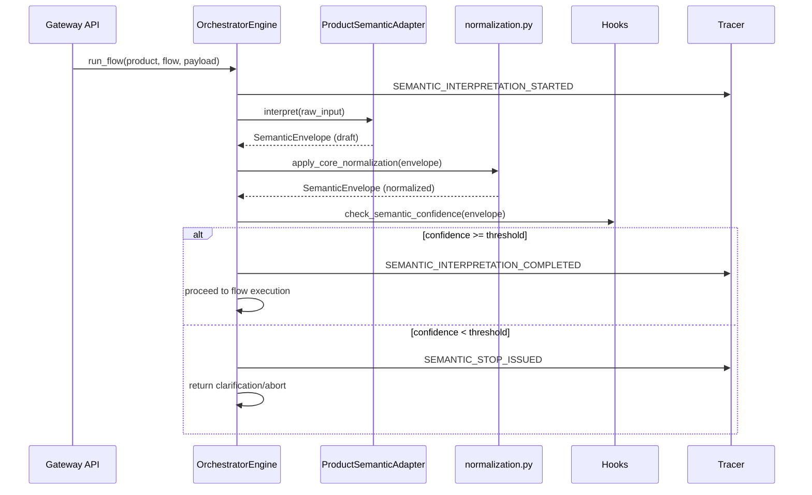
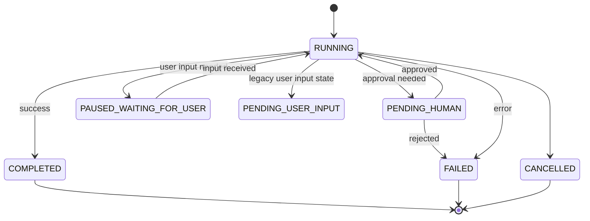
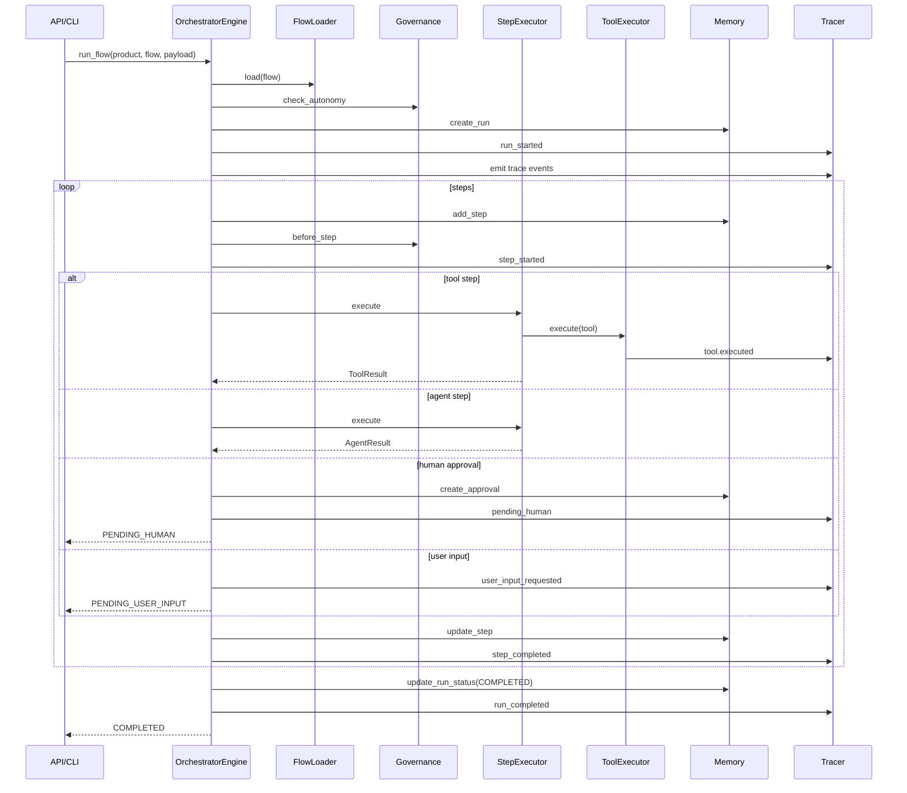
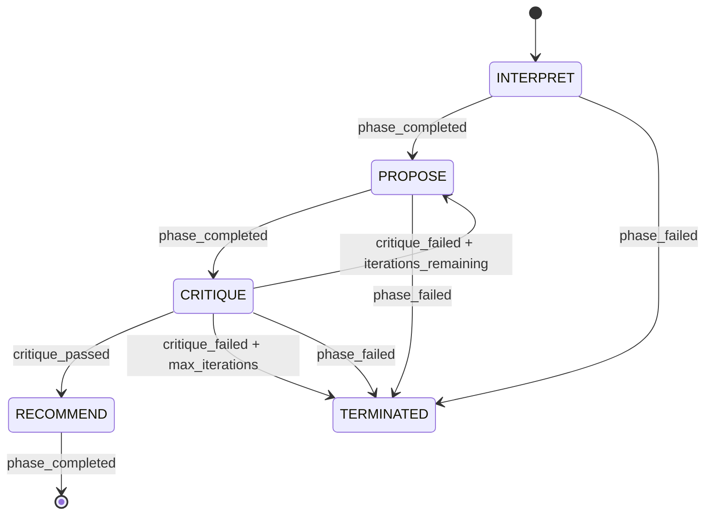

# System Design: Orchestration (SD-ORC)

> **Component**: Orchestration Engine  
> **Version**: 1.2  
> **Path**: `core/orchestrator/`  
> **Tech Spec**: [ORC-orchestration.md](../../03_technical_specifications/ORC-orchestration.md)  
> **Last Updated**: 2026-01-20  

---

## Version Control

| Version | Date | Changes |
|---------|------|---------|
| 1.2 | 2026-01-20 | Added V1.3 Reasoning Lifecycle (ORC-REASON) and Terminal Outcomes (ORC-TERM) sections |
| 1.1 | 2026-01-13 | Header version normalization |

## 1. Scope & Ownership

### Responsibility

The orchestrator owns **run lifecycle and step execution**. It is the control plane that:
- Manages run state transitions
- Executes flow steps in sequence
- Coordinates with governance for approvals
- Persists state for pause/resume

### Boundaries

| Owns | Does Not Own |
|------|--------------|
| Run lifecycle (start, pause, resume, complete) | Agent intelligence (advisory only) |
| Step execution order | Tool execution logic |
| Flow loading and validation | Policy evaluation (delegates to governance) |
| State persistence | LLM calls (delegates to models) |
| HITL pause/resume | Business logic |
| User input handling | Direct model calls |
| Plan execution (propose/gate/execute) | Direct tool calls |
| Branch and loop evaluation | Direct persistence |

---

## 2. Module Structure

```
core/orchestrator/
├── engine.py              # Main coordinator
├── run_lifecycle.py       # start/resume/complete run lifecycle
├── step_executor.py       # Tool/agent step dispatch
├── plan_executor.py       # plan_propose/gate/execute steps
├── loop_executor.py       # repeat_until handling
├── user_input_handler.py  # user_input pause/resume/validation
├── flow_loader.py         # YAML → FlowDef parsing
├── normalization.py       # Semantic envelope normalization (ORC-SEM-030+)
├── branching.py           # Branch condition evaluation
├── looping.py             # Loop condition evaluation
├── templating.py          # Param/message rendering
├── context.py             # RunContext/StepContext
├── state.py               # Status helpers
├── hitl.py                # Approval creation/resolution
└── error_policy.py        # Retry/backoff definitions
```

---

## 3. External Contracts

### Public APIs

| Interface | Location | Purpose |
|-----------|----------|---------|
| `OrchestratorEngine.run_flow()` | `core/orchestrator/engine.py` | Start a new orchestrator run |
| `OrchestratorEngine.resume_run()` | `core/orchestrator/engine.py` | Resume a paused run |
| `OrchestratorEngine.from_settings()` | `core/orchestrator/engine.py` | Factory method to create engine from Settings |
| `RunContext` | `core/orchestrator/context.py` | Execution context for a run |
| `StepContext` | `core/orchestrator/context.py` | Execution context for a step |
| `StepExecutor` | `core/orchestrator/step_executor.py` | Executes individual steps |

### Schemas (IO Boundaries)

| Schema | Location | Purpose |
|--------|----------|---------|
| `SemanticEnvelope` | `core/contracts/semantic_schema.py` | Semantic interpretation envelope |
| `Entity` | `core/contracts/semantic_schema.py` | Named entity extraction result |
| `ClarificationResponse` | `core/contracts/semantic_schema.py` | ASK_USER clarification payload |
| `AbortResponse` | `core/contracts/semantic_schema.py` | ABORT response payload |
| `FlowSchema` | `core/contracts/flow_schema.py` | Flow definition validation |
| `RunSchema` | `core/contracts/run_schema.py` | Run state serialization |
| `UserInputRequest` | `core/contracts/user_input_schema.py` | User input request structure |
| `ActionPlan` | `core/contracts/action_plan_schema.py` | Executable plan schema |
| `QuestionSet` | `core/contracts/interaction_schema.py` | HITL question schemas |

### Key Components

| Code Path | Code Name | Functional Details | Technical Details |
| --- | --- | --- | --- |
| `core/orchestrator/engine.py` | Flow engine | Drives flow execution, pause/resume, and trace emission. | Loads FlowDef from `products/<product>/flows/`, enforces autonomy and governance checks, persists runs/steps, emits trace events, handles branch/loop/plan steps. |
| `core/orchestrator/run_lifecycle.py` | Run lifecycle | Handles start_run, resume_run, complete_run. | Extracted from engine.py for focused responsibility. |
| `core/orchestrator/plan_executor.py` | Plan executor | Handles plan_propose/gate/execute steps. | Manages action plan lifecycle. |
| `core/orchestrator/loop_executor.py` | Loop executor | Handles repeat_until step execution. | Budget-aware loop handling. |
| `core/orchestrator/user_input_handler.py` | User input handler | Handles user_input pause/resume/validation. | Validates against QuestionSet schemas. |
| `core/orchestrator/flow_loader.py` | Flow loader | Loads FlowDefs/StepDefs from flow YAML. | Validates and normalizes step ids; no execution or persistence. |
| `core/orchestrator/normalization.py` | Semantic normalizer | Domain-agnostic envelope normalization. | `normalize_whitespace()`, `deduplicate_entities()`, `merge_constraints()`, `apply_stable_ordering()`, `coerce_types()`, `apply_core_normalization()`. |
| `core/orchestrator/step_executor.py` | Step executor | Executes tool/agent/tool_batch/plan_proposal steps. | Renders params from payload/artifacts, delegates to ToolExecutor/AgentRegistry, enforces agent output governance; tool retries only. |
| `core/orchestrator/branching.py` | Branch evaluator | Deterministic branch evaluation. | Evaluates safe condition expressions over artifacts and step outputs. |
| `core/orchestrator/looping.py` | Loop evaluator | Deterministic stop-condition evaluation. | Evaluates bounded repeat-until conditions against artifacts and memory. |
| `core/orchestrator/templating.py` | Template renderer | Param/message rendering for steps. | Supports payload/artifact interpolation; strict for messages, lenient for params. |
| `core/orchestrator/hitl.py` | HITL service | Approval creation and resolution. | Persists approval records via MemoryRouter. |
| `core/orchestrator/state.py` | Status helpers | Canonical run/step status groups. | Re-exports RunStatus/StepStatus for runtime use. |

---

## 4. Responsibilities

- Load flow definitions (YAML) via `FlowLoader` from `products/<product>/flows/`.
- Enforce autonomy policy **before** a run starts.
- Execute steps in order, honoring tool retry policies & backoff.
- Pause execution for HITL approvals and user_input steps; persist approvals and user input requests.
- Evaluate branch conditions and loop stop conditions deterministically.
- Execute plan steps (`plan_propose`, `plan_gate`, `plan_execute`) using stored plan artifacts.
- Resume execution deterministically using stored run/step snapshots.
- Emit trace events for every transition (run, step, tool, approval, user_input, plan proposals).
- Govern output persistence (run output + output files) before write.
- Apply optional run budgets when `_budget_policy` is supplied in the payload.

### What Orchestrator Does NOT Do
- Call models directly.
- Call tools directly.
- Persist data directly.
- Contain business logic.

### Session Isolation (Gateway)
The Gateway API constructs an `OrchestratorEngine` per request to avoid cross-user state leakage. Registries, settings, and the memory/tracing backends remain cached, but run context and execution state are request-scoped. Run ids include a timestamp plus a random suffix to avoid collisions under concurrent starts.

---

## 4.1 Semantic Interpretation Phase

The semantic interpretation phase transforms raw user input into a normalized `SemanticEnvelope` before flow execution begins. This is a critical pre-processing step defined by ORC-SEM-001.

### Phase Lifecycle



### SemanticEnvelope Structure

| Field | Type | Purpose | Tech Spec |
|-------|------|---------|-----------|
| `raw_input` | `str` | Original user input | ORC-SEM-010 |
| `normalized_input` | `str` | Whitespace-normalized input | ORC-SEM-011 |
| `product_id` | `str` | Target product identifier | ORC-SEM-012 |
| `intent_type` | `str` | Detected intent (product-specific) | ORC-SEM-013 |
| `entities` | `List[Entity]` | Extracted named entities | ORC-SEM-014 |
| `constraints` | `Dict[str, Any]` | User-specified constraints | ORC-SEM-015 |
| `confidence` | `float` | Overall interpretation confidence (0.0-1.0) | ORC-SEM-016 |
| `ambiguities` | `List[str]` | Detected ambiguities requiring clarification | ORC-SEM-017 |
| `proposed_next_action` | `NextAction` | CONTINUE, ASK_USER, ABORT, NEEDS_APPROVAL | ORC-SEM-018 |
| `parameters` | `Dict[str, Any]` | Flow-ready parameters | ORC-SEM-019 |
| `interpretation_method` | `str` | How interpretation was performed (e.g., "regex", "llm") | ORC-SEM-019 |

### Core Normalization Functions

The orchestrator applies domain-agnostic normalization via `core/orchestrator/normalization.py`:

| Function | Purpose | Tech Spec |
|----------|---------|-----------|
| `normalize_whitespace(text)` | Collapse whitespace, normalize line endings | ORC-SEM-030 |
| `deduplicate_entities(entities)` | Key by (name, type), keep highest confidence | ORC-SEM-031 |
| `merge_constraints(constraints)` | Deep merge with override precedence | ORC-SEM-032 |
| `apply_stable_ordering(envelope)` | Sort entities by name, ambiguities alphabetically | ORC-SEM-033 |
| `coerce_types(value, target_type)` | str→int, str→float, str→bool, str→date | ORC-SEM-034 |
| `apply_core_normalization(envelope)` | Orchestrate all normalizations | ORC-SEM-035 |

### NextAction Outcomes

| Action | Run Status Transition | Trace Event |
|--------|----------------------|-------------|
| `CONTINUE` | RUNNING | `SEMANTIC_INTERPRETATION_COMPLETED` |
| `ASK_USER` | PAUSED_WAITING_FOR_USER | `SEMANTIC_STOP_ISSUED` |
| `ABORT` | FAILED | `SEMANTIC_STOP_ISSUED` |
| `NEEDS_APPROVAL` | PENDING_HUMAN | `SEMANTIC_STOP_ISSUED` |

### Skip Semantic Interpretation

Flows may opt out via configuration:

```yaml
# products/{product}/flows/{flow}.yaml
skip_semantic_interpretation: true
```

When skipped, `SEMANTIC_INTERPRETATION_SKIPPED` is emitted and the envelope is bypassed.

---

## 5. Internal State & Lifecycles

### Run State Machine



### State Transitions

| From | Event | To | Trace Event |
|------|-------|----|-------------|
| — | `run_flow()` | RUNNING | `run.started` |
| RUNNING | step complete | RUNNING | `step.completed` |
| RUNNING | all steps done | COMPLETED | `run.completed` |
| RUNNING | gate requires approval | PENDING_HUMAN | `run.paused` |
| RUNNING | user input needed | PAUSED_WAITING_FOR_USER | `user_input.requested` |
| RUNNING | error + fail policy | FAILED | `run.failed` |
| PENDING_HUMAN | `resume_run()` with approval | RUNNING | `run.resumed` |
| PAUSED_WAITING_FOR_USER | `resume_run()` with input | RUNNING | `run.resumed` |

### Persistence Rules

| State | Persisted? | Location |
|-------|------------|----------|
| Run metadata | Yes | Memory backend (SQLite/InMemory) |
| Step results | Yes | Memory backend |
| Current position | Yes | In run metadata |
| Trace events | Yes | Memory backend + observability store |
| Approvals | Yes | Memory backend |

---

## 6. Detailed Execution Sequence



---

## 7. Governance & Controls

### Enforcement Points

| Check | When | Enforced By | Trace Event |
|-------|------|-------------|-------------|
| `check_autonomy` | Run initialization | `governance/hooks.py` | `autonomy.checked` |
| `before_step` | Before every step | `step_executor.py` | `hook.pre_step` |
| `validate_agent_output` | After agent step | `step_executor.py` | `agent.output.validated` |
| `before_run_output` | Before output persistence | `run_lifecycle.py` | `output.governed` |
| Gate evaluation | Before gated steps | `gates.py` | `gate.evaluated` |

### Integration with Governance

```python
# Simplified step execution flow
async def execute_step(step, context):
    # 1. Pre-step governance hook (non-bypassable)
    await governance.before_step(step, context)
    
    # 2. Gate check if step is gated
    if step.gate:
        result = await governance.evaluate_gate(step.gate, context)
        if not result.approved:
            return PauseResult(gate=step.gate)
    
    # 3. Execute step
    result = await step.execute(context)
    
    # 4. Validate agent output if agent step
    if step.type == "agent":
        await governance.validate_agent_output(result)
    
    return result
```

---

## 8. Observability

### Trace Events Emitted

| Event | When | Payload |
|-------|------|---------|
| `run.started` | Run begins | `{run_id, flow_name, product, autonomy}` |
| `run.completed` | Run finishes successfully | `{run_id, duration_ms}` |
| `run.failed` | Run fails | `{run_id, error, step_id}` |
| `run.paused` | Run pauses for approval | `{run_id, gate_id}` |
| `run.resumed` | Run resumes after approval | `{run_id, approved_by}` |
| `step.started` | Step begins | `{run_id, step_id, step_type}` |
| `step.completed` | Step finishes | `{run_id, step_id, duration_ms}` |
| `step.failed` | Step fails | `{run_id, step_id, error}` |
| `step.timeout` | Step times out | `{run_id, step_id, timeout_ms}` |
| `user_input.requested` | User input needed | `{run_id, step_id, question_set}` |
| `user_input.received` | User input received | `{run_id, step_id}` |
| `semantic_interpretation.started` | Semantic phase begins | `{run_id, product_id, raw_input}` |
| `semantic_interpretation.completed` | Semantic phase succeeds | `{run_id, intent_type, confidence, entities_count}` |
| `semantic_interpretation.failed` | Semantic phase errors | `{run_id, error}` |
| `semantic_interpretation.skipped` | Semantic phase bypassed | `{run_id, reason}` |
| `semantic_validation.completed` | Confidence check complete | `{run_id, passed, confidence}` |
| `semantic_stop.issued` | ASK_USER/ABORT triggered | `{run_id, next_action, reason}` |

### Artifact Outputs

| Artifact | Format | Location |
|----------|--------|----------|
| `run_state` | JSON | Memory backend |
| `step_result_{n}` | JSON | Memory backend |
| `trace.jsonl` | JSON Lines | `observability/<product>/<run_id>/runtime/` |
| `response.json` | JSON | `observability/<product>/<run_id>/output/` |

---

## 8.1. Orchestrator-Controlled Reasoning Lifecycle (V1.3)

The orchestrator controls reasoning phases as first-class lifecycle states, ensuring explicit phase transitions, bounded iterations, and deterministic termination.

### Reasoning Phases

| Phase | Purpose | Artifact Type | Tech Spec |
|-------|---------|---------------|-----------|
| `INTERPRET` | Parse and understand input | `InterpretPhaseOutput` | ORC-REASON-001 |
| `PROPOSE` | Generate candidate solutions | `ProposePhaseOutput` | ORC-REASON-001 |
| `CRITIQUE` | Evaluate proposals | `CritiquePhaseOutput` | ORC-REASON-001 |
| `RECOMMEND` | Select final recommendation | `RecommendPhaseOutput` | ORC-REASON-001 |

**Invariant**: RECOMMEND phase MUST NOT proceed without passing CRITIQUE (ORC-REASON-005).

### Reasoning Phase State Machine



### Bounded Reasoning Iteration

| Config | Default | Max | Tech Spec |
|--------|---------|-----|-----------|
| `max_reasoning_iterations` | 3 | 10 | ORC-REASON-010 |
| Budget consumed per iteration | Yes | — | ORC-REASON-011 |
| Iteration count in trace | Yes | — | ORC-REASON-012 |

### Termination Reasons

| Reason | Description | Tech Spec |
|--------|-------------|-----------|
| `SUFFICIENT` | Reasoning complete with acceptable confidence | ORC-REASON-014 |
| `MAX_ITERATIONS` | max_reasoning_iterations reached | ORC-REASON-013, ORC-REASON-014 |
| `BUDGET_EXCEEDED` | Reasoning budget exhausted | ORC-REASON-014 |
| `CONFIDENCE_MET` | Confidence threshold achieved early | ORC-REASON-014 |

### Reasoning Trace Events

| Event | Trigger | Payload | Tech Spec |
|-------|---------|---------|-----------|
| `reasoning_phase_started` | Phase begins | `{run_id, phase, iteration}` | ORC-REASON-020 |
| `reasoning_phase_completed` | Phase succeeds | `{run_id, phase, output_type, confidence}` | ORC-REASON-021 |
| `reasoning_phase_failed` | Phase errors | `{run_id, phase, error, iteration}` | ORC-REASON-022 |
| `reasoning_terminated` | Reasoning ends | `{run_id, iteration_count, reason, final_confidence}` | ORC-REASON-015 |

### Implementation Files

| File | Purpose |
|------|---------|
| `core/orchestrator/reasoning_lifecycle.py` | ReasoningPhase enum, ReasoningLifecycle class, phase execution |
| `core/contracts/reasoning_schema.py` | ReasoningTerminationReason enum, phase output models |
| `core/memory/tracing.py` | Phase trace event types |

### Module Structure

```python
# core/orchestrator/reasoning_lifecycle.py
class ReasoningPhase(str, Enum):
    INTERPRET = "interpret"
    PROPOSE = "propose"
    CRITIQUE = "critique"
    RECOMMEND = "recommend"

class ReasoningTerminationReason(str, Enum):
    SUFFICIENT = "sufficient"
    MAX_ITERATIONS = "max_iterations"
    BUDGET_EXCEEDED = "budget_exceeded"
    CONFIDENCE_MET = "confidence_met"

class ReasoningLifecycle:
    def __init__(self, max_iterations: int = 3, budget_per_iteration: int = 1000): ...
    def start_phase(self, phase: ReasoningPhase) -> PhaseStartedPayload: ...
    def complete_phase(self, phase: ReasoningPhase, output: Any, confidence: float) -> PhaseCompletedPayload: ...
    def fail_phase(self, phase: ReasoningPhase, error: str) -> PhaseFailedPayload: ...
    def terminate(self, reason: ReasoningTerminationReason, final_confidence: float) -> ReasoningTerminatedPayload: ...
    def should_terminate(self) -> Tuple[bool, Optional[ReasoningTerminationReason]]: ...
```

---

## 8.2. Explicit Terminal Outcomes (V1.3)

Every run terminates with an explicit, auditable outcome that includes structured reason and explanation.

### Terminal Outcome Enum

| Outcome | Description | Tech Spec |
|---------|-------------|-----------|
| `COMPLETED` | Run finished successfully | ORC-TERM-001 |
| `FAILED` | Run encountered unrecoverable error | ORC-TERM-001 |
| `CANCELLED` | Run cancelled by user/system | ORC-TERM-001 |
| `ABORTED` | Run aborted by governance | ORC-TERM-001 |
| `PAUSED_INDEFINITE` | Run paused with no resume expected | ORC-TERM-001 |

### Outcome Reason Enum

| Reason | Description | Tech Spec |
|--------|-------------|-----------|
| `SUCCESS` | Normal completion | ORC-TERM-003 |
| `USER_ABORT` | User requested abort | ORC-TERM-003 |
| `GOVERNANCE_BLOCK` | Governance policy blocked | ORC-TERM-003 |
| `BUDGET_EXCEEDED` | Budget exhausted | ORC-TERM-003 |
| `MAX_ITERATIONS` | Iteration limit reached | ORC-TERM-003 |
| `VALIDATION_FAILED` | Output validation failed | ORC-TERM-003 |
| `UNRECOVERABLE_ERROR` | System error | ORC-TERM-003 |

### Terminal Artifact Schemas

| Outcome | Artifact | Fields | Tech Spec |
|---------|----------|--------|-----------|
| `COMPLETED` | `CompletedArtifact` | `output`, `summary`, `confidence` | ORC-TERM-ART-001 |
| `FAILED` | `FailedArtifact` | `error_code`, `error_message`, `stack_trace` | ORC-TERM-ART-002 |
| `ABORTED` | `AbortedArtifact` | `abort_reason`, `abort_source`, `governance_rule` | ORC-TERM-ART-003 |
| `CANCELLED` | `CancelledArtifact` | `cancelled_by`, `cancellation_reason` | ORC-TERM-ART-003 |
| `PAUSED_INDEFINITE` | `PausedIndefiniteArtifact` | `pause_reason`, `resume_instructions` | ORC-TERM-ART-003 |

### RunRecord Terminal Fields

```python
# core/contracts/run_schema.py
class RunRecord(BaseModel):
    # ... existing fields ...
    terminal_outcome: Optional[TerminalOutcome] = None      # ORC-TERM-001
    outcome_reason: Optional[OutcomeReason] = None          # ORC-TERM-002
    outcome_explanation: Optional[str] = None               # ORC-TERM-004
    terminal_artifact: Optional[Dict[str, Any]] = None      # ORC-TERM-ART-004
```

### Terminal Trace Event

| Event | Trigger | Payload | Tech Spec |
|-------|---------|---------|-----------|
| `run_terminal_outcome` | Run terminates | `{run_id, outcome, reason, explanation, artifact_hash}` | ORC-TERM-005 |

### Implementation Files

| File | Purpose |
|------|---------|
| `core/contracts/run_schema.py` | TerminalOutcome, OutcomeReason enums, terminal artifact models |
| `core/orchestrator/run_lifecycle.py` | Terminal outcome persistence and event emission |
| `core/memory/tracing.py` | RUN_TERMINAL_OUTCOME event type |
| `core/memory/in_memory.py` | Terminal field persistence |
| `core/memory/sqlite_backend.py` | Terminal field persistence |

---

## 9. Tech Spec Coverage

See [SD-COVERAGE.md](../SD-COVERAGE.md#orchestration-orc) for full coverage matrix.

### Summary

| Category | Tech Spec IDs | Status |
|----------|---------------|--------|
| Run Lifecycle | ORC-RUN-001 to ORC-RUN-005 | ✅ All Implemented |
| Semantic Interpretation | ORC-SEM-001 to ORC-SEM-043 | ✅ All Implemented |
| Step Execution | ORC-STEP-001 to ORC-STEP-004 | ✅ All Implemented |
| Flow Loading | ORC-FLOW-001 to ORC-FLOW-004 | ✅ All Implemented |
| HITL | ORC-HITL-001 to ORC-HITL-003 | ✅ All Implemented |
| Reasoning Lifecycle | ORC-REASON-001 to ORC-REASON-022 | ✅ All Implemented (V1.3) |
| Terminal Outcomes | ORC-TERM-001 to ORC-TERM-005 | ✅ All Implemented (V1.3) |
| Terminal Artifacts | ORC-TERM-ART-001 to ORC-TERM-ART-004 | ✅ All Implemented (V1.3) |

---

## 10. Files

| File | Purpose |
|------|---------|
| `core/orchestrator/engine.py` | Main engine class |
| `core/orchestrator/run_lifecycle.py` | Run lifecycle management |
| `core/orchestrator/reasoning_lifecycle.py` | Reasoning phase lifecycle (V1.3) |
| `core/orchestrator/context.py` | RunContext/StepContext definitions |
| `core/orchestrator/state.py` | State management |
| `core/orchestrator/step_executor.py` | Step execution logic |
| `core/orchestrator/flow_loader.py` | YAML flow loading |
| `core/orchestrator/normalization.py` | Semantic envelope normalization |
| `core/orchestrator/branching.py` | Conditional branching |
| `core/orchestrator/looping.py` | Loop execution |
| `core/orchestrator/hitl.py` | Human-in-the-loop |
| `core/orchestrator/user_input_handler.py` | User input handling |
| `core/orchestrator/plan_executor.py` | Plan step execution |
| `core/orchestrator/loop_executor.py` | Loop step execution |
| `core/orchestrator/templating.py` | Parameter templating |
| `core/orchestrator/error_policy.py` | Error handling policies |
| `core/orchestrator/_types.py` | Type definitions |
| `core/contracts/reasoning_schema.py` | Reasoning phase schemas (V1.3) |

---

## See Also

- [SD-ARCH.md](../SD-ARCH.md) — Architecture overview
- [SD-GOV.md](SD-GOV.md) — Governance integration
- [SD-MEM.md](SD-MEM.md) — Memory/persistence integration
