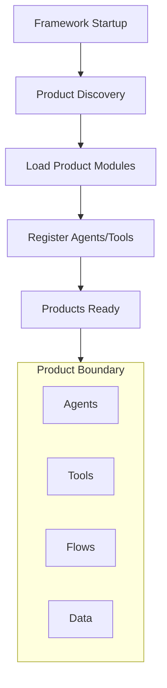

# System Design: Products (SD-PROD)

> **Component**: Product Layer  
> **Path**: `products/`  
> **Tech Spec**: [PROD-products.md](../../03_technical_specifications/PROD-products.md)  
> **Last Updated**: 2026-01-16

---

## 1. Scope & Ownership

| Owns | Does Not Own |
|------|--------------|
| Product folder structure | Framework core logic |
| Product-specific agents | Agent base contracts |
| Product-specific tools | Tool execution engine |
| Product-specific flows | Flow execution engine |
| Product documentation | Framework documentation |
| Product data/schemas | Core schemas |
| Product configuration | Core configuration |
| Product-specific tests | Core test infrastructure |

**Invariant**: INV-5 — Products are isolated. They cannot import from each other.

---

## 2. Product Design Principles

Products in this framework:
- Are **self-contained** packages with defined structure
- Are **auto-discovered** at startup
- Use **namespaced** agents, tools, and flows
- Follow **isolation** rules (no cross-product imports)
- Have their **own documentation** mirroring framework structure
- Can **override** certain policies via product config



---

## 3. Module Structure

### Framework Product Root

```
products/
├── __init__.py           # Product discovery and registration
├── __pycache__/
├── ade/                   # ADE product
│   └── ...
├── hello_world/           # Hello World demo product
│   └── ...
└── data/                  # Shared demo data (if any)
```

### Per-Product Structure

```
products/{product_name}/
├── __init__.py          # Product module exports
├── manifest.yaml        # Product metadata (name, version, flows, UI)
├── registry.py          # Product registration (register(registries) function)
├── semantic.py          # Semantic adapter (interpret/validate user input)
├── descriptors.py       # Product descriptors (optional)
├── config/              # Product-specific configuration
│   └── product.yaml     # Limits, defaults, flags
├── agents/              # Product-specific agents
│   ├── __init__.py
│   └── {agent_name}.py
├── tools/               # Product-specific tools
│   ├── __init__.py
│   └── {tool_name}.py
├── flows/               # Flow definitions (YAML)
│   └── {flow_name}.yaml
├── schemas/             # Product data schemas (optional)
│   └── {schema_name}.py
├── data/                # Static data files (optional)
│   └── ...
├── staging/             # Staging/scratch files
├── tests/               # Product-specific tests
│   └── ...
└── docs/                # Product documentation (optional)
    └── ...
```

---

## 4. External Contracts

### Product Manifest

Each product must have a `manifest.yaml`:

```yaml
# products/{product}/manifest.yaml
name: "hello_world"
display_name: "Hello World"
description: "Golden-path demo product for master. Safe tools and simple flows."
version: "0.1.0"

default_flow: "hello_world"

exposed_api:
  enabled: true
  allowed_flows:
    - "hello_world"

ui_enabled: true
ui:
  enabled: true
  nav_label: "Hello World"
  panels:
    - id: "runner"
      title: "Run a Flow"
    - id: "runs"
      title: "Run History"
    - id: "approvals"
      title: "Approvals Queue"
  icon: "🧪"
  category: "demo"

flows:
  - "hello_world"
```

### Component Details

| Code Path | Code Name | Functional Details | Technical Details |
| --- | --- | --- | --- |
| `core/utils/product_loader.py` | ProductLoader | Discovers products, parses manifests, loads configs. | `discover_products()`, `register_enabled_products()` |
| `products/{name}/manifest.yaml` | ProductManifest | Product metadata. | Name, display_name, version, flows, UI config. |
| `products/{name}/config/product.yaml` | ProductConfig | Per-product settings. | Limits, defaults, flags, metadata. |
| `products/{name}/registry.py` | ProductRegistry | Registration entry point. | `register(registries)` function. |
| `products/{name}/semantic.py` | SemanticAdapter | Product-specific semantic interpretation. | `interpret()` and `validate()` methods. |
| `products/{name}/flows/` | Flows | Product flows. | YAML flow definitions. |

### Semantic Adapter Pattern

Each product may optionally implement a semantic adapter in `products/{name}/semantic.py` to provide domain-specific user input interpretation. The adapter transforms raw user input into a normalized `SemanticEnvelope` that the orchestrator can use for flow execution.

#### Interface

```python
class ProductSemanticAdapter:
    """Product-specific semantic interpretation adapter."""
    
    def interpret(self, raw_input: str, context: Optional[Dict[str, Any]] = None) -> SemanticEnvelope:
        """
        Interpret raw user input into a SemanticEnvelope.
        
        Returns a SemanticEnvelope with:
        - intent_type: Domain-specific intent classification
        - entities: Extracted named entities with confidence scores
        - confidence: Overall interpretation confidence (0.0-1.0)
        - proposed_next_action: CONTINUE, ASK_USER, ABORT, NEEDS_APPROVAL
        """
        ...
    
    def validate(self, envelope: SemanticEnvelope) -> Tuple[bool, Optional[str]]:
        """
        Validate a semantic envelope for domain-specific constraints.
        
        Returns (is_valid, error_message).
        """
        ...
```

#### Example: Hello World Semantic Adapter

```python
# products/hello_world/semantic.py
class HelloWorldSemanticAdapter:
    GREETING_PATTERNS = [r"hello", r"hi", r"hey", r"greetings"]
    LANGUAGE_PATTERNS = {"english": ["en", "english"], "spanish": ["es", "spanish"]}
    
    def interpret(self, raw_input: str, context: Optional[Dict[str, Any]] = None) -> SemanticEnvelope:
        intent = self._detect_greeting_intent(raw_input)
        name = self._extract_name(raw_input)
        language = self._detect_language(raw_input)
        
        entities = []
        if name:
            entities.append(Entity(name="name", type="person", value=name, confidence=0.9))
        if language:
            entities.append(Entity(name="language", type="language", value=language, confidence=0.85))
        
        return SemanticEnvelope(
            raw_input=raw_input,
            normalized_input=normalize_whitespace(raw_input),
            product_id="hello_world",
            intent_type=intent,
            entities=entities,
            confidence=0.9 if intent else 0.3,
            proposed_next_action=NextAction.CONTINUE if intent else NextAction.ASK_USER,
        )
```

#### Core Normalization

After product-specific interpretation, the orchestrator applies core normalization via `core/orchestrator/normalization.py`:

| Function | Purpose |
|----------|---------|
| `normalize_whitespace()` | Collapse whitespace, normalize line endings |
| `deduplicate_entities()` | Key by (name, type), keep highest confidence |
| `merge_constraints()` | Deep merge with override precedence |
| `apply_stable_ordering()` | Sort entities by name, ambiguities alphabetically |
| `coerce_types()` | str→int, str→float, str→bool, str→date |

### Key Data Structures

```python
# core/utils/product_loader.py
@dataclass(frozen=True)
class ProductMeta:
    name: str
    display_name: str
    description: Optional[str]
    version: Optional[str]
    default_flow: Optional[str]
    expose_api: bool
    ui_enabled: bool
    flows: List[str]
    ui: UiConfig
    root_dir: str
    manifest_path: str
    config_path: str
    registry_path: str
    enabled: bool

@dataclass
class ProductCatalog:
    products: Dict[str, ProductMeta]
    configs: Dict[str, ProductConfigModel]
    flows: Dict[str, List[str]]
    errors: List[ProductLoadError]
```

### Auto-Discovery

Products are auto-discovered by scanning `products/` for folders containing `manifest.yaml`:

```python
# core/utils/product_loader.py
def discover_products(settings: Settings, *, repo_root: Optional[Path | str] = None) -> ProductCatalog:
    """
    Discover product manifests/configs/flows under repo_root / products_dir.
    
    Discovery rules:
    1. Folder must contain manifest.yaml
    2. Manifest must be valid YAML with required fields (name)
    3. Product enabled by settings.products.enabled or auto_enable
    """
    products_root = root / settings.products.products_dir
    manifest_paths = sorted(products_root.glob("*/manifest.yaml"))
    # Parse manifests, load configs, enumerate flows
    ...
```

---

## 5. Namespace Isolation

### Product Registration

Products use `registry.py` as the registration entry point:

```python
# products/{product}/registry.py
from pathlib import Path
from core.utils.product_loader import ProductRegistries, auto_register

def register(registries: ProductRegistries) -> None:
    """Auto-discover and register all decorated agents and tools."""
    auto_register(registries, Path(__file__).parent)
```

### Agent Namespacing

```python
# Products define agents with @agent decorator
# products/ade/agents/intent_agent.py
from core.agents.base import agent

@agent(
    name="ade.intent_agent",
    description="Extract user intent from text",
    product="ade"
)
class IntentAgent:
    ...

# Registered as "ade.intent_agent" in AgentRegistry
# Flow references: agent: ade.intent_agent
```

### Tool Namespacing

```python
# Products define tools with @tool decorator
# products/ade/tools/data_reader.py
from core.tools.base import tool

@tool(
    name="ade.data_reader",
    description="Read data from source",
    product="ade"
)
class DataReaderTool:
    ...

# Registered as "ade.data_reader" in ToolRegistry
# Flow references: tool: ade.data_reader
```

### Flow Isolation

- Flows can only reference agents/tools from their own product or core
- Cross-product flow references are blocked at load time
- Flow paths: `products/{product}/flows/{flow}.yaml`

---

## 6. Product Configuration

### Per-Product Overrides

Products define configuration in `config/product.yaml`:

```yaml
# products/{product}/config/product.yaml
name: ade
defaults:
  model: "gpt-4o"
limits:
  max_steps: 50
  max_tool_calls: 100
flags:
  enable_caching: true
metadata:
  owner: "analytics-team"
```

### Override Rules

| Setting | Can Override? | Scope |
|---------|--------------|-------|
| `allowed_models` | ✅ Yes | Restrict from global |
| `allowed_tools` | ✅ Yes | Restrict from global |
| `blocked_tools` | ✅ Yes | Add to global |
| `max_steps` | ✅ Yes | Lower only |
| `max_tool_calls` | ✅ Yes | Lower only |
| `governance_hooks` | ❌ No | Framework only |
| `security_rules` | ❌ No | Framework only |

---

## 7. Product Documentation

Each product mirrors the framework documentation structure:

```
products/{product}/docs/
├── 00_developer_intent/
│   └── intent.md              # Why this product exists
├── 01_brd/
│   └── requirements.md        # Business requirements
├── 02_techspec/
│   └── spec.md                # Technical specifications
├── 03_implementation_plan/
│   └── plan.md                # Implementation phases
└── 04_systemdesign/
    ├── overview.md            # Architecture overview
    └── flows/                 # Flow-specific design
        └── {flow}.md
```

---

## 8. Internal State & Lifecycles

### Product Lifecycle

```
┌─────────────┐   discover   ┌─────────────┐   validate   ┌─────────────┐
│ UNDISCOVERED│ ────────────►│  DISCOVERED │ ────────────►│   LOADED    │
└─────────────┘              └─────────────┘              └──────┬──────┘
                                                                 │
                                                          ┌──────┼──────┐
                                                          │             │
                                                          ▼             ▼
                                                   ┌──────────┐  ┌──────────┐
                                                   │  ACTIVE  │  │  FAILED  │
                                                   └──────────┘  └──────────┘
```

### State Transitions

| State | Description |
|-------|-------------|
| `UNDISCOVERED` | Product folder exists but not yet scanned |
| `DISCOVERED` | Manifest found and parsed |
| `LOADED` | Agents, tools, flows loaded into registries |
| `ACTIVE` | Ready to serve runs |
| `FAILED` | Load error (invalid manifest, missing deps) |

---

## 9. Product Isolation Rules

### Import Rules

```python
# ✅ ALLOWED: Import from core
from core.agents import AdvisoryAgent
from core.tools import tool

# ✅ ALLOWED: Import from own product
from products.ade.tools import data_reader

# ❌ BLOCKED: Import from other product
from products.hello_world.agents import greeter  # ImportError
```

### Enforcement

- Static analysis in CI (linting rules)
- Runtime import hooks (optional)
- Code review guidelines

### Storage Isolation

Products have isolated storage:

```
storage/
├── memory/
│   ├── ade/
│   │   └── runs.db
│   └── hello_world/
│       └── runs.db
└── vectors/
    ├── ade/
    │   └── index/
    └── hello_world/
        └── index/
```

---

## 10. Observability

| Event | When | Payload |
|-------|------|---------|
| `product.discovered` | Product found at startup | `{product_name, version}` |
| `product.loaded` | Product agents/tools loaded | `{product_name, agent_count, tool_count}` |
| `product.failed` | Product load failed | `{product_name, error}` |
| `product.run_started` | Run started for product | `{product_name, flow_name, run_id}` |
| `product.run_completed` | Run completed for product | `{product_name, run_id, status}` |

---

## 11. Tech Spec Coverage

See [SD-COVERAGE.md](../SD-COVERAGE.md#products-prod) for full matrix.

| Category | Status |
|----------|--------|
| Structure (PROD-STRUCT-*) | ✅ All Implemented |
| Isolation (PROD-ISO-*) | ✅ All Implemented |
| Discovery (PROD-DISC-*) | ✅ All Implemented |
| Documentation (PROD-DOC-*) | ✅ All Implemented |

---

## 12. Files

| File | Purpose |
|------|---------|
| `core/utils/product_loader.py` | Product discovery and registration (`discover_products()`, `auto_register()`) |
| `products/__init__.py` | Products module init |
| `products/{name}/__init__.py` | Product module init |
| `products/{name}/manifest.yaml` | Product metadata (name, flows, UI config) |
| `products/{name}/registry.py` | Registration entry point (`register(registries)`) |
| `products/{name}/config/product.yaml` | Product config (limits, defaults, flags) |
| `products/{name}/agents/` | Product agents |
| `products/{name}/tools/` | Product tools |
| `products/{name}/flows/` | Product flows (YAML) |
| `products/{name}/schemas/` | Product schemas (optional) |
| `products/{name}/data/` | Product data (optional) |
| `products/{name}/tests/` | Product-specific tests |
| `products/{name}/staging/` | Staging/scratch files |

---

## See Also

- [SD-ARCH.md](../SD-ARCH.md) — Architecture overview
- [SD-ORC.md](SD-ORC.md) — Orchestration (runs products)
- [SD-GOV.md](SD-GOV.md) — Governance (product policies)
- [../howto/product-howto.md](../../howto/product-howto.md) — Product development guide
