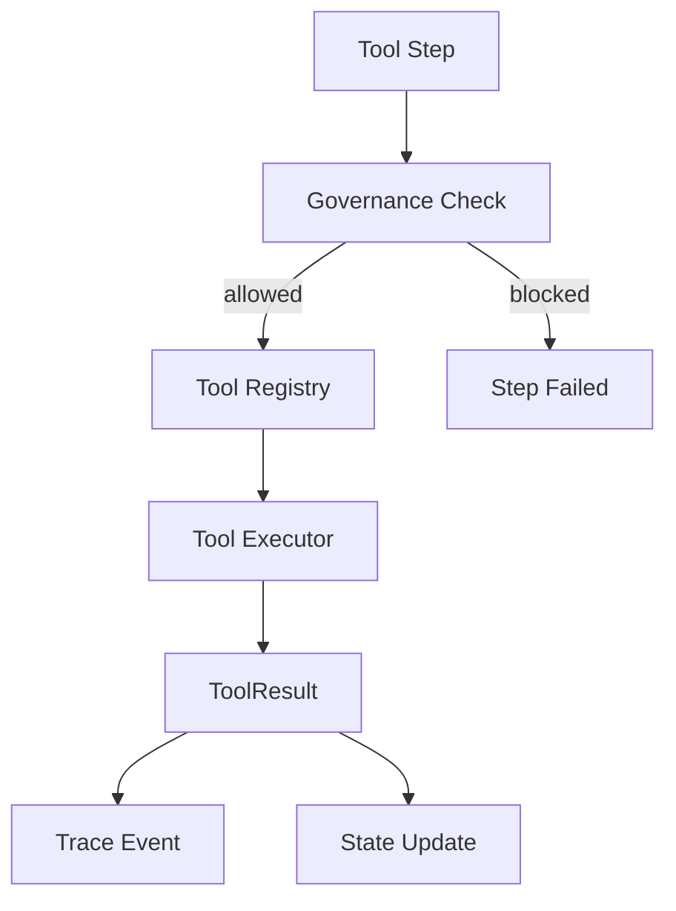

# System Design: Tools (SD-TOOLS)

> **Component**: Tool Execution Layer  
> **Path**: `core/tools/`  
> **Tech Spec**: [AGT-agents-tools.md](../../03_technical_specifications/AGT-agents-tools.md) (TOOL-* requirements)  
> **Last Updated**: 2026-01-16

---

## 1. Scope & Ownership

| Owns | Does Not Own |
|------|--------------|
| Tool registration | Tool invocation decisions (orchestrator) |
| Tool execution | Policy enforcement (governance) |
| Result capture | State persistence (memory) |
| Error handling | LLM calls (models) |
| Tool descriptors | Advisory recommendations |
| Evidence collection | Flow control |
| Deterministic computation | Token budgets |

**Invariant**: INV-4 — Tools are deterministic. Same inputs → same outputs.

---

## 2. Tool Design Principles

Tools in this framework:
- Are **pure functions** with deterministic behavior
- Are **registered** via decorator for discovery
- Have **self-describing metadata** (descriptors)
- Return **structured results** with evidence
- Are **governed** (allowlists, blocked lists)
- Are **traced** (all invocations logged)



---

## 3. Module Structure

```
core/tools/
├── __init__.py
├── base.py             # BaseTool abstract class
├── registry.py         # ToolRegistry with factory pattern
├── executor.py         # ToolExecutor for tool invocation
├── retrieval.py        # Retrieval tool implementation
└── backends/           # Execution backends
    ├── __init__.py
    └── local_backend.py  # Local Python execution
```

---

## 4. External Contracts

### Public APIs

| Interface | Location | Purpose |
|-----------|----------|---------|
| `ToolRegistry.register()` | `core/tools/registry.py` | Register tool factory |
| `ToolRegistry.resolve()` | `core/tools/registry.py` | Get tool instance by name |
| `ToolRegistry.list_descriptors()` | `core/tools/registry.py` | List all tool descriptors |
| `ToolExecutor.execute()` | `core/tools/executor.py` | Execute tool with governance |
| `BaseTool` | `core/tools/base.py` | Abstract base tool class |
| `LocalToolBackend` | `core/tools/backends/local_backend.py` | Local execution backend |

### Component Details

| Code Path | Code Name | Functional Details | Technical Details |
| --- | --- | --- | --- |
| `core/tools/registry.py` | ToolRegistry | Class-level registry for tools. | Stores `ToolRegistration` with factory, meta, descriptor. Factory pattern avoids shared state. |
| `core/tools/executor.py` | ToolExecutor | Invokes tools with governance. | Calls `hooks.before_tool_call()`, executes via backend, returns `ToolResult`. |
| `core/tools/base.py` | BaseTool | Abstract base class. | Subclasses implement `run(params, ctx) -> ToolResult`. |
| `core/tools/backends/local_backend.py` | LocalToolBackend | Executes tool Python code. | Default backend; calls `tool.run()` directly. |
| `core/tools/retrieval.py` | RetrievalTool | Document retrieval tool. | Queries vector store for relevant context. |

### Schemas

| Schema | Location | Purpose |
|--------|----------|---------|
| `ToolResult` | `core/contracts/tool_schema.py` | Result with `ok`, `data`, `error`, `meta` |
| `ToolError` | `core/contracts/tool_schema.py` | Error with code, message, details |
| `ToolMeta` | `core/contracts/tool_schema.py` | Execution metadata (timing, etc) |
| `ToolDescriptor` | `core/contracts/descriptors_schema.py` | Tool metadata for discovery |
| `EvidenceItem` | `core/contracts/context_pack_schema.py` | Evidence attached to results |

---

## 5. Tool Registration

### Decorator Pattern

```python
from core.tools import tool

@tool(
    name="compute_metrics",
    description="Compute business metrics from a dataset",
    returns="Dictionary of metric names to computed values"
)
def compute_metrics(dataset: Dataset, metrics: list[str]) -> dict:
    """
    Compute specified metrics for the given dataset.
    
    Args:
        dataset: The input dataset to analyze
        metrics: List of metric names to compute
        
    Returns:
        Dictionary mapping metric names to computed values
    """
    results = {}
    for metric in metrics:
        results[metric] = calculate(dataset, metric)
    return results
```

### Auto-Generated Descriptor

The `@tool` decorator automatically generates:

```python
ToolDescriptor(
    name="compute_metrics",
    description="Compute business metrics from a dataset",
    parameters={
        "dataset": {"type": "Dataset", "required": True},
        "metrics": {"type": "list[str]", "required": True}
    },
    returns="Dictionary of metric names to computed values"
)
```

### Registration Rules

- Tool names must be unique
- Tools must be pure functions (no side effects)
- Tools must have type hints
- Tools must have docstrings

---

## 6. Tool Execution

### Execution Flow

```python
async def execute_tool(tool_name: str, args: dict, context: Context) -> ToolResult:
    # 1. Governance pre-check
    governance.before_tool_call(tool_name, args, context)
    
    # 2. Get tool from registry
    tool_fn = registry.get_tool(tool_name)
    
    # 3. Execute with timeout
    try:
        result = await asyncio.wait_for(
            tool_fn(**args),
            timeout=context.tool_timeout
        )
        return ToolResult(success=True, data=result)
    except TimeoutError:
        return ToolResult(success=False, error="timeout")
    except Exception as e:
        return ToolResult(success=False, error=str(e))
```

### ToolResult Structure

```python
@dataclass
class ToolResult:
    success: bool           # Whether execution succeeded
    data: Any = None        # Result data if successful
    error: str = None       # Error message if failed
    evidence: dict = None   # Supporting evidence/provenance
    duration_ms: int = 0    # Execution time
```

---

## 7. Evidence Collection

Tools can attach evidence to their results for traceability:

```python
@tool(name="fetch_data")
def fetch_data(source: str) -> ToolResult:
    data = external_api.get(source)
    
    return ToolResult(
        success=True,
        data=data,
        evidence={
            "source": source,
            "timestamp": datetime.now().isoformat(),
            "record_count": len(data)
        }
    )
```

Evidence is:
- Stored with step results
- Available for audit trails
- Used by critic evaluators for validation

---

## 8. Internal State & Lifecycles

### Tool Lifecycle

```
┌───────────┐   register   ┌────────────┐   invoke    ┌───────────┐
│ UNDEFINED │ ───────────► │ REGISTERED │ ──────────► │ EXECUTING │
└───────────┘              └────────────┘             └─────┬─────┘
                                                           │
                                              ┌────────────┼────────────┐
                                              │            │            │
                                              ▼            ▼            ▼
                                       ┌──────────┐ ┌──────────┐ ┌──────────┐
                                       │ SUCCESS  │ │  ERROR   │ │ TIMEOUT  │
                                       └──────────┘ └──────────┘ └──────────┘
```

### Error Handling

| Scenario | Behavior | Trace Event |
|----------|----------|-------------|
| Tool raises exception | Captured in ToolResult | `tool.error` |
| Tool times out | ToolResult with timeout error | `tool.timeout` |
| Tool returns invalid schema | Validation error in result | `tool.validation_error` |
| Tool blocked by policy | Step fails with policy error | `tool.blocked` |

### Timeout Configuration

| Level | Default | Override |
|-------|---------|----------|
| Global | 30s | `configs/app.yaml` |
| Per-tool | Inherits global | `@tool(timeout=60)` |
| Per-step | Inherits tool | Flow step config |

---

## 9. Governance Integration

### Pre-Tool Hook

Before any tool call:
```python
governance.before_tool_call(tool_name, args, context)
# Checks:
# - Tool in allowed list
# - Tool not in blocked list
# - Product can use this tool
```

### Tool Allowlists

Configured in `configs/policies.yaml`:

```yaml
allowed_tools: []          # Empty = all allowed
blocked_tools:
  - dangerous_tool

by_product:
  hello_world:
    allowed_tools:
      - echo_tool
      - format_tool
```

---

## 10. Observability

| Event | When | Payload |
|-------|------|---------|
| `tool.invoked` | Tool called | `{tool_name, args_summary}` |
| `tool.completed` | Tool finished | `{tool_name, duration_ms, success}` |
| `tool.error` | Tool failed | `{tool_name, error}` |
| `tool.timeout` | Tool timed out | `{tool_name, timeout_ms}` |
| `tool.blocked` | Tool blocked by policy | `{tool_name, policy}` |

### Artifacts

| Artifact | Format | When |
|----------|--------|------|
| `tool_result` | JSON | Every tool invocation |
| `tool_evidence` | JSON | When evidence attached |
| `tool_args` | JSON | Input arguments (redacted) |

---

## 11. Built-in Tools

Core provides utility tools:

| Tool | Purpose |
|------|---------|
| `echo` | Return input unchanged (testing) |
| `format` | Format string with template |
| `validate_json` | Validate JSON against schema |
| `hash` | Compute hash of input |

Products define their own domain-specific tools.

---

## 12. Tech Spec Coverage

See [SD-COVERAGE.md](../SD-COVERAGE.md#agents--tools-agt-tool) for full matrix.

| Category | Status |
|----------|--------|
| Tool Registration (TOOL-001) | ✅ Implemented |
| Tool Result Schema (TOOL-002) | ✅ Implemented |
| Determinism (TOOL-003) | ✅ Implemented |
| Error Capture (TOOL-004) | ✅ Implemented |
| Descriptors (TOOL-005) | ✅ Implemented |
| Evidence (TOOL-006) | ✅ Implemented |

---

## 13. Files

| File | Purpose |
|------|---------|
| `core/tools/__init__.py` | Module exports |
| `core/tools/registry.py` | Tool registration and lookup |
| `core/tools/executor.py` | Tool execution |
| `core/tools/decorators.py` | @tool decorator |
| `core/tools/descriptors.py` | Tool metadata |
| `core/tools/evidence.py` | Evidence utilities |

---

## See Also

- [SD-ARCH.md](../SD-ARCH.md) — Architecture overview
- [SD-ORC.md](SD-ORC.md) — Orchestration (invokes tools)
- [SD-GOV.md](SD-GOV.md) — Governance (tool policies)
