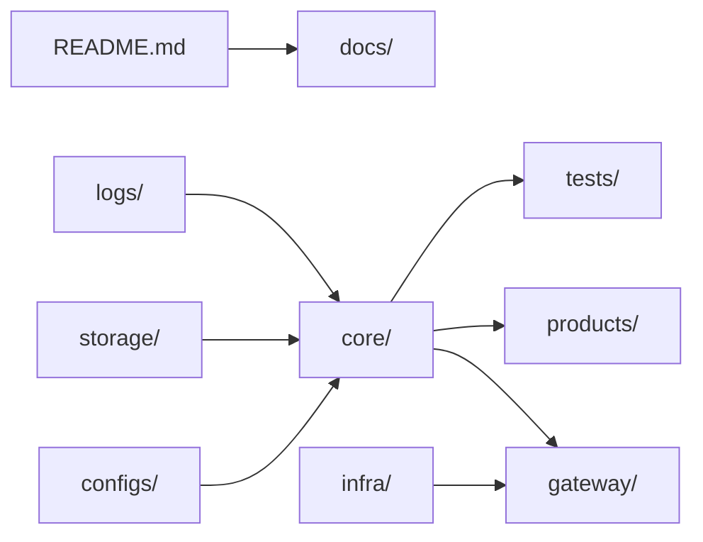
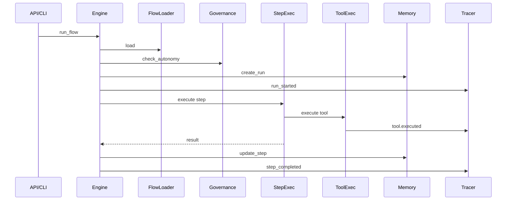
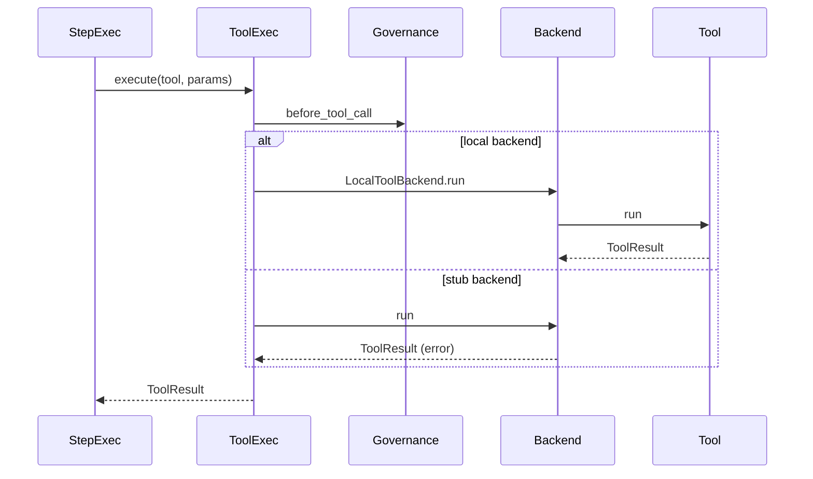
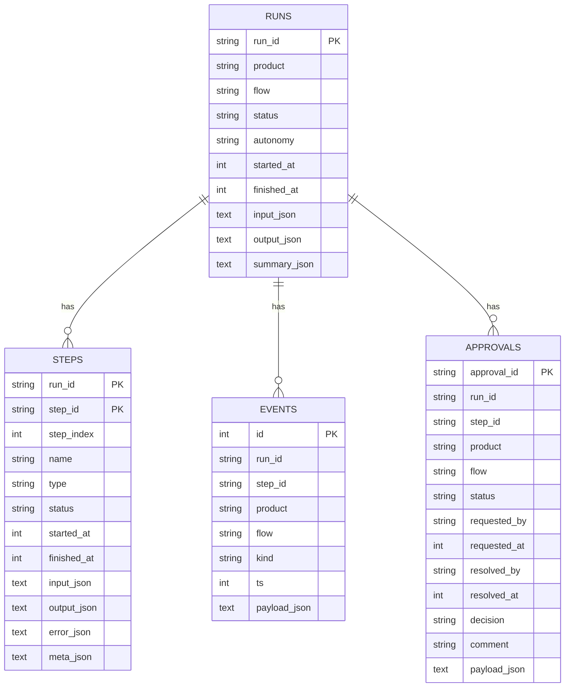
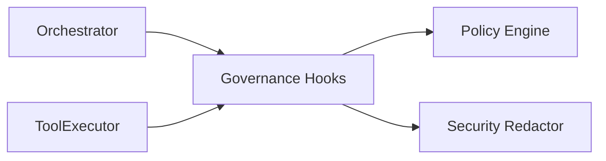
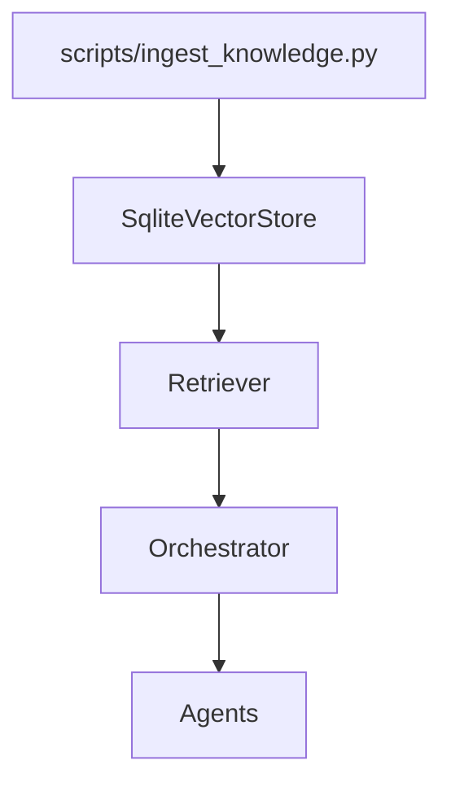
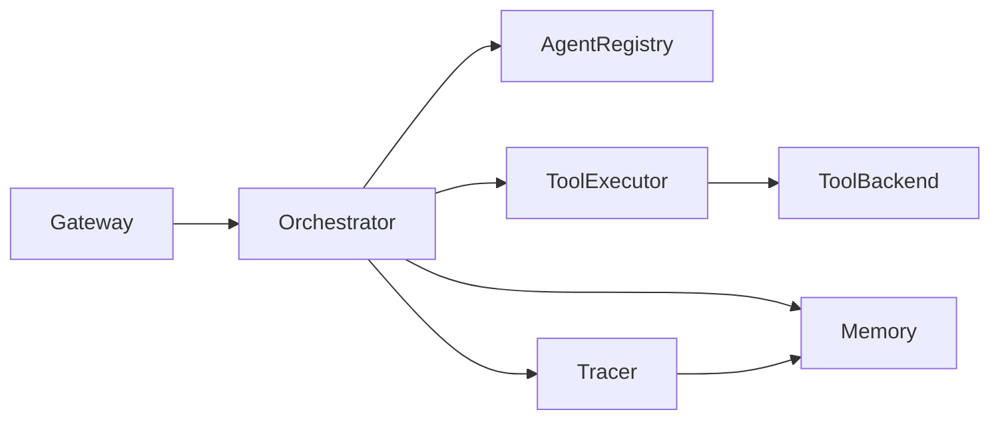

# Component Details

This document summarizes the major components in the `master` codebase, including their code
paths, intent, and key technical characteristics. It mirrors the codebase structure and
highlights how components collaborate at runtime.

---

## Top-Level Structure

| Code Path | Code Name | Functional Details | Technical Details |
| --- | --- | --- | --- |
| `/README.md` | Root overview | High-level description of the platform, bootstrap instructions, and governance expectations. | Markdown consumed by contributors; echoes product vision and links to docs. |
| `/configs` | Configuration bundles | Declarative settings for the runtime (app metadata, model defaults, policies, per-product enablement). | YAML files loaded via `core.config` utilities; injected into agents/tools (no direct env access). |
| `/core` | Core runtime | Houses the reusable orchestration, tool, and agent infrastructure shared by every product. | Pure Python package, typed and organized into submodules (agents, tools, orchestrator, memory, etc.). |
| `/docs` | Knowledge base | Internal documentation (architecture, flows, governance, product HOWTOs). | Markdown assets referenced by onboarding and governance processes. |
| `/gateway` | Entry points | API/CLI/UI shells that expose the orchestrator to users/services. | FastAPI app (`gateway/api`), argparse-based CLI (`gateway/cli`), and Streamlit UI (`gateway/ui`). |
| `/infra` | Deployment glue | Container/K8s definitions and platform scripts used for shipping the stack. | Dockerfile, docker-compose, and k8s manifests. |
| `/logs` | Local log sink | Default on-disk location for structured run logs. | `core/logging/logger.py` and tracer mirror events here. |
| `/products` | Product packs | Individual product definitions (flows, agents, prompts, assets). | Each product ships a `manifest.yaml` plus `config/product.yaml`, custom agents/tools, templates. |
| `/scripts` | Ops scripts | Helper scripts for scaffolding, ingestion, and migrations. | `create_product.py`, `ingest_knowledge.py`, `migrate_memory.py`, `run_flow.py`. |
| `/storage` | Persistent state | Storage folders for artifacts and memory DB files. | Includes `storage/{memory,raw,processed,vectors}` for local/dev use. |
| `/tests` | Automated tests | Pytest suites covering core units, integration flows, CLI/API/UI, and product regressions. | Organized into `tests/core`, `tests/integration`, and `products/*/tests`. |
| `/pyproject.toml` / `/requirements.txt` | Build metadata | PEP‑621 project definition and pip requirements for production tooling. | Used by CI/CD; coordinates dependency versions. |

---

## Core Package (`/core`)

### Orchestrator

| Code Path | Code Name | Functional Details | Technical Details |
| --- | --- | --- | --- |
| `core/orchestrator/engine.py` | Flow engine | Drives flow execution, pause/resume, and trace emission. | Loads FlowDef from `products/<product>/flows/`, enforces autonomy policy, persists runs/steps, emits trace events. |
| `core/orchestrator/flow_loader.py` | Flow loader | Loads FlowDefs/StepDefs from flow YAML/JSON. | Validates and normalizes step ids; no execution or persistence. |
| `core/orchestrator/step_executor.py` | Step executor | Executes tool or agent steps. | Renders params from payload, delegates to ToolExecutor/AgentRegistry, handles retry policy. |
| `core/orchestrator/hitl.py` | HITL service | Approval creation and resolution. | Persists approval records via MemoryRouter. |
| `core/orchestrator/state.py` | Status helpers | Canonical run/step status groups. | Re-exports RunStatus/StepStatus for runtime use. |
| `core/orchestrator/runners.py` | Convenience wrappers | Thin helpers for CLI/API. | Calls OrchestratorEngine directly. |

### Agents

| Code Path | Code Name | Functional Details | Technical Details |
| --- | --- | --- | --- |
| `core/agents/base.py` | `BaseAgent` | Abstract contract for agents. | `run(step_context)` returns `AgentResult`. |
| `core/agents/registry.py` | Agent registry | Global DI container for agent factories. | Case-normalized name resolution; new instance per resolution. |

### Tools

| Code Path | Code Name | Functional Details | Technical Details |
| --- | --- | --- | --- |
| `core/tools/base.py` | `BaseTool` | Tool contract used by products. | `run(params, ctx)` returns `ToolResult`. |
| `core/tools/executor.py` | Tool executor | Central dispatcher for tool execution. | Applies governance hooks and redaction; emits trace events. |
| `core/tools/backends/local_backend.py` | Local backend | In-process tool execution. | Calls Python tool implementation directly. |
| `core/tools/backends/remote_backend.py` | Remote backend (stub) | Placeholder for HTTP/gRPC tools. | Returns error in v1. |
| `core/tools/backends/mcp_backend.py` | MCP backend (stub) | Placeholder for MCP tools. | Disabled by default; returns error in v1. |

### Memory

| Code Path | Code Name | Functional Details | Technical Details |
| --- | --- | --- | --- |
| `core/memory/base.py` | Memory interfaces | Contracts for adapters (runs, steps, events, approvals). | Base classes consumed by routers/backends. |
| `core/memory/sqlite_backend.py` | SQLite backend | Durable run/memory persistence. | Stores runs, steps, events, approvals in SQLite. |
| `core/memory/in_memory.py` | In-memory backend | Lightweight store for tests/dev. | Dict-backed, non-durable. |
| `core/memory/router.py` | Memory router | Chooses appropriate backend and exposes CRUD. | Used by orchestrator, API, CLI, tracer. |

### Governance & Security

| Code Path | Code Name | Functional Details | Technical Details |
| --- | --- | --- | --- |
| `core/governance/policies.py` | Policy engine | Evaluates tool/model allowlists and autonomy rules. | Per-product overrides supported. |
| `core/governance/hooks.py` | Governance hooks | Integration point for orchestrator/tools. | Autonomy check at run start; tool/step checks at execution. |
| `core/governance/security.py` | Redaction | Scrubs secrets/PII from payloads. | Regex + key-hint based sanitization. |

### Models

| Code Path | Code Name | Functional Details | Technical Details |
| --- | --- | --- | --- |
| `core/models/router.py` | Model router | Selects provider/model per product/purpose. | Enforces model policies. |
| `core/models/providers/openai_provider.py` | OpenAI provider (stub) | Placeholder adapter. | No network calls in v1. |
| `core/models/providers/other_provider.py` | Other provider (stub) | Placeholder adapter. | Returns structured error in v1. |

### Knowledge

| Code Path | Code Name | Functional Details | Technical Details |
| --- | --- | --- | --- |
| `core/knowledge/vector_store.py` | Vector store | SQLite-backed chunk store. | Lexical Jaccard scoring in v1. |
| `core/knowledge/retriever.py` | Retriever | Thin wrapper over VectorStore. | Adds filters/top_k defaults. |
| `core/knowledge/structured.py` | Structured access | Deterministic CSV reads. | Pandas optional; no SQL. |

### Logging & Metrics

| Code Path | Code Name | Functional Details | Technical Details |
| --- | --- | --- | --- |
| `core/logging/tracing.py` | Tracer | Persists trace events with redaction. | Writes to memory backend. |
| `core/logging/logger.py` | Logger | JSON log formatting. | Structured context fields (run_id, step_id, product, flow). |
| `core/logging/metrics.py` | Metrics | In-memory counters/timers. | No external exporters in v1. |

---

## Gateway (`/gateway`)

| Code Path | Code Name | Functional Details | Technical Details |
| --- | --- | --- | --- |
| `gateway/api/http_app.py` | FastAPI factory | Builds API router and app. | `/api` routes wired in `routes_run.py`. |
| `gateway/api/routes_run.py` | Run routes | Starts/resumes flows and reads runs. | Uses orchestrator + product catalog. |
| `gateway/cli/main.py` | CLI entry | Argparse CLI for local runs. | Directly calls orchestrator. |
| `gateway/ui/platform_app.py` | Streamlit UI | Control center for products, runs, approvals. | Talks to API only. |

---

## Products (`/products`)

Each product pack includes:
- `manifest.yaml`
- `config/product.yaml`
- `flows/*.yaml`
- `agents/` and `tools/`
- `registry.py`
- `tests/`

Products are discovered and registered by `core/utils/product_loader.py`.

---

## Configurations (`/configs`)

| File | Purpose | Notes |
| --- | --- | --- |
| `app.yaml` | Global app metadata | Host/ports, paths, flags. |
| `logging.yaml` | Logging config | Level, redaction, sinks. |
| `models.yaml` | Model routing | Provider and model defaults. |
| `policies.yaml` | Governance rules | Tool/model allowlists, autonomy. |
| `products.yaml` | Product enablement | Discovery settings. |

---

## Tests

| Path | Purpose | Notes |
| --- | --- | --- |
| `tests/core` | Unit/regression suites for core subsystems. | Orchestrator, memory, governance, tools, contracts. |
| `tests/integration` | End-to-end flows. | CLI, API, UI, knowledge, resilience. |
| `products/*/tests` | Product regressions. | Golden paths for each product. |

---

## Component Relationships

- Gateway (API/CLI/UI) invokes the core orchestrator.
- Orchestrator executes steps via tool and agent registries.
- Tool execution flows through `ToolExecutor` with governance checks.
- Memory persists runs, steps, events, and approvals.
- Tracing emits sanitized events to memory + logs.

---

## Technical Standards Recap

- Agents/tools never read environment variables directly.
- All agent/tool outputs must use Pydantic contracts.
- Logging goes through `core.logging`.
- Governance checks are centralized and non-bypassable.

---

This document should be updated whenever new top-level components or subsystems are added.
