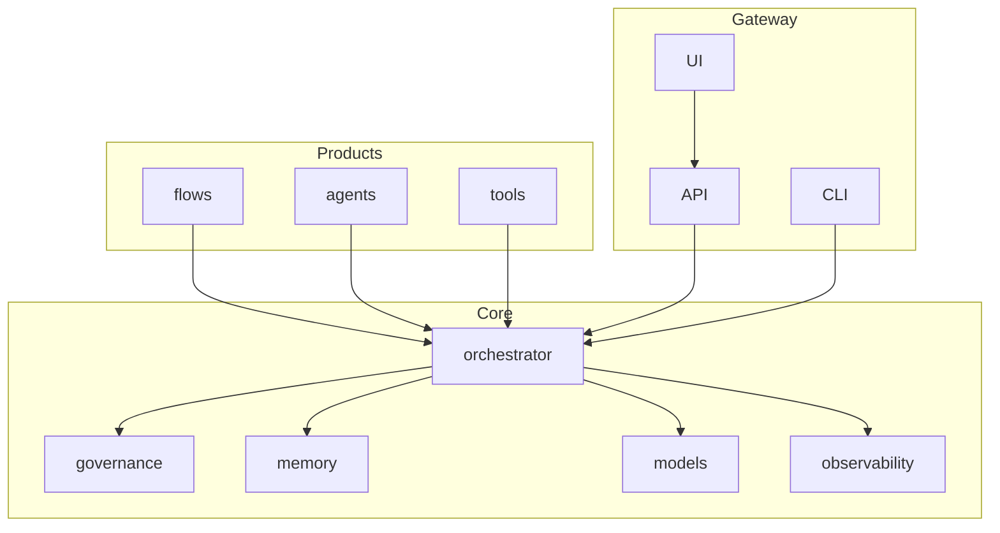
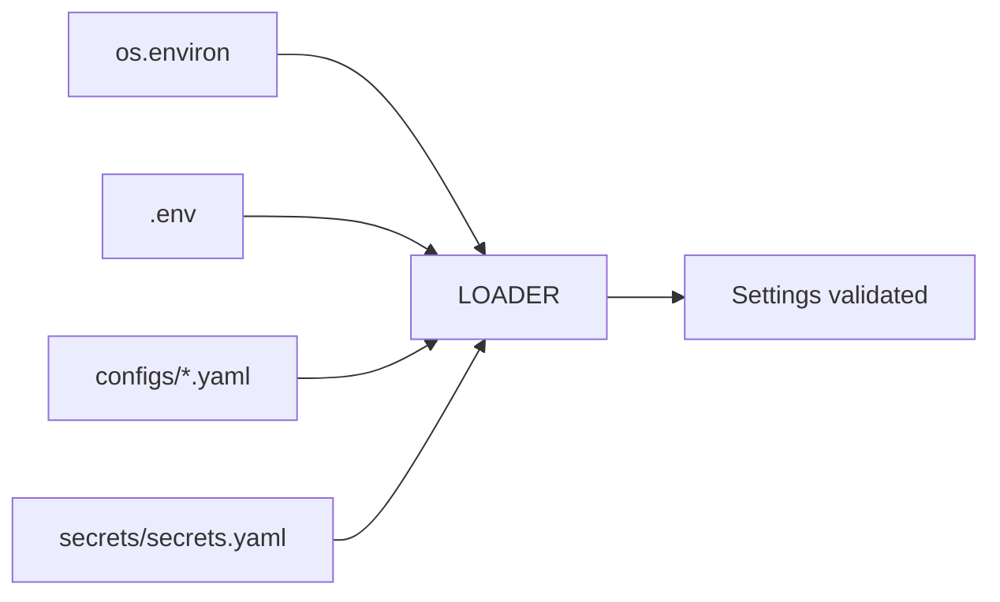
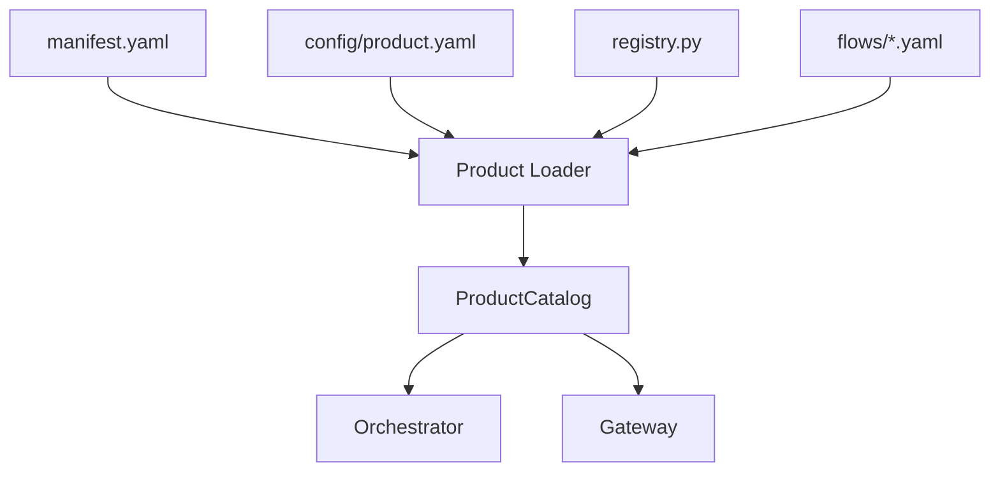
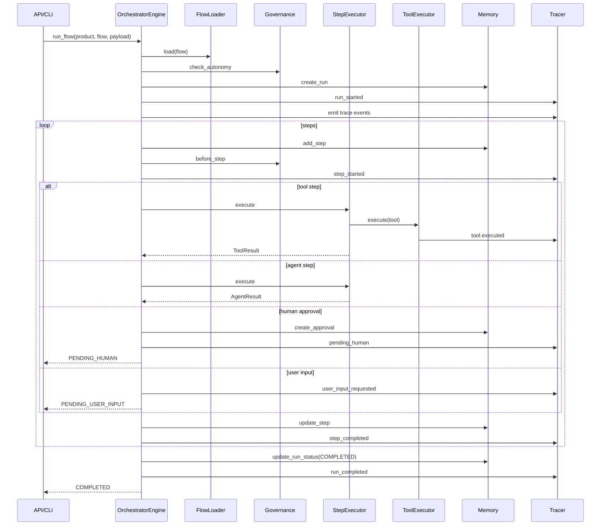
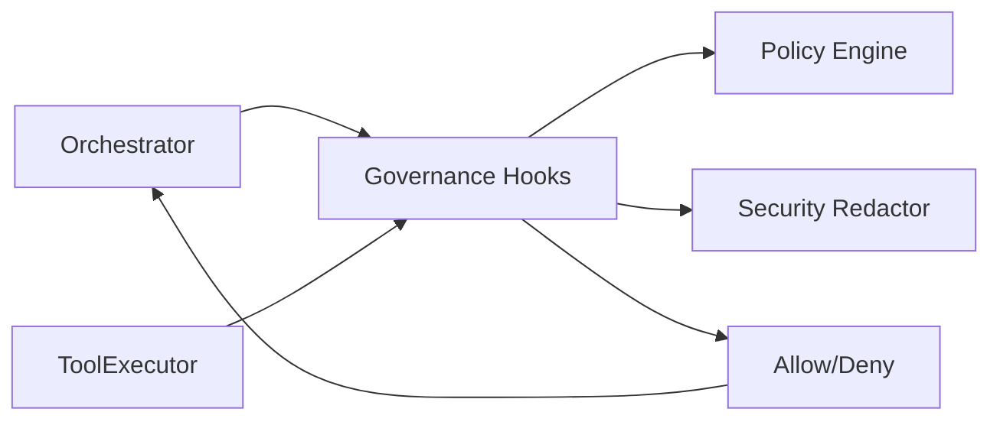
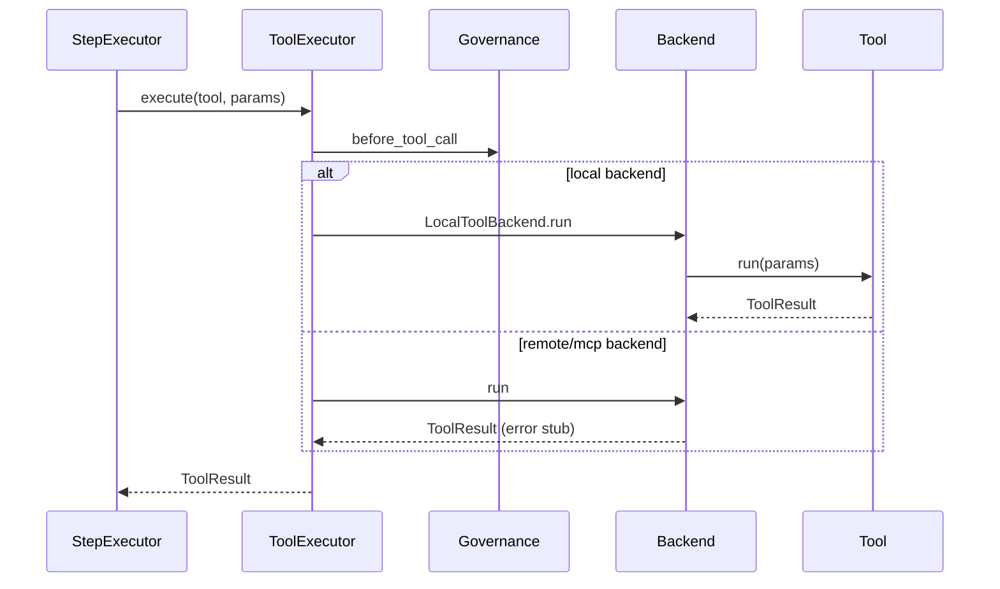
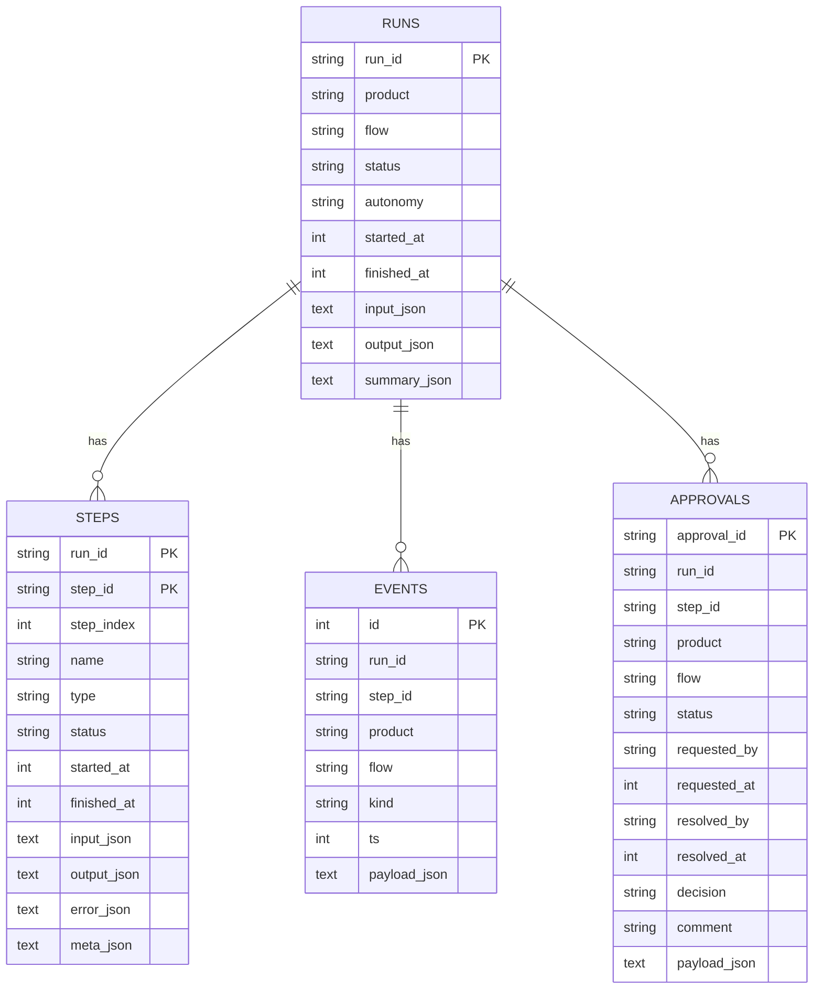
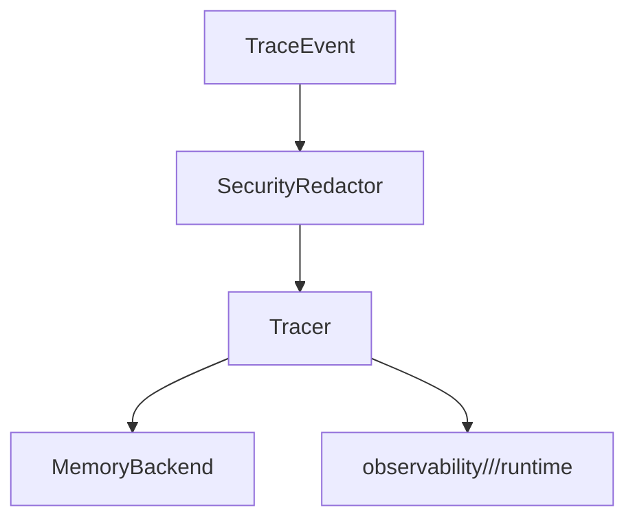
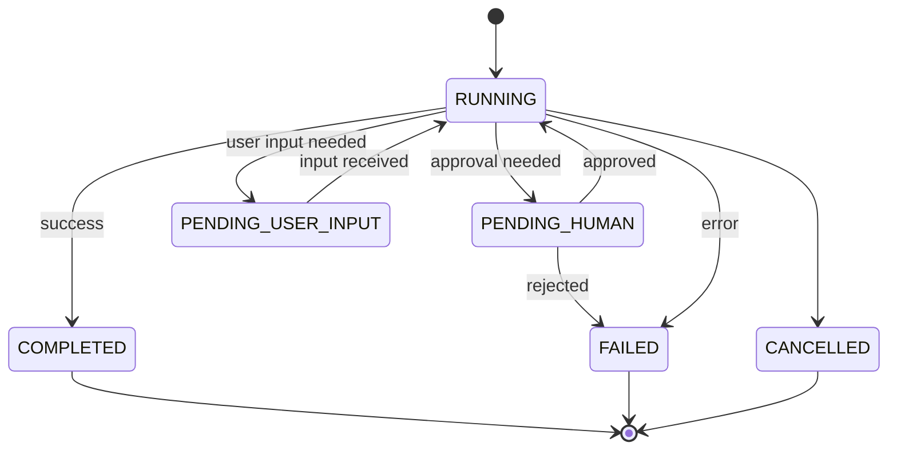

# Core Architecture — master/

This document describes the **core architecture** of the `master/` agentic framework.
It explains **what exists, why it exists, and how the pieces interact**, with enough detail for engineers to reason about changes without reading all the code.

---

## 1. Architectural Principles

The architecture follows these non-negotiable principles:

- **Thin Products, Thick Platform**
- **Headless Core Runtime**
- **Explicit Contracts Everywhere**
- **No Hidden Side Effects**
- **Auditability > Cleverness**
- **Pause / Resume is First-Class**

Everything in `core/` is **product-agnostic**.
Everything in `products/` is **domain-specific**.

---

## 2. High-Level Layering

```
┌───────────────────────────────┐
│           Products            │  ← Business logic only
│  (flows, agents, tools)       │
└──────────────▲────────────────┘
│
┌──────────────┴────────────────┐
│             Core              │  ← Runtime + rules
│  Orchestrator, Memory,        │
│  Governance, Models, Tools    │
└──────────────▲────────────────┘
│
┌──────────────┴────────────────┐
│            Gateway            │  ← API, UI, CLI
│  HTTP, UI routing, auth stub  │
└───────────────────────────────┘
```



---

## 3. Configuration & Settings

**Source of truth:** `core/config/loader.py` and `core/config/schema.py`.

- Only the loader reads environment variables and secrets.
- Precedence: `env` > `secrets/secrets.yaml` > `configs/*.yaml` > defaults.
- `.env` is optional and does not override real env vars.
- Environment overrides use `MASTER__` namespacing.
- Paths are resolved through `app.paths.*` (repo_root, storage_dir, observability_dir).



---

## 4. Product Discovery & Registration

**Source of truth:** `core/utils/product_loader.py`.

- Products are discovered under `products/`.
- Required files:
  - `manifest.yaml`
  - `config/product.yaml`
  - `registry.py`
- Flows are loaded from `products/<product>/flows/*.yaml` or `*.json`.



---

## 5. Orchestrator

**Source of truth:** `core/orchestrator/*`.

Purpose: control flow execution, tool retries, HITL pauses, and resume.

### Key Modules
```
core/orchestrator/
├── engine.py
├── flow_loader.py
├── context.py
├── state.py
├── error_policy.py
└── hitl.py
```

### Responsibilities
- Load flow definitions (YAML/JSON) via `FlowLoader` from `products/<product>/flows/`.
- Enforce autonomy policy **before** a run starts.
- Execute steps in order, honoring tool retry policies & backoff.
- Pause execution for HITL approvals and user_input steps; persist approvals and user input requests.
- Resume execution deterministically using stored run/step snapshots.
- Emit trace events for every transition (run, step, tool, approval, user_input, plan proposals).
- Govern output persistence (run output + output files) before write.

### Session Isolation (Gateway)
The Gateway API constructs an `OrchestratorEngine` per request to avoid cross-user state leakage. Registries, settings, and the memory/tracing backends remain cached, but run context and execution state are request-scoped. Run ids include a timestamp plus a random suffix to avoid collisions under concurrent starts.

### What It Does NOT Do
- Call models directly.
- Call tools directly.
- Persist data directly.
- Contain business logic.

### Execution Flow (Sequence)


### Step Parameter Rendering
`StepExecutor` renders params via `core/orchestrator/templating.py`, replacing:
- `{{payload.<key>}}`
- `{{artifacts.<key>}}` (flat keys or nested access)

Missing values render as `null` for full-token values and as empty strings for inline tokens.

### Templating

Templating lives in `core/orchestrator/templating.py` and is used by:
- `render_template` / `render_messages` for strict message rendering (missing keys raise).
- `render_params` for lenient tool parameter rendering (missing keys resolve to `None` or empty string).

---

## 6. Flow Definitions & Contracts

**Source of truth:** `core/contracts/flow_schema.py`.

- `FlowDef` is the canonical flow structure.
- Step types: `agent`, `tool`, `human_approval`, `user_input`, `plan_proposal`, `subflow` (subflow is not implemented in v1).
- Retry policy is declarative (`max_attempts`, `backoff_seconds`, `retry_on_codes`) and applies to tool steps.

---

## 7. Governance & Security

**Source of truth:** `core/governance/*`.

- `PolicyEngine` enforces tool/model allowlists and autonomy rules.
- `GovernanceHooks` are the standard integration point for orchestrator and tools.
- `SecurityRedactor` sanitizes payloads before persistence or logging.

Hooks run:
- At run initialization (autonomy check)
- Before step execution
- Before tool execution
- Before model execution
- Before user input ingestion
- Before run output persistence
- Before output file persistence



---

## 8. Tools & Backends

**Source of truth:** `core/tools/*`.

- Tools execute only through `ToolExecutor`.
- Backends:
  - `LocalToolBackend` (in-process)
  - `RemoteToolBackend` (stub, not implemented)
  - `MCPBackend` (stub, disabled by default)



---

## 9. Memory & Persistence

**Source of truth:** `core/memory/*`.

Memory is the only layer allowed to persist state.

### Backends
- `SQLiteBackend` (durable; default)
- `InMemoryBackend` (test/dev; non-durable)

### SQLite Tables (v1)
- `runs`
- `steps`
- `events` (trace events)
- `approvals`



---

## 10. Tracing & Observability

**Source of truth:** `core/memory/tracing.py` and `core/memory/observability_store.py`.

- `Tracer` sanitizes and persists `TraceEvent` via memory.
- `MemoryRouter` mirrors trace events to `observability/<product>/<run_id>/runtime/events.jsonl` when observability is enabled.
- `ObservabilityStore` owns the run directory layout:
  - `input/`
  - `runtime/`
  - `output/`
The observability root is configurable via `app.paths.observability_dir`.



---

## 11. Models

**Source of truth:** `core/models/*`.

- `ModelRouter` selects provider/model by product/purpose.
- Providers live under `core/models/providers/`.
- Provider modules are the only location allowed to call vendor SDKs.
- LLM invocation in v1 is centralized in `core/agents/llm_reasoner.py`.
- Reasoning purpose is required for every model call.

---

## 12. Contracts & Envelopes

**Source of truth:** `core/contracts/*`.

- `AgentResult` and `ToolResult` are mandatory envelopes.
- Run records (`RunRecord`, `StepRecord`, `TraceEvent`) enforce stable persistence and serialization.

---

## 13. Gateway

**Source of truth:** `gateway/*`.

- API: `gateway/api` (FastAPI)
- UI: `gateway/ui` (Streamlit control center)
- CLI: `gateway/cli` (argparse)

The CLI calls the orchestrator directly; the UI talks only to the API.

---

## 14. Run Lifecycle (Status Model)

**Source of truth:** `core/contracts/run_schema.py`, `core/orchestrator/state.py`.



---

## 15. Adding a New Product (No Core Changes)

Steps:
1. Create `products/<new_product>/`.
2. Add `manifest.yaml` and `config/product.yaml`.
3. Implement agents/tools and register them in `registry.py`.
4. Add flows under `flows/`.
5. UI/API auto-discover the product when enabled.

---
