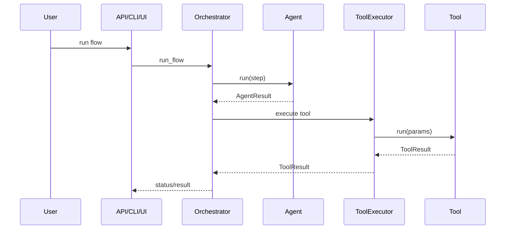

# Flows and Agents — master/

This document explains **how flows and agents are defined, wired, and executed**
in the `master/` platform.

It is intended for engineers **building products**, not modifying the core runtime.

This document is governed by:
- docs/engineering_standards.md

---

## 1. Core Concepts

### Flow
A **flow** is a declarative definition of:
- *what goal is being pursued*
- *what steps are required*
- *in what order they execute*
- *under what constraints*



Flows:
- Are defined in YAML or JSON
- Are loaded and validated by the orchestrator
- Contain **no executable logic**
- Describe intent, not implementation

---

### Agent
An **agent** is a unit of goal-driven reasoning.

Agents are:
- Stateless
- Deterministic for a given context
- Goal-driven (not template-driven)
- Side-effect free

Agents:
- Receive params and constraints from the orchestrator
- Reason and decide
- Return structured outputs (`AgentResult`)
- Do **not** perform IO or execution directly

---

## 2. Flow Location

Flows live under:

products/<product>/flows/

Example:

products/hello_world/flows/hello_world.yaml

---

## 3. Flow Definition Schema (Conceptual)

```yaml
id: hello_world
description: Simple demo flow

autonomy_level: semi_auto   # suggest_only | semi_auto | full_auto

steps:
  - id: plan
    type: agent
    agent: hello_world.planner
    params:
      instruction: "Generate an execution plan"
    retry:
      max_attempts: 2
      backoff_seconds: 1

  - id: approve
    type: human_approval
    message: "Approve generated plan?"

  - id: execute
    type: agent
    agent: hello_world.executor
    params:
      instruction: "Execute the approved plan"
```

Notes:
- `params` are the primary control inputs to agents and tools
- Retry behavior is declarative and flow-driven

---

## 4. Step Types

### 4.1 Agent Step

- id: step_name
  type: agent
  agent: product.agent_name
  params:
    instruction: "Describe desired outcome"

Behavior:
- Resolves agent from registry
- Provides StepContext (params, payload, artifacts)
- Executes agent reasoning
- Expects an AgentResult

Agents:
- Do not decide the next step
- Do not call tools directly
- Do not mutate persistent state

---

### 4.2 Tool Step

- id: call_tool
  type: tool
  tool: product.tool_name

Behavior:
- Executed only by the tool executor
- Subject to governance and policy checks
- Produces a ToolResult

Notes:
- The orchestrator decides whether and when tools run
- Tools are executed only by ToolExecutor

---

### 4.3 Human Approval Step (HITL)

- id: approve
  type: human_approval
  message: "Approve this output?"

Behavior:
- Pauses execution
- Persists run and step state
- Sets run status to PENDING_APPROVAL (PENDING_HUMAN in storage)
- Requires explicit resume action
- Approval context can be supplied in `params` (reason, decision notes, recommended action)

---

### 4.4 User Input Step

- id: collect_input
  type: user_input
  params:
    schema_version: "1.0"
    form_id: "chart_config"
    title: "Select chart options"
    mode: choice_input
    schema:
      type: object
      properties:
        chart_type:
          type: string
          enum: [bar, line]
    defaults:
      chart_type: bar
    required: [chart_type]

Behavior:
- Pauses execution
- Sets run status to PENDING_USER_INPUT
- Requires resume with `user_input_response` payload

---

### 4.5 Plan Proposal Step

- id: propose_plan
  type: plan_proposal
  agent: product.plan_agent

Behavior:
- Invokes a planner agent that returns a structured PlanProposal (JSON)
- Validates proposal against schema
- Emits plan proposal trace events
- Does not execute the plan automatically

---

## 5. Autonomy Levels

Level	Description
suggest_only	Agents reason and suggest; no execution
semi_auto	Tools may execute but require approval
full_auto	Fully autonomous execution

Rules:
- Autonomy level is enforced by governance hooks
- Agents do not override autonomy

---

## 6. Retry and Error Handling

Retries are flow-driven, never agent-driven.

retry:
  max_attempts: 3
  backoff_seconds: 2

Rules:
- Retries occur only on recoverable errors
- Error classification is handled by error policy evaluation
- Agents return structured errors; they do not retry themselves

---

## 7. Agent Location

Agents live under:

products/<product>/agents/

Example:

products/hello_world/agents/simple_agent.py


---

## 8. Agent Contract

All agents must:
- Inherit from BaseAgent
- Implement run(step_context)
- Return AgentResult
- Never raise exceptions for expected failures

Conceptual example:

class SimpleAgent(BaseAgent):
    name = "hello_world.simple"

    def run(self, step_context):
        return AgentResult(
            ok=True,
            data={"message": "Hello world"},
            error=None,
            meta={"agent_name": "hello_world.simple"},
        )


---

## 9. Agent Responsibilities

Agents MAY:
- Read params, constraints, and artifacts
- Reason and decide
- Emit trace events
- Request tool usage via structured output

Agents MUST NOT:
- Execute tools directly
- Call other agents
- Read/write files
- Persist state
- Invoke models directly
- Read environment variables

---

## 10. Agent Registry

Agents are registered at startup:
- Product agents self-register via controlled import
- Registry maps agent_name -> agent class

Resolution:
- Orchestrator resolves agents by name at runtime
- Names should be namespaced (product.agent)

---

## 11. Flow Execution Lifecycle
	1.	Flow loaded and validated
	2.	RunContext initialized
	3.	Step loop begins
	4.	Step executed
	5.	Trace events emitted
	6.	State persisted via memory backend
	7.	HITL pause or continuation
	8.	Completion or failure recorded

Step parameter rendering supports:
- `{{payload.<key>}}`
- `{{artifacts.<key>}}`
Missing values render as `null` for full-token values and as empty strings for inline tokens.

---

## 12. Flow Composition Patterns

### 12.1 Linear Flow

Plan → Execute → Finish


---

### 12.2 Iterative Flow

Plan → Execute → Validate → Re-plan

(Requires conditional support in orchestrator)

---

### 12.3 Approval Gate

Generate → Approve → Execute


---

## 13. Product Isolation

Rules:
- Flows must not reference agents from other products
- Tools are product-scoped unless explicitly shared
- Core agents/tools may be reused

---

## 14. Testing Flows and Agents

Required:
- Unit test agents independently
- Integration test flows via orchestrator
- Explicitly test HITL paths
- Assert structured outputs and state transitions

---

## 15. Best Practices
- Keep flows declarative and readable
- Express intent via params, not code
- Keep agents small and single-purpose
- Prefer more steps over complex agents
- Use approval gates early for high-risk actions
- Log decisions and intent, not raw data

---

This design ensures flows remain auditable, deterministic, and change-safe
while preserving strong product isolation and long-term evolvability.

---
