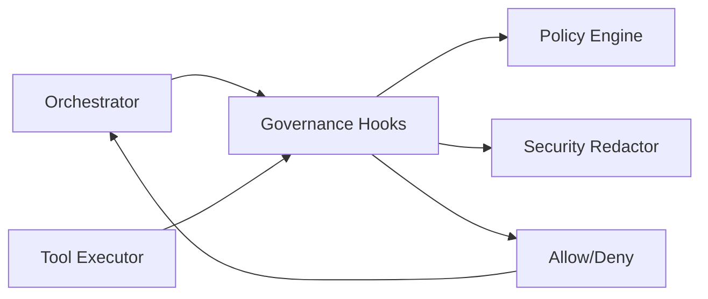

## Governance and Policies — master/

This document defines the **governance model** for the `master/` agentic platform.

Governance exists to ensure:
- Safety
- Auditability
- Determinism
- Enterprise compliance
- Controlled autonomy at scale

All governance is **centralized in core**.  
No product, agent, or tool may bypass governance under any circumstance.

This document is governed by:
- `docs/engineering_standards.md`

---

## 1. Governance Scope

Governance applies uniformly across:
- Flows
- Steps
- Agents
- Tools
- Models
- Autonomy levels
- Human-in-the-loop (HITL)
- Tracing, observability, and persistence

Rules:
- ❌ Products must not implement custom governance logic
- ❌ Agents must not self-enforce policy
- ✅ All enforcement happens via core governance hooks



---

## 2. Policy Configuration

All policies are **data-driven** and defined in:

configs/policies.yaml

Rules:
- Policies are configuration, not code
- Changes to policies do not require redeploying core logic
- Policies are evaluated **at runtime**, not compile time

---

## 3. Policy Types

### 3.1 Global Allow/Block Lists

Policies in `configs/policies.yaml` are allow/block lists, evaluated by the core policy engine.

Example:
```yaml
allowed_tools: []
blocked_tools: []
allowed_models: []
blocked_models: []
```

Rules:
	•	If `allowed_tools` is empty, all registered tools are allowed unless blocked
	•	If `allowed_models` is empty, all registered models are allowed unless blocked
	•	Blocked lists always take precedence

---

### 3.2 Per-Product Overrides

Per-product overrides are the primary way to constrain a specific product.

Example:
```yaml
by_product:
  hello_world:
    allowed_tools:
      - echo_tool
    allowed_models:
      - gpt-4o-mini
```

Rules:
	•	Product policies override global defaults
	• Products cannot access tools or models not explicitly allowed

---

### 3.3 Autonomy Policies

Autonomy is enforced via governance hooks based on the flow autonomy level and policy config.

Rules:
	•	full_auto requires explicit policy enablement
	•	Agents cannot override autonomy
	•	Orchestrator enforces autonomy at run start

---

## 4. Human-in-the-Loop (HITL)

### 4.1 When HITL Is Required

HITL is triggered when:
- A step type is human_approval

HITL is not optional when required.

---

### 4.2 HITL Behavior

When HITL is triggered:
	•	Execution pauses immediately
	•	Run status transitions to PENDING_HUMAN
	•	Run and step context are persisted
	•	An approval request is created and tracked

No further execution occurs until resolution.

---

### 4.3 Resume Flow

Flow resumption occurs via:

POST /api/resume_run/{run_id}

Rules:
	•	Run must be in PENDING_HUMAN
	•	Approval decision must exist
	•	Resume action is fully audited

---

## 5. Governance Hooks

Governance hooks are mandatory enforcement points executed by the runtime.

### 5.1 Available Hooks

Hook Name	Trigger
check_autonomy	Run initialization (autonomy policy enforcement)
before_step	Step execution
before_tool_call	Tool invocation
before_complete	Run finalization


---

### 5.2 Hook Responsibilities

Hooks may:
- Allow execution
- Deny execution
- Modify context metadata
- Emit trace events

Hooks must NOT:
	•	Execute tools
	•	Modify flow structure
	•	Call external systems

---

## 6. Security and Redaction

### 6.1 PII and Secret Scrubbing

All logs, traces, and persisted artifacts are scrubbed for:
	•	API keys
	•	Tokens
	•	Secrets
	•	PII patterns (emails, IDs, phone numbers)

Implemented in:

core/governance/security.py

Scrubbing occurs:
	•	Before persistence
	•	Before logging
	•	Before UI rendering

---

### 6.2 Redaction Rules

Redacted values appear as:

[REDACTED]

Rules:
	•	Raw secrets must never be written to disk
	•	Scrubbing is mandatory and non-configurable

---

## 7. Auditability

Every run must record:
	•	Who initiated the run
	•	Product and flow identifiers
	•	Step execution timeline
	•	Tool invocations
	•	Approval decisions
	•	Final outcome and errors

Stored via:

core/memory/*

Audit records are immutable once written.

---

## 8. Policy Violations

When a policy is violated:
	•	Execution stops immediately
	•	Run status transitions to FAILED
	•	A structured governance error is recorded
	•	No partial or unsafe execution continues

There is no “best effort” execution after violation.

---

## 9. Governance Error Types

Error Type	Description
policy_blocked	Disallowed action
autonomy_denied	Autonomy exceeded
tool_blocked	Tool not permitted
model_blocked	Model not permitted

Errors are returned as structured data, not exceptions.

---

## 10. Product Developer Rules

Product teams:
	•	Must design flows within allowed autonomy
	•	Must request new tool or model access centrally
	•	Must not encode governance logic in agents or flows
	•	Must test approval and denial paths explicitly

---

## 11. Non-Negotiable Rules
	•	Governance cannot be bypassed
	•	Policies are evaluated at runtime
	•	Hooks are mandatory
	•	Violations are final
	•	Safety overrides convenience

---

This governance model ensures controlled autonomy, full auditability, and enterprise-grade safety while preserving extensibility and velocity.
