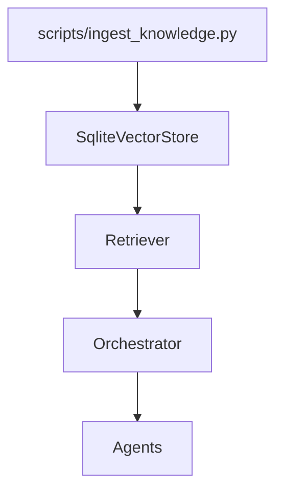

# Knowledge Layer — master/ (v1)

This document defines the **knowledge layer** of the `master/` platform and acts as a
**governing engineering standard** for all knowledge-related code.

The knowledge layer provides **deterministic, local, auditable retrieval**.
It is intentionally conservative in v1.

This document is governed by:
- `docs/engineering_standards.md`
- `docs/governance_and_policies.md`

---

## 1. Design Principles

The knowledge layer is built on the following non-negotiable principles:

- **Deterministic**: Same input → same output
- **Local-first**: No outbound network calls in v1
- **Auditable**: All data is inspectable and reproducible
- **Read-only at runtime**: Writes happen only via ingestion workflows
- **Framework-owned**: Products do not manage storage directly

The knowledge layer supports **retrieval**, not reasoning.
Reasoning happens in agents; orchestration happens in the orchestrator.



---

## 2. Scope and Boundaries

### 2.1 What the Knowledge Layer Does
- Stores and retrieves unstructured and structured knowledge
- Provides ranked chunks with metadata
- Supports filtering and collections
- Enables deterministic ingestion and re-ingestion

### 2.2 What the Knowledge Layer Does NOT Do
- ❌ No external vector databases
- ❌ No outbound HTTP or API calls
- ❌ No embedding or model inference in v1
- ❌ No autonomous querying by agents
- ❌ No direct SQL access outside the store implementation

All access is mediated through core interfaces.

---

## 3. Core Primitives

The knowledge subsystem consists of four primitives.

---

### 3.1 Vector Store  
**File:** `core/knowledge/vector_store.py`

The vector store is a **SQLite-backed, file-based store**.

Characteristics:
- Backed by SQLite (local file)
- Default location: `storage/vectors/knowledge.sqlite` (configurable)
- All access via `SqliteVectorStore` interface
- No raw SQLite usage outside this module

Data Model:
- Chunks are keyed by:

(collection, doc_id, chunk_id)

- This guarantees **idempotent upserts**

Ranking:
- Default ranking is lexical similarity (`_jaccard`)
- Scores are optional and deterministic
- Embeddings are explicitly out of scope for v1

Metadata:
- Stored as JSON
- Filterable via exact-match equality
- Used for product scoping, tags, timestamps, etc.

---

### 3.2 Retriever  
**File:** `core/knowledge/retriever.py`

The retriever is a **thin orchestration wrapper** over the vector store.

Responsibilities:
- Construct `Query` objects
- Apply top-k limits and filters
- Normalize results into `Chunk` objects

The retriever:
- Does not rank independently
- Does not mutate data
- Does not apply business logic

Returned object:
- `Chunk(chunk_id, text, source, metadata, score?)`

---

### 3.3 Structured Access  
**File:** `core/knowledge/structured.py`

Structured access supports **deterministic tabular reads**.

Capabilities:
- Load CSV files
- Prefer `pandas` when available
- Fallback to Python `csv` when required
- Filter rows deterministically
- Compute basic column statistics

Explicit exclusions (v1):
- ❌ No text-to-SQL
- ❌ No database joins
- ❌ No network access

This module is read-only by design.

---

### 3.4 Ingestion  
**File:** `scripts/ingest_knowledge.py`

Ingestion is the **only write path** into the knowledge store.

Responsibilities:
- Read files from disk
- Chunk content deterministically
- Upsert chunks into the vector store
- Emit ingestion summary statistics

Supported file types (v1):
- `.txt`
- `.md`
- `.json`
- `.csv`

Chunk identity rules:
- `doc_id` = normalized absolute file path
- `chunk_id` = `{doc_id}:::{chunk_index}`

This guarantees:
- Idempotent ingestion
- Safe re-ingestion
- No duplicate chunks

---

## 4. Ingestion CLI Usage

Example: ingest a directory of markdown files

```bash
python scripts/ingest_knowledge.py \
--db storage/vectors/knowledge.sqlite \
--collection hello_world \
--path docs/knowledge \
--glob "**/*.md" \
--chunk-size 800 \
--chunk-overlap 150 \
--max-bytes 200000
```
Example: ingest explicit files
```
python scripts/ingest_knowledge.py \
  --db storage/vectors/knowledge.sqlite \
  --collection ops \
  --file docs/runbook.md \
  --file docs/alerts.json
```
Rules:
	•	The CLI is idempotent
	•	Existing chunks are updated, not duplicated
	•	Missing files are skipped with warnings
	•	Failures are explicit and visible

---

## 5. Retrieval Usage (Framework Only)

Retrieval is performed by core components only.
Agents do not access the knowledge layer directly.

Example (core-side):

```
from core.knowledge.base import Query
from core.knowledge.vector_store import SqliteVectorStore
from core.knowledge.retriever import Retriever

store = SqliteVectorStore("storage/vectors/knowledge.sqlite")
retriever = Retriever(store)

chunks = retriever.retrieve(
    query="approval workflow",
    collection="hello_world",
    top_k=3,
    filters={"product": "hello_world"},
)

for chunk in chunks:
    print(chunk.source, chunk.score)
```
Rules:
	•	Products do not instantiate stores directly
	•	Orchestrator controls retrieval usage
	•	Agents consume retrieved data via context/artifacts only

---

## 6. Storage Layout

The SQLite store contains one row per chunk.

Column	Description
collection	Logical namespace (default, hello_world, etc.)
doc_id	Stable document identifier (normalized path)
chunk_id	Unique chunk key (doc_id + index)
text	Chunk text
source	Source path (file://...)
metadata	JSON metadata (tags, timestamps, product, etc.)
created_at	Unix timestamp (first insert)
updated_at	Unix timestamp (last update)

All reads and writes go through SqliteVectorStore.

---

## 7. Governance and Security

The knowledge layer is governed by core policies.

Rules:
	•	No secrets may be stored in knowledge metadata
	•	All metadata is subject to redaction before logging
	•	Knowledge access is read-only at runtime
	•	Collection scoping prevents cross-product leakage

Security enforcement:
	•	core/governance/security.py
	•	core/governance/hooks

---

## 8. Product Usage Rules

Products:
	•	❌ Must not write to the knowledge store
	•	❌ Must not bypass retrieval interfaces
	•	❌ Must not access SQLite directly

Products may:
	•	Reference collections in flows
	•	Consume retrieved chunks via orchestrator-managed artifacts
	•	Filter results using metadata

---

## 9. Versioning and Evolution

v1 deliberately excludes:
	•	Embeddings
	•	Hybrid search
	•	External vector databases
	•	Autonomous retrieval loops

These may be introduced in future versions without breaking contracts.

---

## 10. Non-Negotiable Rules
	•	Knowledge layer is deterministic and local in v1
	•	Ingestion is the only write path
	•	Retrieval is orchestrator-controlled
	•	No direct SQL access outside the store
	•	No outbound network calls

---

This knowledge layer ensures predictable retrieval, auditability, and
enterprise-safe foundations while leaving room for future evolution.
