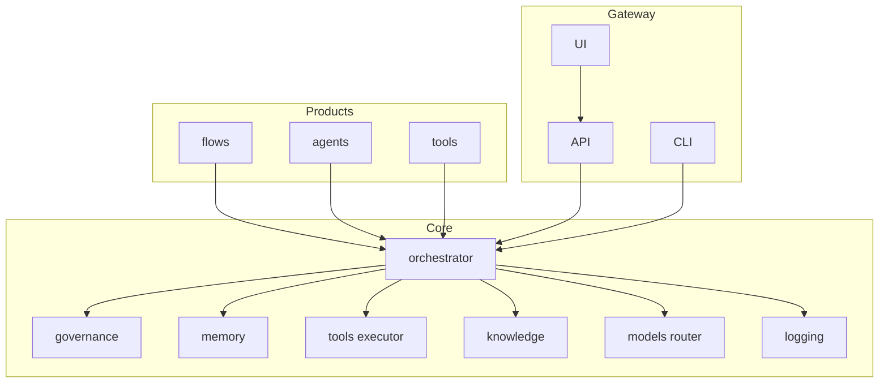
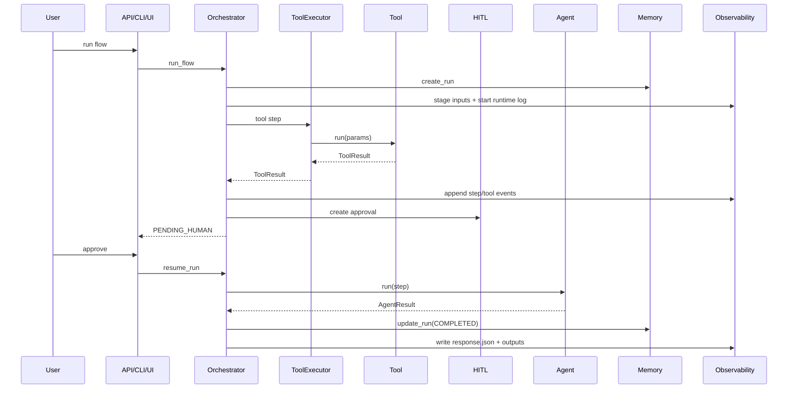
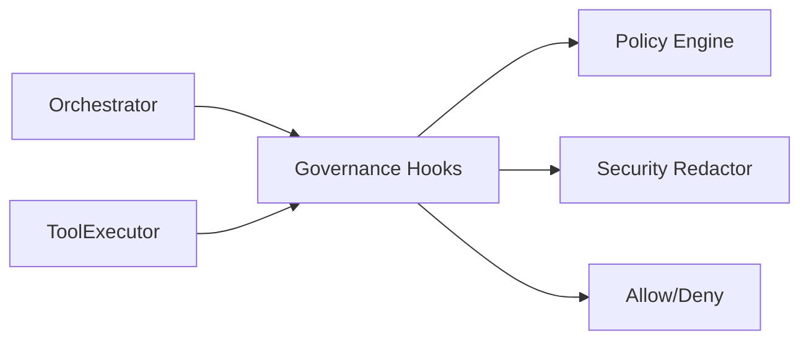
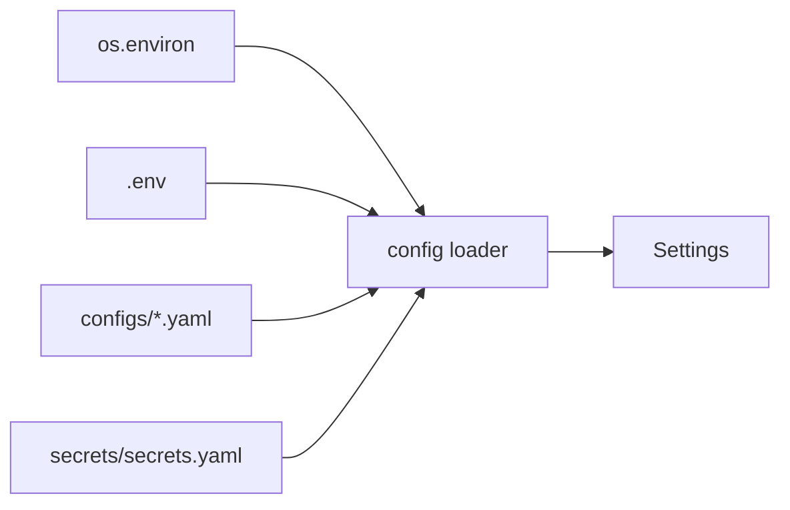
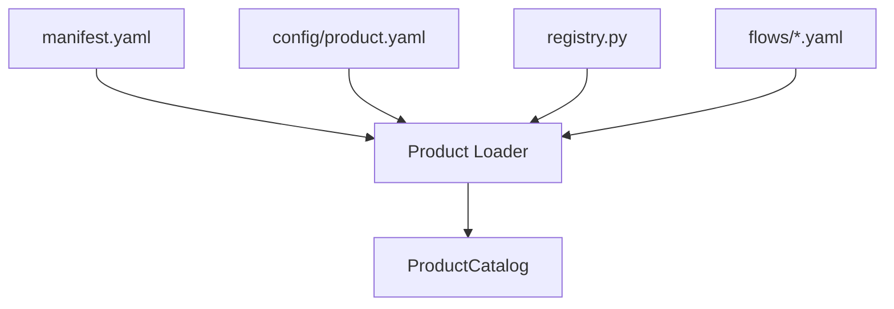

# master — Architecture Overview

This document explains the **high-level architecture** of the `master/` agentic framework.
It is intended for engineers building products on top of the platform.

---

## 1. Core Design Principles

- **Thin products, thick platform**
  - Heavy logic lives in `core/`
  - Products define *what* to run, not *how* it runs
- **Single runtime**
  - One deployable service
  - One API
  - One platform UI
- **No domain logic in core**
  - Core is reusable across teams and business units
- **Config > code**
  - Flows, policies, limits, and UI hints defined in YAML
- **Auditability first**
  - Every run, step, tool call, and decision is traceable

---

## 2. System Overview

---

## 3. Execution Flow (Golden Path)

---

## 4. Governance at a Glance

- Governance is centralized in `core/governance`.
- Policies are loaded from `configs/policies.yaml`.
- Autonomy is checked at run start.
- Tool calls are checked before execution.
- Payloads are redacted before persistence/logging.

---

## 5. Core vs Products Separation

### Core (`core/`)
The **framework runtime**. Product-agnostic and centrally managed.

Core owns:
- Orchestration & workflow execution
- Agent and tool contracts
- Model routing
- Memory & persistence
- Governance & safety
- Logging, tracing, metrics
- Knowledge (RAG + structured access)

Core **must not**:
- Contain domain logic
- Reference specific products
- Contain hardcoded flows, agents, or tools

### Products (`products/`)
Thin plug-ins built on top of core.

Each product defines:
- Flows (YAML / JSON)
- Agents (Python)
- Tools (Python)
- Prompts (YAML)
- Product-level config

Products **must not**:
- Implement orchestration logic
- Bypass governance, memory, or logging
- Modify core code

---

## 6. Gateway

### API
- `GET /api/products`
- `GET /api/products/{product}/flows`
- `POST /api/run/{product}/{flow}`
- `POST /api/resume_run/{run_id}`
- `GET /api/run/{run_id}`
- `GET /api/output/{product}/{run_id}/{filename}`

### UI
- Streamlit control center (`gateway/ui/platform_app.py`)
- Talks only to the API; product inputs/intent/output links are driven by product config

### CLI
- Argparse-based CLI (`gateway/cli/main.py`)
- Calls the orchestrator directly

---

## 7. Configuration & Settings

- Configs live in `configs/*.yaml`.
- Secrets live in `secrets/secrets.yaml`.
- `.env` is optional and only read by the config loader.
- All components receive validated `Settings` objects.

---

## 8. Product Discovery

- Products are discovered under `products/`.
- Each product must provide:
  - `manifest.yaml`
  - `config/product.yaml`
  - `registry.py`
  - `flows/*.yaml`
  - Optional UI hints under `config/product.yaml: metadata.ui`

---

## 9. Why This Architecture Scales

- Centralized governance and safety
- Consistent execution model
- Low skill barrier for product teams
- Fast prototyping with enterprise controls
- Direct path from prototype → production

This is a **platform**, not a bot.
