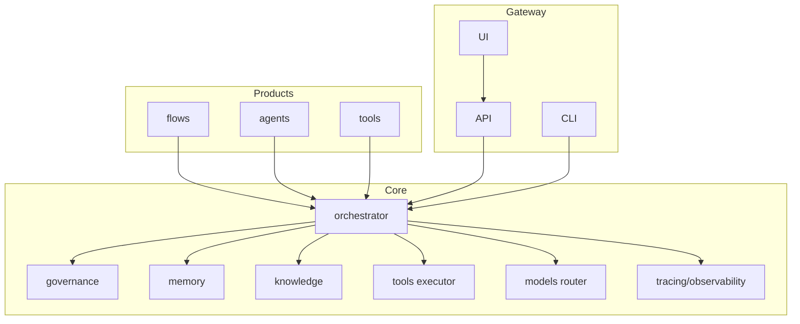
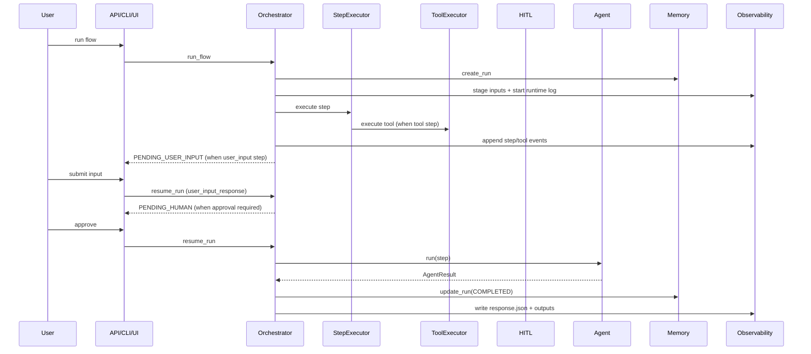
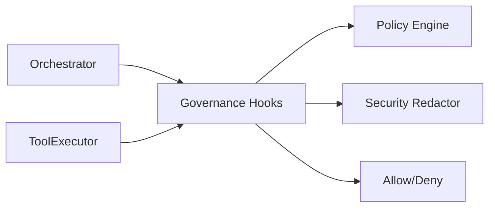
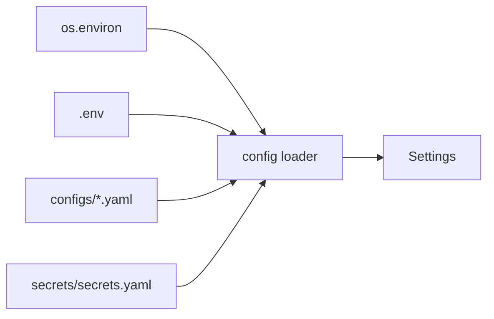
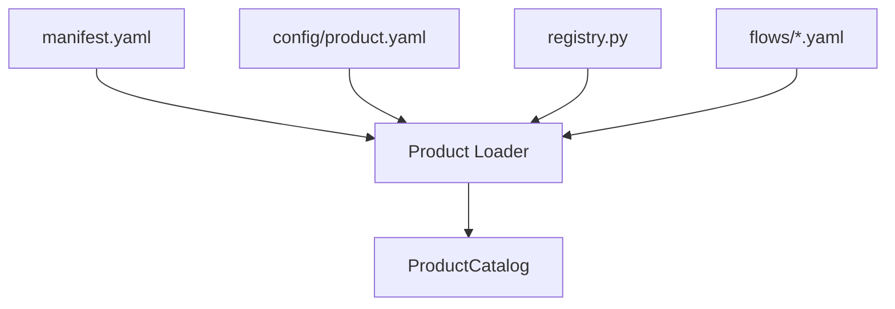

# master — Architecture Overview

This document explains the **high-level architecture** of the `master/` agentic framework.
It is intended for engineers building products on top of the platform.

---

## 1. Core Design Principles

- **Thin products, thick platform**
  - Heavy logic lives in `core/`
  - Products define *what* to run, not *how* it runs
- **Single runtime**
  - One deployable service
  - One API
  - One platform UI
- **No domain logic in core**
  - Core is reusable across teams and business units
- **Config > code**
  - Flows, policies, limits, and UI hints defined in YAML
- **Auditability first**
  - Every run, step, tool call, and decision is traceable

---

## 2. System Overview

```mermaid
flowchart TB
  subgraph Products
    P1[flows]
    P2[agents]
    P3[tools]
  end
  subgraph Core
    O[orchestrator]
    G[governance]
    M[memory]
    K[knowledge]
    T[tools executor]
    R[models router]
    L[tracing/observability]
  end
  subgraph Gateway
    A[API]
    U[UI]
    C[CLI]
  end

  P1 --> O
  P2 --> O
  P3 --> O
  A --> O
  C --> O
  U --> A

  O --> G
  O --> M
  O --> K
  O --> T
  O --> R
  O --> L
```

---

## 3. Execution Flow (Golden Path)

```mermaid
sequenceDiagram
  participant User
  participant Gateway as API/CLI/UI
  participant Orchestrator
  participant StepExec as StepExecutor
  participant ToolExec as ToolExecutor
  participant HITL
  participant Agent
  participant Memory
  participant Observability

  User->>Gateway: run flow
  Gateway->>Orchestrator: run_flow
  Orchestrator->>Memory: create_run
  Orchestrator->>Observability: stage inputs + start runtime log
  Orchestrator->>StepExec: execute step
  StepExec->>ToolExec: execute tool (when tool step)
  Orchestrator->>Observability: append step/tool events
  Orchestrator-->>Gateway: PENDING_USER_INPUT (when user_input step)
  User->>Gateway: submit input
  Gateway->>Orchestrator: resume_run (user_input_response)
  Orchestrator-->>Gateway: PENDING_HUMAN (when approval required)
  User->>Gateway: approve
  Gateway->>Orchestrator: resume_run
  Orchestrator->>Agent: run(step)
  Agent-->>Orchestrator: AgentResult
  Orchestrator->>Memory: update_run(COMPLETED)
  Orchestrator->>Observability: write response.json + outputs
```

---

## 4. Governance at a Glance

- Governance is centralized in `core/governance`.
- Policies are loaded from `configs/policies.yaml`.
- Autonomy is checked at run start.
- Branch and loop conditions are validated before execution.
- Tool calls are checked before execution.
- Model calls are checked before invocation and require a reasoning purpose.
- Payloads are redacted before persistence/logging.
- User input ingestion and run output/output files are governed before persistence.
- Run limits are enforced (max steps, tool calls, tokens per run).
- Runs pause for `user_input`, `human_approval`, and plan gating that requires HITL; every state transition is traced.

```mermaid
flowchart LR
  ORC[Orchestrator] --> HOOKS[Governance Hooks]
  TOOL[ToolExecutor] --> HOOKS
  HOOKS --> POLICY[Policy Engine]
  HOOKS --> REDACT[Security Redactor]
  HOOKS --> DECISION[Allow/Deny]
```

---

## 5. Core vs Products Separation

### Core (`core/`)
The **framework runtime**. Product-agnostic and centrally managed.

Core owns:
- Orchestration & workflow execution
- Agent and tool contracts
- Model routing
- Memory & persistence
- Governance & safety
- Tracing & observability
- LLM invocation via `core/agents/llm_reasoner.py`

Core **must not**:
- Contain domain logic
- Reference specific products
- Contain hardcoded flows, agents, or tools

### Products (`products/`)
Thin plug-ins built on top of core.

Each product defines:
- Flows (YAML)
- Agents (Python)
- Tools (Python)
- Product-level config

Products **must not**:
- Implement orchestration logic
- Bypass governance, memory, or logging
- Modify core code
- Call models or vendor SDKs directly

---

## 6. Gateway

### API
- `GET /api/products`
- `GET /api/products/{product}/flows`
- `GET /api/runs`
- `GET /api/approvals`
- `GET /api/run/{run_id}`
- `GET /api/runs/{run_id}/pending_input`
- `POST /api/runs/{run_id}/user_input`
- `POST /api/run/{product}/{flow}`
- `POST /api/resume_run/{run_id}`
- `GET /api/output/{product}/{run_id}/{filename}`

Run and resume endpoints execute orchestration work in a threadpool to keep the API responsive during long-running flows.

### UI
- Streamlit control center (`gateway/ui/platform_app.py`)
- Talks only to the API; product inputs/intent/output links are driven by product config

### CLI
- Argparse-based CLI (`gateway/cli/main.py`)
- Calls the orchestrator directly

---

## 7. Configuration & Settings

- Configs live in `configs/*.yaml`.
- Secrets live in `secrets/secrets.yaml`.
- `.env` is optional and only read by the config loader (it does not override real env vars).
- All components receive validated `Settings` objects.
- Paths are resolved through `app.paths.*` (repo_root, storage_dir, observability_dir).

```mermaid
flowchart LR
  ENV[os.environ] --> LOADER[config loader]
  DOTENV[.env] --> LOADER
  CONFIGS[configs/*.yaml] --> LOADER
  SECRETS[secrets/secrets.yaml] --> LOADER
  LOADER --> SETTINGS[Settings]
```

---

## 8. Product Discovery

- Products are discovered under `products/`.
- Required files:
  - `manifest.yaml`
  - `config/product.yaml`
  - `registry.py`
  - `flows/*.yaml`

```mermaid
flowchart TB
  Manifest[manifest.yaml] --> Loader[Product Loader]
  Config[config/product.yaml] --> Loader
  Registry[registry.py] --> Loader
  Flows[flows/*.yaml] --> Loader
  Loader --> Catalog[ProductCatalog]
```

---

## 9. V1 Acceptance Checklist

### Runtime invariants
- Orchestrator emits trace events for run state transitions.
- Runs pause only for `user_input` or `human_approval`.
- No product-specific imports in core orchestrator.
- Models are accessed only via `core/models/router.py`.
- Tools are executed only via `core/tools/executor.py`.

### Intelligence acceptance guardrails
- Deterministic flows must replay the same steps and outputs (see `tests/acceptance_intelligence`).
- HITL/user_input transitions remain paused until explicitly resumed, and resume actions stay idempotent.
- Governance continues to deny blocked tools/models before execution, traces capture tool/model boundaries, and `plan_proposal` steps emit artifacts without invoking tools.
