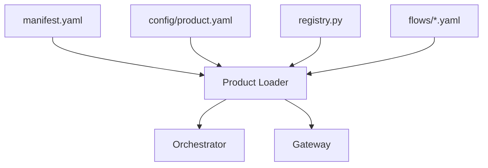

# Product How-To — master/

This document explains **how to build and ship a product** on top of the `master/` platform.  
Products are thin bundles that plug into the shared runtime; **no core changes are needed**.

---

## 1. Product Principles

- Thin: products only define flows, agents, tools, and config.
- Safe: obey the platform laws (no env reads outside config loader, no persistence outside `core/memory`, no direct tool execution).
- Declarative: flows/policies belong in YAML; behavior is wired via manifests.
- Testable: each product can ship regression suites that run via sqlite.

## 2. Product Layout

Products live under `products/<product_name>/` with the following required structure:

```
products/<product>/
├── manifest.yaml                  # Metadata + flows + UI/API flags
├── config/
│   └── product.yaml               # Product-specific defaults injected into Settings
├── flows/                         # Flow definitions (YAML)
├── agents/                        # BaseAgent implementations
├── tools/                         # BaseTool implementations
├── registry.py                    # Safe registration hook (ProductRegistries)
└── tests/                         # Optional product-level regression tests
```



There is no scaffolding script; create the product layout manually following this document. The generated `registry.py` imports `ProductRegistries` and registers agents/tools without side effects.

## 3. Manifest & Config

`manifest.yaml` declares the product catalog entry. Provide:

- `name`, `display_name`, `description`, `version`
- `default_flow`
- `exposed_api` / `ui` flags+panels (used by gateway & Streamlit UI)
- `flows`: list of flow IDs published by the product
- Optional metadata (category, icon, gallery)

`config/product.yaml` stores product defaults (autonomy, budgets, flags). It is merged into the global Settings object and can be injected into agents/tools via dependency injection. Optional UI hints live under `metadata.ui` to drive dynamic inputs/intent in the Streamlit UI.

## 4. Flow Definitions

Flows live under `flows/*.yaml`. Each flow defines a linear/graphical sequence of steps referencing registered agents/tools, `human_approval`, or `user_input`. Example snippet:

```yaml
id: hello_world
autonomy_level: suggest_only

steps:
  - id: echo
    type: tool
    tool: echo_tool
    backend: local
    params:
      message: "{{payload.keyword}}"
    retry:
      max_attempts: 2
      backoff_seconds: 1
  - id: approval
    type: human_approval
    title: Review the echoed message
    message: Please approve or reject the output.
  - id: summary
    type: agent
    agent: simple_agent
```

The flow loader normalizes step IDs, enforces retry policies, and wires the step definitions to the registered agents/tools.

## 5. Agents & Tools

Agents (`BaseAgent`) operate on `StepContext`, inspect payload/artifacts, and return an `AgentResult`. They must not execute tools directly, call vendors, or write to disk.

Tools (`BaseTool`) validate inputs (Pydantic), perform deterministic actions, and return a `ToolResult`. Tool execution always flows through `core/tools/executor.py`, which applies governance hooks, retries, and redaction.

## 6. Registration

Every product must provide `products/<name>/registry.py` with:

```python
from core.utils.product_loader import ProductRegistries

def register(registries: ProductRegistries) -> None:
    registries.agent_registry.register("simple_agent", build_agent)
    registries.tool_registry.register("echo_tool", build_tool)
```

`ProductRegistries` bundles the global `AgentRegistry` and `ToolRegistry` plus settings. The loader imports each registry module, calls `register(...)`, and only then exposes the product's flows to the API/UI. Keep registry imports side-effect-free and idempotent.

## 7. Testing & Validation

Product tests belong under `products/<name>/tests/`. Hello World ships `products/hello_world/tests/test_hello_world_flow.py`, which:

- Boots settings via `load_settings(configs_dir=..., secrets_path=...)` to point the sqlite backend into a temp path
- Discovers/registers the hello_world product
- Runs `hello_world`, asserts the run pauses for HITL, resumes with an approval payload, and inspects persisted step outputs (echo + summary)

Use pytest to keep the golden path deterministic (sqlite backend only, no network).

## 8. Running the Product

Once registered, the gateway exposes:

- `GET /api/products` + `/api/products/{product}/flows` (driven by manifests + discovery)
- `POST /api/run/{product}/{flow}` to start flows
- `POST /api/resume_run/{run_id}` to resolve HITL approvals
- `POST /api/resume_run/{run_id}` with `user_input_response` to resume `user_input` steps
- CLI commands (`master list-products`, `master run`, `master resume`, `master approvals`)
- Streamlit control center (`gateway/ui/platform_app.py`) that lists products, flows, run history, and approvals

## Recap

- Products ship manifests, configs, flows, agents, tools, registries, and optional tests.
- The product loader discovers manifests deterministically, registers components safely, and feeds the gateway/orchestrator.
- Tests run via sqlite to prove the golden path (`tool → HITL → agent summary`) behaves under audit-ready persistence.
